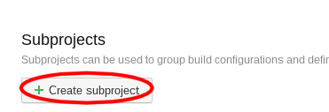
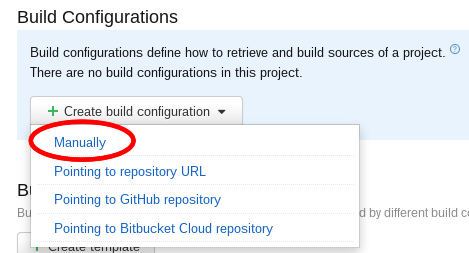

Add Customer / Installation
===========================

Create a new Customer
---------------------

1. Go to the `Continuous Delivery project settings`_
2. Manually create a new subproject (screenshot above)

   .. _Continuous Delivery project settings: https://dev.tocco.ch/teamcity/admin/editProject.html?projectId=ContinuousDeliveryNg

.. figure:: new_customer2.png

   Project setting for a new customer

3. Fill in parameters as shown above

.. _create-installation-in-teamcity:

Create a new Installation
-------------------------

.. figure:: new_installation1.png

1. Go to the `Continuous Delivery project settings`_
2. Find the customer you want and click on **edit**. If doesn't exist, it needs to be
   `created <#create-a-new-customer>`_ first.

   Build configurations for customers

3. Manually create a new subproject (screenshot above)

.. figure:: new_installation3.png

   Template parameters

4. Fill in parameters as shown above
5. Fill in these additional template parameters:

   ================ ================================================================
   CUSTOMER         Customer name
   DOCKER_IMAGE_TAG ``test`` for production systems and empty for test systems
   DUMP_MODE        ``dump`` for production systems and ``no_dump`` for test systems
   GIT_TREEISH      Branch to be deployed, e.g. ``releases/2.13``
   ================ ================================================================

   It shouldn't be necessary to touch any of the other parameters.

.. important::

    The installation needs also to be :doc:`created in OpenShift <../openshift/create_nice_installation>`.
