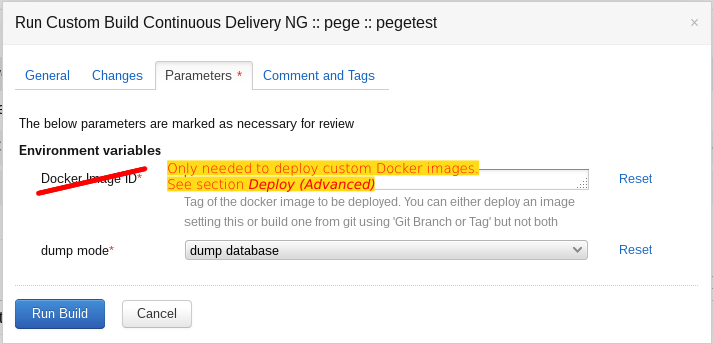
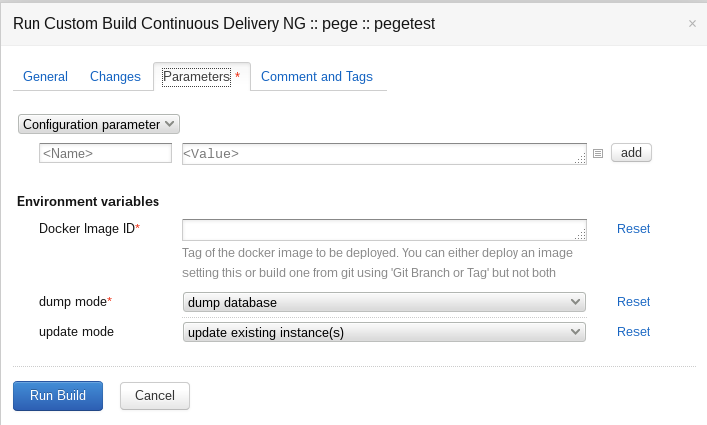
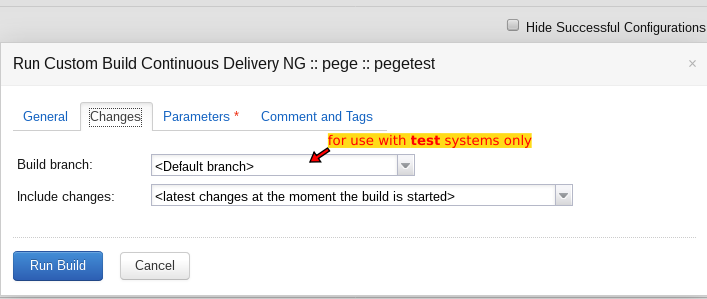
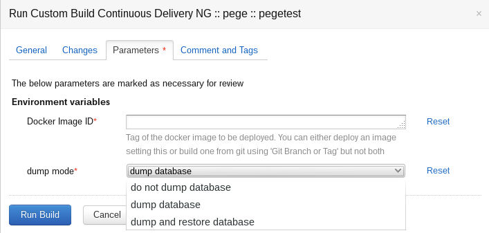
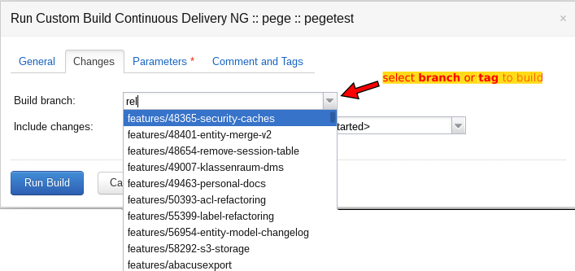

Deploy / Basics
===============

Teamcity Project "Continuous Delivery"
--------------------------------------

The `Continuous Delivery project`_ is the entry point to CD.

.. _Continuous Delivery project: https://dev.tocco.ch/teamcity/project.html?projectId=Nice2ContinuousDelivery

.. figure:: tc_main.png
   :name: main page
   :target: ../_images/tc_main.png

   *Continuous delivery* project on on TC's main page

Deliver (Simple)
----------------

.. note::

   Use `Deliver (Advanced)`_ if you need to deploy …
      #. … a test system with a custom Git branch or tag
      #. … a production system with a Docker image previously installed on the test system

   .. todo:: link "Docker image" to high level overview

   *Run* menu

#. Click on **Run** in the `main page`_
#. (optional) adjust the `dump mode`_ in the `run menu`_
#. Click **Run Build** in the `run menu`_

Deliver (Advanced)
------------------

   Full **Parameters** menu as shown when opening via ellipsis (...)

   *Changes* tab in *Run* menu

#. Click on **Run** in the `main page`_.
#. (optional) Adjust the `dump mode`_ in the `run menu`_.
#. (optional) Select a particular `Git tag or branch <#deploy-a-specific-git-tag>`_ or deploy a particular Docker image.
   tag [#f1]_
#. Click **Run Build** in the `run menu`_.

.. todo:: write and link guide for deploying specific Docker images

Dump Mode
---------

   **Dump Mode** dropdown on **Parameters** tab in **Run** menu

=========================  =============================================================================================
do not dump database       Deploy without creating a dump first (default for test systems.)
dump database              Create a dump and only then deploy (default for production systems.)
dump and restore database  In case of a deployment failure, automatically roll back by restoring the created dump.
                           **In case of a rollback, changes made to the DB, after starting the dump, are lost!**
=========================  =============================================================================================

Deploy a Specific Git Tag
-------------------------

   **Build branch** dropdown on **Changes** tab in **Run** menu

**Build branch** allows you to specify to deploy an arbitrary Git branch or tag.

.. important::
   #. This should only be used with test systems [#f1]_.
   #. The value of **Build branch** is ignored if `Docker Image ID <#run-menu-advanced>`_ is set.

.. rubric:: Footnotes

.. [#f1] In general, test systems are deployed from git and production systems reuse the Docker Images from
         the test systems.
