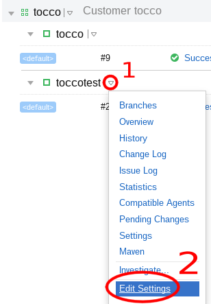

Automatically Trigger Deployments
=================================

.. attention::

    You need to be a Teamcity administrator to set up triggers.

Time-Based Triggers
-------------------

Open Settings
`````````````



Go to `Continuous Delivery project settings`_, find the right customer and open the *Settings* menu.


Create Trigger
``````````````

.. _Continuous Delivery project settings: https://dev.tocco.ch/teamcity/admin/editProject.html?projectId=ContinuousDeliveryNg

.. figure:: trigger_deployments_static/cron_trigger.png

1. Go to *Triggers* settings
2. *Add new Trigger*
3. Select trigger type *Schedule Trigger*
4. Select desired schedule
5. Save


Triggered by Database Refactoring
---------------------------------

Open Settings
`````````````


Go to `Continuous Delivery project settings`_, find the right customer and open the *Settings* menu.


Create Trigger
``````````````


.. figure:: trigger_deployments_static/finish_build_trigger.png

1. Go to *Triggers* settings
2. *Add new Trigger*
3. Select trigger type *Finish Build Trigger*
4. Select build that triggers deployment (select refactoring for **existing** database)
5. **Always** check *Trigger after successful build only*
6. Save
