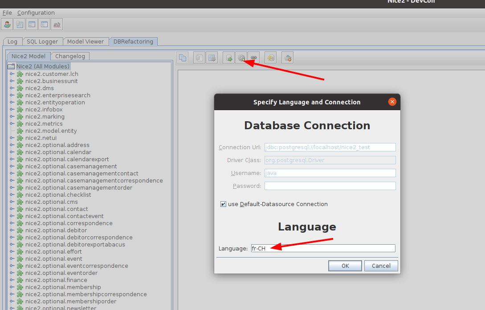
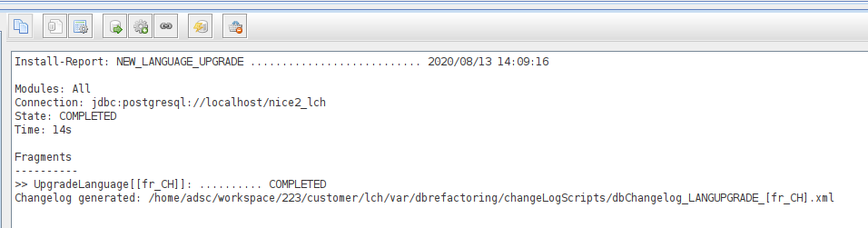
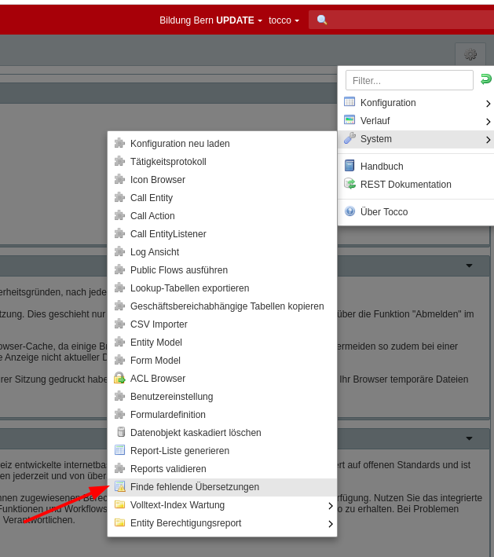

Language Upgrade
================

.. warning:: This guide only applies to versions with yaml initialvalues (≥2.22)

Adding a new language is a two step process. In a first step, the language needs to be added to the code and
changesets to add the missing language columns need to be created. In a second step, missing translations need to
be located and added.

Change Code & Generate Changesets
---------------------------------

* start the system locally and run all changesets / make sure the db is clean
* add language to ``application.properties`` e.g. ``i18n.locale.available=de-CH,fr-CH``
* copy language.properties file of fallback locale and add it in the new locale. e.g. ``language_fr.properties``
* coordinate translation of the new language.properties file with project manager
* change runenv to update ``-Dch.tocco.nice2.runenv=update``
* temporarily comment out ``System.exit(125);`` and ``System.exit(126);`` in ``StarterExecutorImpl`` **(dont commit this change!)**
* start devcon and run "Update to a new language"

* find the generated changelog

* split the generated changelog and add it to the customer module as followed

   * ``new_language_definition`` -> add to ``schema`` folder. This change adds the columns
   * ``new_language_values`` -> add to ``initialvalues`` folder. This change sets the values of the new columns to the corresponding fallback-locale value
   * ``new_language_constraints`` -> add to ``schema`` folder. Sets the constraints of the new columns
* remove hashes from ``databasechangelog`` table of the database: ``update databasechangelog set md5sum = null;`` (**this needs to be executed on the test / prod database aswell!**)
* run changesets, start modelvalidation to check if the database is clean again
* **translations of all standard entities with version 1 (e.g. not edited) will be added automatically**

Find missing translations
-------------------------

To find missing translations a new action was added.

This action will generate a list of all entities that potentially have a missing translations. To do this, it checks if
a localized field is equal to the corresponding fallback locale field.

The generated list needs to be checked and can be fixed as followed:

* decide to ignore it (e.g. Order_positions of existing Orders do not need to be translated as these orders are not in the new locale)
* manually translate it (this is required for all customer edited / customer created entities)

   * use csv export / import to be able to apply it to as well the test as the prod system

* decide to reset it to the "standard" (all fields / languages). This can be useful if ...

   * ... the entity contains only standard values and was accidentally changed
   * ... the standard entity was added before initialvalues were available and the old standard changeset contained a wrong version

* to reset an entity back to standard, have a changeset created for it that resets the version to 1. Please find below an example of such a changeset. If not all entities of a table need to be reset, additional ``where`` conditions should be added.

.. code-block:: xml

   <changeSet author="adsc" dbms="postgresql" id="reset-gender-J92nMaL/2.23">
     <preConditions onFail="MARK_RAN">
       <not>
         <sqlCheck expectedResult="0">select count(*) from nice_gender where _nice_version != 1</sqlCheck>
       </not>
     </preConditions>
     <update tableName="nice_gender">
       <column name="_nice_version" valueNumeric="1"/>
       <where>_nice_version != 1</where>
     </update>
   </changeSet>