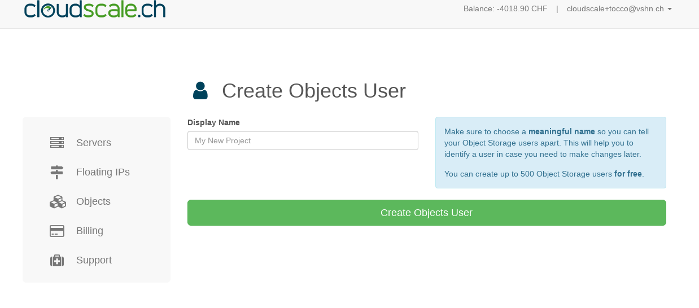
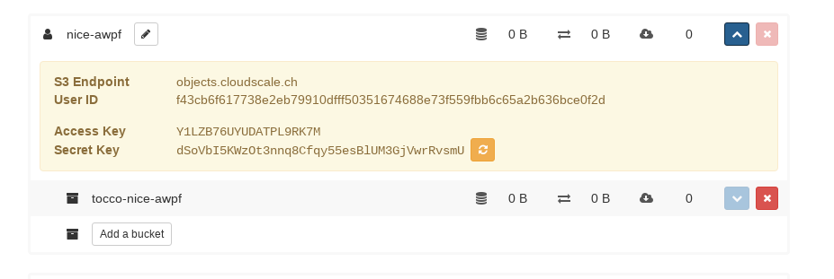
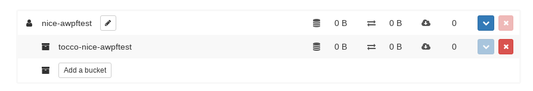

S3 Buckets
==========

Naming conventions for S3
--------------------------

S3 User-Name: **nice-[clientname]**
S3 Bucket-Name : **tocco-[S3 User-Name]**

To create buckets, access the control panel at ``https://control.cloudscale.ch/objects``

.. figure:: resources/s3_cloudscale_webclient.png

Create a new S3 user
--------------------

Press the button ``Create a new Object User`` at the top-right.
For the name, use the convention listed above.

A new user can easily be created via curl.
This is especially useful when many users need to be created.

.. parsed-literal::

        curl -i -H 'Authorization: Bearer **${MY_ACCESS_TOKEN}**' -F display_name=**${NEW_USERNAME}** https://api.cloudscale.ch/v1/objects-users;

Check the access-key and security-Key
-------------------------------------

Press the blue button in the upper right corner. There is a blue panel on which the S3 Keys are stored.

Create new S3-Bucket
--------------------

press the button ``add a bucket`` and insert a bucket name.

