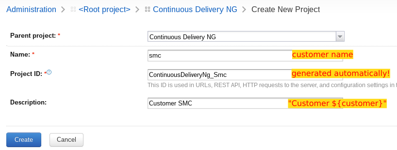
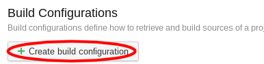
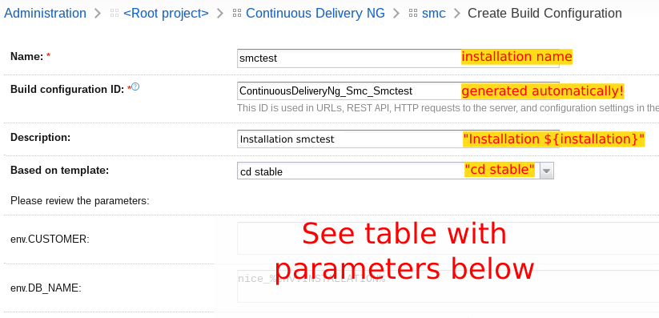

Add Customer / Installation
===========================

Create a new Customer
---------------------

.. figure:: add_customer_or_installation_static/new_customer.png

1. Go to the `Continuous Delivery project settings`_
2. **Create subproject** (screenshot above)

   .. _Continuous Delivery project settings: https://dev.tocco.ch/teamcity/admin/editProject.html?projectId=ContinuousDeliveryNg

   Project setting for a new customer

3. Fill in parameters as shown above

.. _create-installation-in-teamcity:

Create a new Installation
-------------------------

.. figure:: add_customer_or_installation_static/new_installation1.png

1. Go to the `Continuous Delivery project settings`_
2. Find the customer you want and click on **edit**. If doesn't exist, it needs to be
   `created <#create-a-new-customer>`_ first.

   Build configurations for customers

3. **Create build configuration** (screenshot above)

   Template parameters

4. Fill in parameters as shown above
5. Fill in these additional template parameters:

   ============================  =======================================================================================
   CUSTOMER                      Customer name (e.g. agogis or smc but never :strike:`agogistest` or :strike:`smctest`)
   DOCKER_PULL_URL               Default values are [#f1]_:

                                 **production** systems:
                                 ``registry.appuio.ch/toco-nice-%env.INSTALLATION%test/%env.DOCKER_IMAGE%`` [#f3]_

                                 **test** systems: ``""`` (empty)
   DUMP_MODE                     ``dump`` for production systems and ``no_dump`` for test systems [#f2]_
   GIT_TREEISH                   Git branch (e.g. ``releases/2.13``). [#f1]_
   INSTALLATION                  Installation name (e.g. smc or smctest)
   ============================  =======================================================================================

   It shouldn't be necessary to touch any of the other parameters.

.. important::

    The installation needs also to be :doc:`created in OpenShift <../openshift/create_nice_installation>`.

.. rubric:: Footnotes

.. [#f1] If **DOCKER_PULL_URL** is present, the Docker image for the installation is fetched from that URL. Otherwise,
         a new image is built from **GIT_TREEISH**.
.. [#f2] **DUMP_MODE** decides whether a dump is done by default. The user can still override this when deploying.
.. [#f3] This fetches the current image from the test system.
