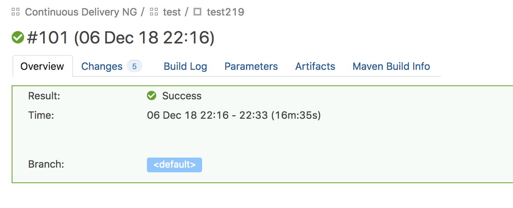
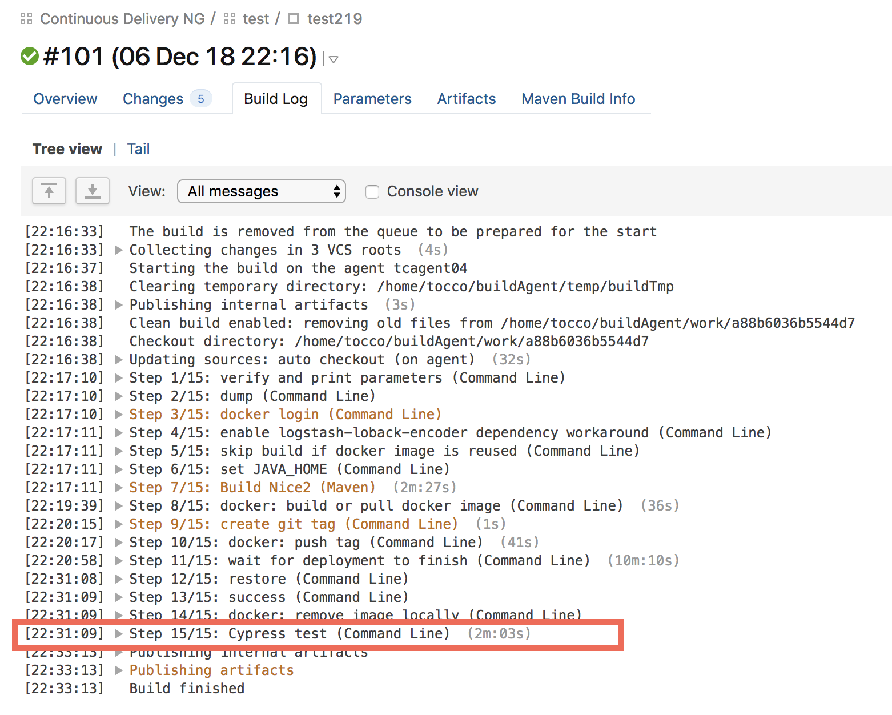
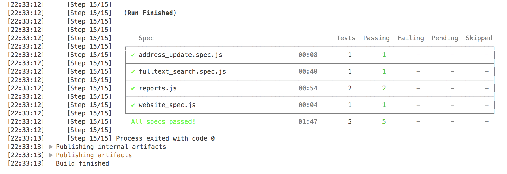
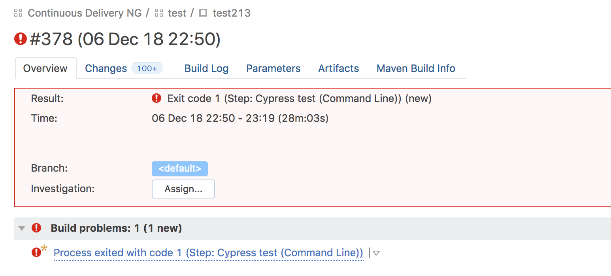
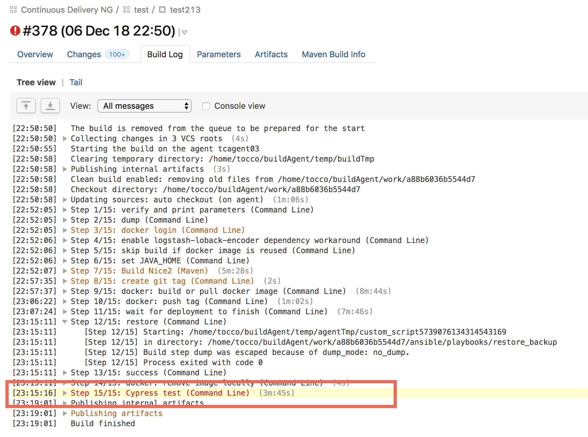
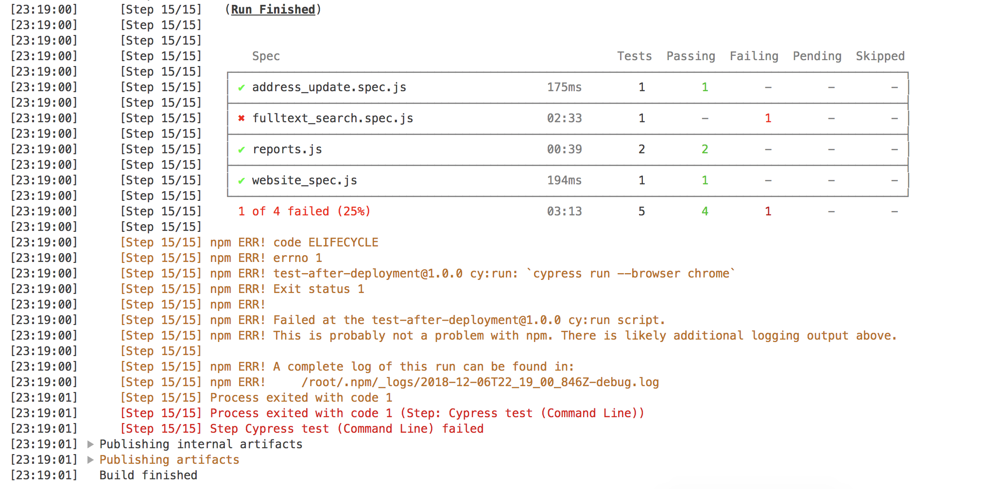
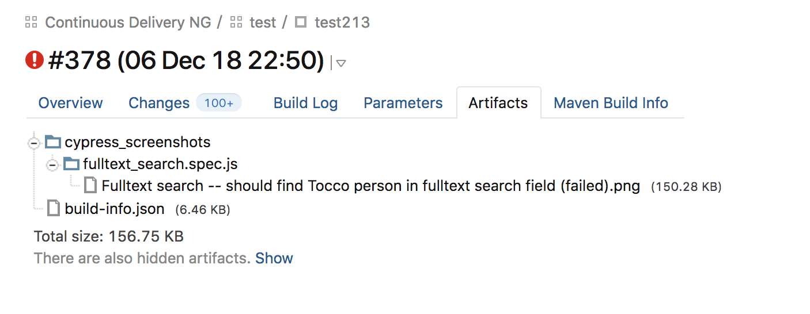
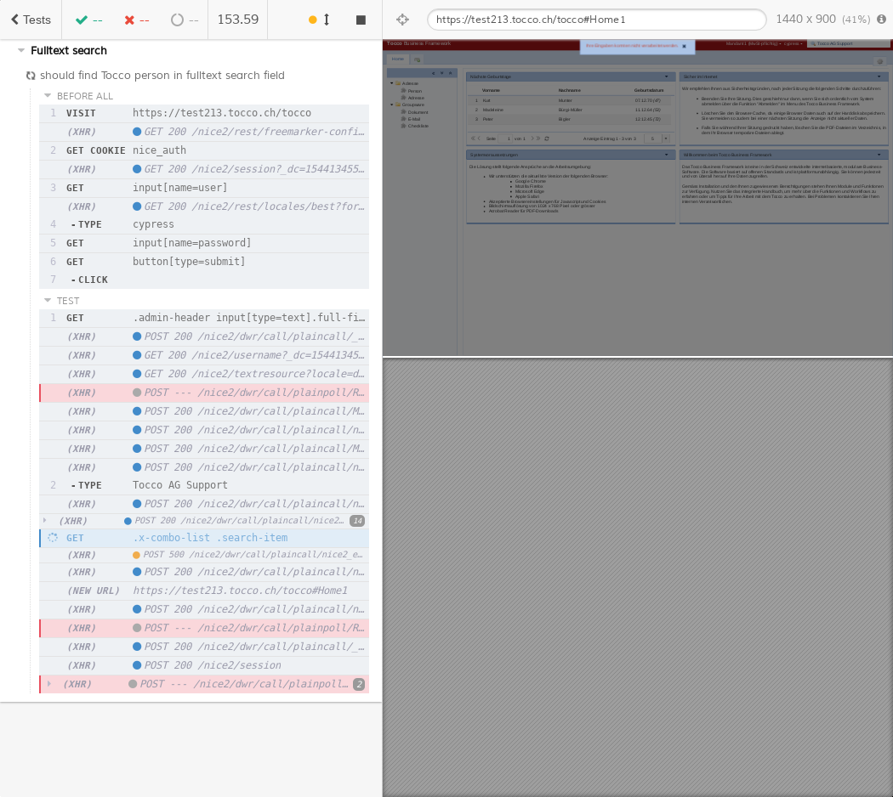

.. _automated-test-after-deployment:

Automated Test After Deployment (Cypress)
=========================================

The last build step in the continuous delivery build config runs simple end-to-end tests in order to ensure that some
basic functionality still works. The tests comprise the generation of PDF reports, the fulltext search and public
flows.

The following documentation describes what you can expect from the tests and how you should react if the tests fail.

.. _test-after-deployment GitHub repository: https://github.com/tocco/test-after-deployment

.. note::

   Please have a look at the README file of the `test-after-deployment GitHub repository`_ for more details about
   the tests itself.

How to set up the tests
-----------------------

Please check the README file of the `test-after-deployment GitHub repository`_ for setup instructions.

Tests terminated successfully
-----------------------------

If the deployment could be completed successfully and all tests passed, the build status is green.

   Build status of successful test

Take a look at the build log and you'll find the results of the test in the section ``Cypress test``.

   Build log summary of successful test

   Summary of successful tests in build log

.. note::

   You don't need to look at the build log to check if the Cypress tests passed. The build status won't be green if
   one of the tests failed.

In this case, everything went fine. You can expect the **basic functionality** of the installation to work as expected
and you don't need to test it again by hand.

Tests failed
------------

If one of the tests failed, the build status is red. The error message **"Step: Cypress test"** indicates that the
tests failed.

   Build status of failed test

In this case, we need to investigate why the tests failed. **Please note that in the case of failed Cypress tests,
the backup won't be restored.** You need to check the test results on your own and then take appropriate action.
We'll discuss further below what appropriate action might be.

First, let's dig into the build log to see what actually happened.

You'll find more detailed information about the failure in the ``Cypress test`` section of the build log.

   Build log summary of failed test

   Summary of failed tests in build log

.. figure:: automated_test_after_deployment/cypress_test_failure_log.png

   Log of failed test

In this case, the actual error is: "Expected to find element: '.x-combo-list .search-item', but never found it."

What does that mean? To better understand it, we'll take a look at the screenshot that Cypress created for us.
The screenshots for all failed tests can be found in the build artifacts tab.

   List of screenshots of failed tests

   Screenshot of failed test

This screenshot of the **Fulltext search** test shows an error message. Seems like Cypress tried to search for
"Tocco AG Support" in the global fulltext search field and then this error appeared.

What should we do now? First, we'll test the fulltext search again by hand. If the error doesn't occur anymore: fine,
everything seems to be OK, no further action required. Most probably the test failed, because the installation
wasn't fully ready.

But what to do if the error persists? In this case, we'll have to investigate the error further and to decide
whether we need to manually restore the old state of the installation or we're able to fix the error quickly enough.
