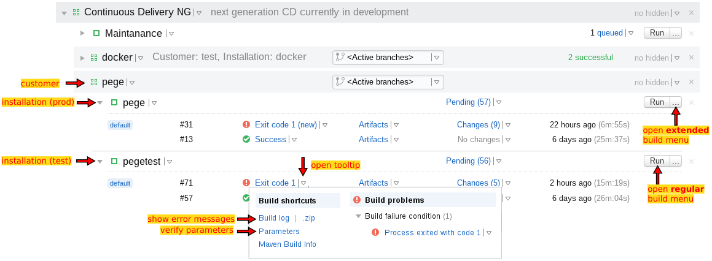
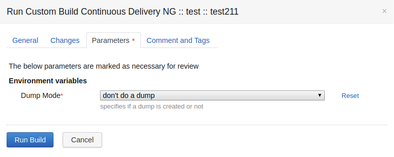
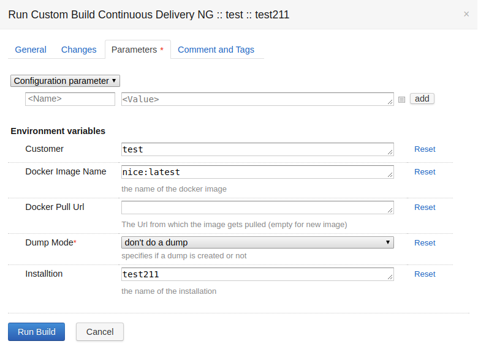

Continious Delivery (CD)
========================

Teamcity Project "Continuous Delivery NG"
-----------------------------------------

The `Continuous Delivery project`_ is the entry point to CD.

.. _Continuous Delivery project: https://tc.tocco.ch/project/ContinuousDeliveryNg

   *Continuous delivery* project on TC's main page

Deliver (Simple)
----------------

.. note::

   Use `Deliver (Advanced)`_ if you need to deploy …
      #. … a test system with a custom Git branch or tag
      #. … a production system with a Docker image previously installed on the test system

   *Run* menu

#. Click on **Run** in the `main page`_
#. (optional) adjust the `dump mode`_ in the `run menu <#run-menu>`__
#. Click **Run Build** in the `run menu <#run-menu>`__

Deliver (Advanced)
------------------

   Full **Parameters** menu as shown when opening via ellipsis (...)

.. figure:: deploy_and_basics_static/tc_run_changes_tab.png

   *Changes* tab in *Run* menu

#. Click on **Run** in the `main page`_.
#. (optional) Adjust the `dump mode`_ in the `run menu <#run-menu>`__.
#. (optional) Select a particular `Git tag or branch <#deploy-a-specific-git-tag>`_ or deploy a particular `Docker image
   <#deploy-a-specific-docker-image>`_.
#. Click **Run Build** in the `run menu <#run-menu>`__.

Dump Mode 
---------

.. figure:: deploy_and_basics_static/tc_dump_modes_dropdown.png

   **Dump Mode** dropdown on **Parameters** tab in **Run** menu

=========================  =============================================================================================
do not dump database       Deploy without creating a dump first (default for test systems.)
dump database              Create a dump and only then deploy (default for production systems.)
=========================  =============================================================================================

Deploy a Specific Git Tag
-------------------------

.. figure:: deploy_and_basics_static/tc_changes_tab_dropdown.png

   **Build branch** dropdown on **Changes** tab in **Run** menu

**Build branch** allows you to specify to deploy an arbitrary Git branch or tag.

.. note:: There might be a situation where you want to deploy a tag directly on production. 
          In that case remove the CD parameter "DOCKER_PULL_URL". `See deploy a Specific Docker Image <#deploy-a-specific-docker-image>`_.

Handling of Version Upgrades
----------------------------

Regular Setup
^^^^^^^^^^^^^

During regular operations, there is one prduction and one test
system. When **test** is deployed, a new Docker image is built and
pushed to OpenShift. When **production** is deployed, the image
from test is copied.

.. graphviz::

    digraph {
        label="Normal Operations"

        tc [ label=TeamCity ]
        prod [ label="prod (v3.0)" ]
        test [ label="test (v3.0)" ]

        tc -> test [ label="push fresh Docker image" ]
        test -> prod [ label="copy image" ]
    }

Upgrade to a new Version of Nice
^^^^^^^^^^^^^^^^^^^^^^^^^^^^^^^^

First a second test system is :green:`created` and updated to the new version:

.. graphviz::

    digraph {
        label="Adding a Secondary Test System"

        tc [ label=TeamCity ]
        prod [ label="prod (v3.0)" ]
        test [ label="test (v3.0)" ]
        test2 [ label="test (v3.5)" color=green fontcolor=green ]

        { rank=same test test2 }

        tc -> test [ label="push" ]
        tc -> test2 [ label="push" color=green fontcolor=green ]
        test -> prod [ label="copy" ]
    }

TeamCity decides what Docker image to copy based on the ``env.DOCKER_IMAGE``
parameter configured for every installation. By default, the image from
the test system called ``${INSTALLATION}test`` is copied. That is, when an
installation called *abc* is deployed, the Docker image of *abctest* is
copied:

.. parsed-literal::

    registry.appuio.ch/toco-nice-%env.INSTALLATION%\ **test**\ /%env.DOCKER_IMAGE%

Should you want to copy the image from *abctest2* instead, adjust the
``env.DOCKER_IMAGE`` parameter accordingly:

.. parsed-literal::

    registry.appuio.ch/toco-nice-%env.INSTALLATION%\ **test2**\ /%env.DOCKER_IMAGE%

Once the new test system has been fully tested and is ready to
be deployed, TeamCity is configured to :green:`copy the Docker image
from the new, updated test system`:

.. graphviz::

    digraph {
        label="Uprading Production"

        tc [ label=TeamCity ]
        prod [ label="prod (v3.5)" ]
        test [ label="test (v3.0)" ]
        test2 [ label="test (v3.5)" ]

        { rank=same test test2 }

        tc -> test [ label="push" ]
        tc -> test2 [ label="push" ]
        test -> prod [ label="(removed)", style=dotted, color=gray, fontcolor=gray ]
        test2 -> prod [ label="copy" color=green fontcolor=green ]
    }

The old test system is usally kept for a short while, in order to be
able to verify potential regression that resulted from the upgrade.
Then, the old test system is removed and were back to the regular setup:

.. graphviz::

    digraph {
        label="Regular Operations, Again"

        tc [ label=TeamCity ]
        prod [ label="prod (v3.5)" ]
        test [ label="test (v3.5)" ]

        tc -> test [ label="push" ]
        test -> prod [ label="copy" ]
    }
