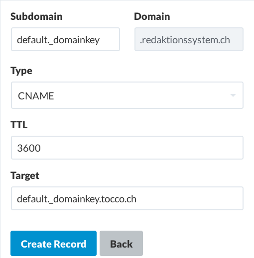
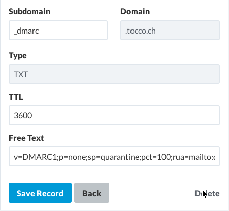

DNS Records for Outgoing Mails
==============================

Create SPF Record
-----------------

As shown below, ``include:spf.tocco.ch`` needs to be added to the SPF record. The record shown below may need to be
extended depending on whether another relay is used to send mails from the same domain. Also, ``?all`` is
generally safe but the domain owner may wish to use ``~all`` or ``-all`` to avoid that anyone else can send mails using
her domain.

.. code::

    @ IN TXT "v=spf1 … include:spf.tocco.ch ?all"

.. warning::

    ``~all`` and ``-all`` may lead to mails being rejected or considered spam if the policy is incorrect. Be careful!

Wikipedia has comprehensive article on `SPF`_ if more information is needed.

.. figure:: nine_spf.png
    :scale: 60%

    Sample SPF record in Nine web interface

.. _SPF: https://en.wikipedia.org/wiki/Sender_Policy_Framework

Create DKIM Record
------------------

A ``CNAME`` record for the name ``default._domainkey`` needs to be created.

.. code::

    default._domainkey IN CNAME default._domainkey.tocco.ch.

See wikipedia entry on `DKIM`_ for more details.

.. _DKIM: https://en.wikipedia.org/wiki/DomainKeys_Identified_Mail

.. hint::

   In case the selector name ``default`` is already in use, a different selector can be configured for a domain. See
   :vshn:`TOCO-23` for details.

    Sample CNAME record in Nine web interface redirecting to our DKIM entry.

Create DMARC Record
-------------------

A ``TXT`` entry for the name ``_dmarc`` needs to be created. Reports about mails rejected or classified as spam are sent
the the mail address specified in the record.

The subdomain policy, ``sp``, may need to be adjusted if the domain owner wishes to send mails from subdomains. The
policy ``p=none`` is generally safe but it can also be set to ``quarantine`` or ``reject`` if a stricter policy is
desired.

.. code::

    _dmarc IN TXT "v=DMARC1;p=none;sp=quarantine;pct=100;rua=mailto:dmarcreports@example.com"

.. warning::

    Be careful with ``quarantine`` and ``reject``. If SPF or DKIM records fail to validate the mail is going to be moved
    to spam or reject respectively.

Wikipedia has some more details on `DMARC`_.

.. _DMARC: https://en.wikipedia.org/wiki/DMARC

    Sample DMARC record in Nine web interface

Verify Correctness
------------------

There are several online services that test the records for you. `Mail Tester`_ is one of the simpler ones and it covers
all the DNS entries listed above.

.. _Mail Tester: https://www.mail-tester.com/
