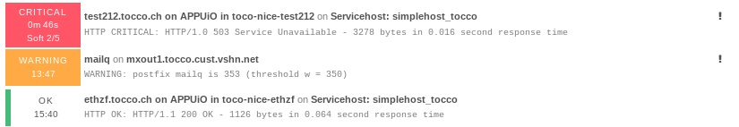
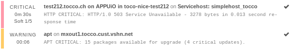
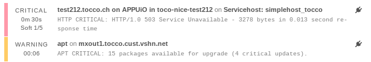
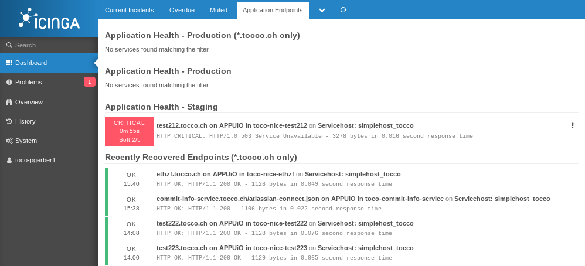

====================
Icinga Web Interface
====================

Introduction
------------

Icinga is a web interface for the Nagios monitoring system which
used to monitor Nice installations on OpenShift.

It can be found at https://monitoring.vshn.net. Use your regular
VSHN login.

Basic Concepts
--------------

Alerts and Warnings
^^^^^^^^^^^^^^^^^^^

   :red:`solid red`: critical issue, :orange:`solid orange`: non-critical issue,
   :green:`green bar`: everything is OK

Unhandled alerts and warnings are indicated by a solid red and orange respectively.

Acknowledging an Alert or Warning
^^^^^^^^^^^^^^^^^^^^^^^^^^^^^^^^^

   Acknowledgment is indicated by having an orange or red bar with an additional
   **check mark icon**.

When a warning or alert is worked on, it should be acknowledged. Acknowledging tells
everyone else that the issue is being attended.

Acknowledging works like this:

1. .. figure:: resources/acking_1.png

       Select the service.

2. .. figure:: resources/acking_2.png

       Select *acknowledge* and leave a comment describing what's being
       done to restore the service.

Schedule Downtime
^^^^^^^^^^^^^^^^^

   Downtime is indicated by having an orange or red bar with an additional **plug icon**.

When a service is expected to become unavailable because of maintenance, a downtime should
be scheduled to ensure no alert will pop up.

#. .. figure:: resources/schedule_downtime_1.png

       Find the service.

#. .. figure:: resources/schedule_downtime_2.png

       Show service details.

#. .. figure:: resources/schedule_downtime_3.png

       Fill in downtime details.

Custom *Application Endpoints* Dashboard
----------------------------------------

By default there are *Current Incidents*, *Overdue* and *Muted*
dashboards. To have a better overview of the Nice installations, it's
recommended to add a custom *Application Endpoints* dashboard as described
here.

    *Application Endpoints* tab showing details about Nice endpoints only.

Adding the dashboard:

#. Select *Add Dashlet*

   .. figure:: resources/add_dashlet.png

#. Create Dashboard with these options:

   * *Url*::

         monitoring/list/services?service_problem=1&service=%2Asimplehost_tocco%2A&((service_display_name!=%2Atest%2A&service_display_name=%2A.tocco.ch%20%2A))&sort=service_severity&dir=descdeploymentconfig.apps.openshift.io%2Fnice&modifyFilter=1
   * *Dashlet Title*: Application Health - Production (\*.tocco.ch only)
   * *New Dashboard*: true
   * *New Dashboad Title*: Application Endpoints

#. Select *Add Dashlet* again

#. Create Dashlet with these options:

   * *Url*::

         monitoring/list/services?service_problem=1&service=%2Asimplehost_tocco%2A&service_display_name!=%2Atest%2A&sort=service_severity&dir=descdeploymentconfig.apps.openshift.io%2Fnice&modifyFilter=1
   * *Dashlet Title*: Application Health - Production
   * *New Dashboard*: false
   * *New Dashboad Title*: Application Endpoints

#. Select *Add Dashlet* again

#. Create Dashlet with these options:

   * *Url*::

         monitoring/list/services?service_problem=1&service=%2Asimplehost_tocco%2A&service_display_name=%2Atest%2A&sort=service_severity&dir=descdeploymentconfig.apps.openshift.io%2Fnice&modifyFilter=1
   * *Dashlet Title*: Application Health - Staging
   * *New Dashboard*: false
   * *New Dashboad Title*: Application Endpoints

#. Select *Add Dashlet* again

#. Create Dashlet with these options:

   * *Url*::

         monitoring/list/services?service_state=0&(service=%2Asimplehost_tocco%2A|service_display_name=%2Asimplehost_tocco%2A)&service_display_name=%2A.tocco.ch%20%2A&limit=10&sort=service_last_state_change&dir=desc
   * *Dashlet Title*: Recently Recovered Endpoints (\*.tocco.ch only)
   * *New Dashboard*: false
   * *New Dashboad Title*: Application Endpoints
