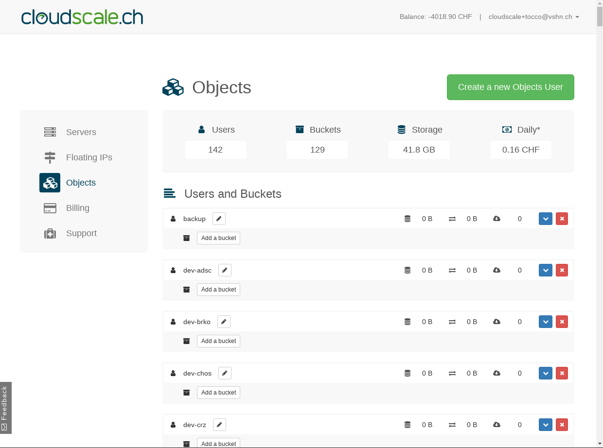

S3 User for Developers
======================

This document describes how to create a user account for a developer
and how to set ACLs and policies properly.

Naming Convention for Developers
--------------------------------

============== ==================================================================
 S3 user name   dev-**${EMPLOYEE_SHORT_NAME}** (see :term:`Employee Short Name`)
============== ==================================================================

.. note::

    The prefix ``dev-`` is used by Ansible to recognize developers and grant
    permissions accordingly.

Access the Web Interface
------------------------

.. important::

    Only a selected number of people have access to the Web interface and REST API. Those people can
    find the credentials in :term:`secrets.yml`.

S3 users and buckets can be managed via the web interface available at https://control.cloudscale.ch/objects.

Create a new S3 User
--------------------

Press the button *Create a new Object User* at the top-right. The *Display Name* is the name of the S3 user,
choose it accordingly to the naming convention above.

.. figure:: resources/create_new_user.png

Alternatively, users can be created via REST API. Here an example using ``curl``:

.. parsed-literal::

        curl -i -H 'Authorization: Bearer **${MY_ACCESS_TOKEN}**' -F display_name=\ **${NEW_USERNAME}** https\://api.cloudscale.ch/v1/objects-users

.. tip::

    API tokens can be managed `here <https://control.cloudscale.ch/user/api-tokens>`__.

.. tip::

    API documentation can be found `here <https://www.cloudscale.ch/en/api/v1#objects-users>`__

Obtain the Access and Security Keys
-----------------------------------

The *Access Key* and *Secret Key* values correspond to the ``s3.main.accessKeyId`` and
``s3.main.secretAccessKey``, respectively, within the ``s3.properties`` file.

See also :doc:`/framework/architecture/s3/s3`.

.. figure:: resources/check_keys.png

Set Permissions via Ansible
---------------------------

Permissions are set by Ansible automatically. It detects user accounts of developers
based on the ``dev-`` prefix in their name::

    $ cd ${ANSIBLE_GIT_REPO}/tocco
    $ ansible-playbook playbook.yml -t s3

See also: doc:`/devops/app_management/ansible`
