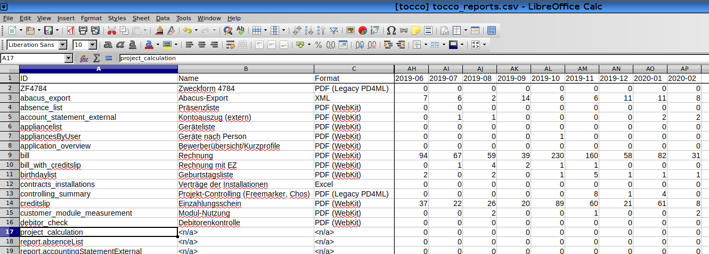

########################
System Activity Reporter
########################

Utility to print monthly usage statistics for reports, batch jobs, actions
and validators. All reports are constrained to a single database/installation.

The information is obtained from the table *System_activity* which is only
**available in Nice 2.12 and newer**.

TL;DR
=====

The utility is installed on all DB servers via Ansible and can be executed
there like this (**root access required**)::

    $ sudo -u postgres n2system-activity-reporter nice_master
    ID,Name,Format,2018-01,2018-02,2018-03,2018-04,2018-05,2018-06,2018-07,2018-08,2018-09,2018-10,2018-11,2018-12,2019-01,2019-02,2019-03,2019-04,2019-05,2019-06,2019-07,2019-08,2019-09,2019-10,2019-11,2019-12,2020-01,2020-02
    ZF4784,Zweckform 4784,PDF (Legacy PD4ML),0,0,0,0,0,0,0,0,0,0,0,0,0,0,0,0,0,0,0,0,0,0,0,0,0,0
    abacus_export,Abacus-Export,XML,0,0,0,0,0,0,0,0,0,0,0,0,1,1,0,0,0,0,1,0,2,0,0,0,0,0
    absence_list,Präsenzliste,PDF (WebKit),0,0,0,0,0,0,0,0,0,0,0,0,0,0,0,0,0,0,0,0,0,0,0,2,8,0
    account_statement_external,Kontoauszug (extern),PDF (WebKit),0,0,0,0,0,0,0,0,0,0,0,0,0,0,0,2,0,4,1,0,1,0,0,0,0,0
    account_statement_internal,Kontoauszug (intern),PDF (WebKit),0,0,0,0,0,0,0,0,0,0,0,0,1,0,0,2,0,0,12,0,1,0,0,0,0,0
    ...

(*nice_master* is the name of the database.)

By default, usage statistics for *reports* are printed. Use ``-t action``, for instance,
to get usage statistics for actions. See ``--help`` for all available options.

.. hint::

    Redirect stdout to write CSV output to a file::

        $ sudo -u postgres n2system-activity-reporter nice_master >master_reports.csv

The output is CSV and can be imported into spreadsheet easily:

   CSV output imported to LibreOffice Calc

About the Generated CSV
=======================

All types:

* Only successful activities are counted (except for *actions* where
  this information isn't available).
* Activities of user *tocco* are not counted.
* Only actions, batch jobs and validators that have been executed at least once are shown.

Reports:

* Report names that start with ``report.`` are legacy Jasper reports. (*Name* and *Format* are
  not available as that information is not listed in the database.)
* All reports are listed. Even the ones that have never been used. The one exception here is
  Jasper reports that only show up after being used.
* Reports that have a *Name* but no *Format* are not connected to an *Output Template*.
* Reports that list neither a *Name* nor a *Format* are Jasper reports (see above) or have
  been removed.

Technical Details
=================

The table *System_activities* only contains the most recent 500,000 events. Older events are
exported to filesystem. Namely, they are exported in JSON to
*/usr/local/lib/system_activity_export/* on the corresponding DB server.

This tool, *n2system-activity-reporter*, and the JSON exporter, *system_activity_export*,
can both be found in the :term:`Ansible Repository`.

The JSON output format is versioned, see comment in the *system_activity_export* script for
details.
