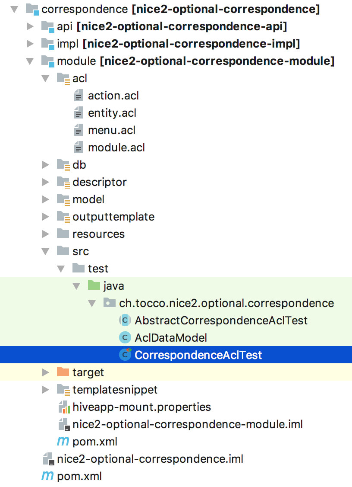

Tests
=====

The easiest way to test the ACL rules of a module is by extending
:java:ref:`ch.tocco.nice2.persist.security.inject.AbstractModuleAclTest`. This base test class automatically sets the
``entity.acl`` file of the current module as initial policy for the tests.

Dependencies and plugins in pom.xml
-----------------------------------

Add the dependency ``nice2-persist-security-testlib`` and the test plugin as follows in the file
``{NICE_MODULE_PATH}/module/pom.xml`` (so for example for the optional module `correspondence` this would be the file
``optional/correspondence/module/pom.xml``).

Required dependency ``nice2-persist-security-testlib``:

.. code-block:: XML

    <dependency>
      <groupId>ch.tocco.nice2.persist.security</groupId>
      <artifactId>nice2-persist-security-testlib</artifactId>
      <version>${project.version}</version>
      <scope>test</scope>
    </dependency>

Add test plugin:

.. code-block:: XML

    <build>
      <plugins>
        <plugin>
          <groupId>org.apache.maven.plugins</groupId>
          <artifactId>maven-compiler-plugin</artifactId>
          <executions>
            <execution>
              <phase>test</phase>
              <goals>
                <goal>testCompile</goal>
              </goals>
            </execution>
          </executions>
        </plugin>
        <plugin>
          <groupId>org.apache.maven.plugins</groupId>
          <artifactId>maven-surefire-plugin</artifactId>
          <executions>
            <execution>
              <phase>test</phase>
              <goals>
                <goal>test</goal>
              </goals>
            </execution>
          </executions>
        </plugin>
      </plugins>
    <build>

Directory structure
-------------------

The test classes should be located in the `module` of that particular Nice module.

Directory path: `src/test/java`

See the following example for the `nice2-optional-correspondence` module:

Test methods
------------

Among others, :java:ref:`ch.tocco.nice2.persist.security.inject.AbstractModuleAclTest` provides the following useful methods:

* `baseTestCase(ExpectedAccess expectedAccess, Principal principal, Callable<Entity> dataCreator, String... fields)`
* `baseTestCase(List<String> aclFileNames, ExpectedAccess expectedAccess, Principal principal, Callable<Entity> dataCreator, String... fields)`
* `baseTestCase(ExpectedAccess expectedAccess, Principal principal, Entity entity, String... fields)`
* `baseTestCase(List<String> aclFileNames, ExpectedAccess expectedAccess, Principal principal, Entity entity, String... fields)`

Simple example
--------------

Have a look at this simple example from the `nice2-optional-correspondence` module which tests the following
ACL declaration:

.. code::

   entity(Serial_correspondence):
       grant access(read) except &anonymous if relSender.pk == principal.user_id
       or relCorrespondence.relUser.pk == principal.user_id;
       grant access, delete to correspondencemanager;
       grant access(read) to correspondenceguest;

   entity(Correspondence):
       grant access(read) except &anonymous if relSerial_correspondence.relSender.pk == principal.user_id
       or relUser.pk == principal.user_id;
       grant delete to correspondencemanager;
       grant access(read) to correspondencemanager, correspondenceguest;

`AclDataModel.java`:

.. code-block:: Java

   package ch.tocco.nice2.optional.correspondence;

   import ch.tocco.nice2.i18n.L10N;
   import ch.tocco.nice2.persist.spi.backend.PersistenceBackend;
   import ch.tocco.nice2.persist.testlib.inject.model.AbstractDataModel;
   import ch.tocco.nice2.persist.testlib.inject.model.EntityModelMock;
   import ch.tocco.nice2.types.TypeManager;

   public class AclDataModel extends AbstractDataModel {

       protected AclDataModel(TypeManager typeManager, PersistenceBackend backend, L10N l10n) {
           super(typeManager, backend, l10n);

           EntityModelMock correspondence = entityModel("Correspondence")
               .with(standardPk());

           EntityModelMock serialCorrespondence = entityModel("Serial_correspondence")
               .with(standardPk());

           EntityModelMock user = entityModel("User")
               .with(standardPk());

           correspondence.manyToOne(serialCorrespondence).required();
           serialCorrespondence.manyToOne("relSender", user, "relSender_serial_correspondence");
           correspondence.manyToMany(user);

           commit();
       }
   }

`AbstractCorrespondenceAclTest.java`:

.. code-block:: Java

   package ch.tocco.nice2.optional.correspondence;

   import ch.tocco.nice2.persist.security.inject.AbstractModuleAclTest;

   public abstract class AbstractCorrespondenceAclTest extends AbstractModuleAclTest {

       @Override
       protected void bindDataModel() {
           bindDataModel(AclDataModel.class);
       }
   }

`CorrespondenceAclTest.java`:

.. code-block:: Java

   package ch.tocco.nice2.optional.correspondence;

   import javax.annotation.Resource;

   import org.testng.annotations.DataProvider;
   import org.testng.annotations.Test;

   import ch.tocco.nice2.persist.Context;
   import ch.tocco.nice2.persist.entity.Entity;
   import ch.tocco.nice2.persist.entity.PrimaryKey;
   import ch.tocco.nice2.persist.testlib.EntityBuilder;
   import ch.tocco.nice2.security.Principal;

   public class CorrespondenceAclTest extends AbstractCorrespondenceAclTest {
       @Resource
       private Context context;

       @Test(dataProvider = "rolePermissions")
       public void testRolePermissions(Principal principal,
                                       ExpectedAccess expectedSerialCorrespondenceAccess,
                                       ExpectedAccess expectedCorrespondenceAccess) throws Exception {
           Entity correspondence = context.tx().invokeRTE(() ->
               entity("Correspondence")
                   .setRelatedEntity("relSerial_correspondence", entity("Serial_correspondence").get())
                   .get());

           Entity serialCorrespondence = correspondence.getRelatedEntity("relSerial_correspondence");

           baseTestCase(expectedSerialCorrespondenceAccess, principal, serialCorrespondence);
           baseTestCase(expectedCorrespondenceAccess, principal, correspondence);
       }

       @DataProvider
       public Object[][] rolePermissions() {
           return new Object[][]{
               {
                   anonymousPrincipal(),
                   ExpectedAccess.none(),
                   ExpectedAccess.none()
               },
               {
                   principal("manager").role(role("correspondencemanager")).get(),
                   ExpectedAccess.readWrite().withDelete(true),
                   ExpectedAccess.read().withDelete(true)
               },
               {
                   principal("guest").role(role("correspondenceguest")).get(),
                   ExpectedAccess.read(),
                   ExpectedAccess.read()
               }
           };
       }

       @Test(dataProvider = "linkedSenderPermissions")
       public void testLinkedSenderPermissions(boolean principalIsLinkedSender,
                                               ExpectedAccess expectedSerialCorrespondenceAccess,
                                               ExpectedAccess expectedCorrespondenceAccess) throws Exception {
           Entity correspondence = context.tx().invokeRTE(() ->
               entity("Correspondence")
                   .setRelatedEntity("relSerial_correspondence", entity("Serial_correspondence").get())
                   .addRelatedEntity("relUser", entity("User").get())
                   .get());

           Entity serialCorrespondence = correspondence.getRelatedEntity("relSerial_correspondence");
           Entity user = correspondence.resolve("relUser").uniqueResult();

           PrimaryKey userId = principalIsLinkedSender ? user.requireKey() : null;
           Principal principal = principal("test", userId).get();

           baseTestCase(expectedSerialCorrespondenceAccess, principal, serialCorrespondence);
           baseTestCase(expectedCorrespondenceAccess, principal, correspondence);
       }

       @DataProvider
       public Object[][] linkedSenderPermissions() {
           return new Object[][]{
               {
                   false,
                   ExpectedAccess.none(),
                   ExpectedAccess.none()
               },
               {
                   true,
                   ExpectedAccess.read(),
                   ExpectedAccess.read()
               },
           };
       }

       @Test(dataProvider = "linkedReceiverPermissions")
       public void testLinkedReceiverPermissions(boolean principalIsLinkedSender,
                                                 ExpectedAccess expectedSerialCorrespondenceAccess,
                                                 ExpectedAccess expectedCorrespondenceAccess) throws Exception {
           Entity correspondence = context.tx().invokeRTE(() ->
               entity("Correspondence")
                   .setRelatedEntity(
                       "relSerial_correspondence",
                       entity("Serial_correspondence")
                           .setRelatedEntity("relSender", entity("User").get()).get()
                   )
                   .get());

           Entity serialCorrespondence = correspondence.getRelatedEntity("relSerial_correspondence");
           Entity sender = serialCorrespondence.getRelatedEntityOrNull("relSender");

           PrimaryKey userId = principalIsLinkedSender ? sender.requireKey() : null;
           Principal principal = principal("test", userId).get();

           baseTestCase(expectedSerialCorrespondenceAccess, principal, serialCorrespondence);
           baseTestCase(expectedCorrespondenceAccess, principal, correspondence);
       }

       @DataProvider
       public Object[][] linkedReceiverPermissions() {
           return new Object[][]{
               {
                   false,
                   ExpectedAccess.none(),
                   ExpectedAccess.none()
               },
               {
                   true,
                   ExpectedAccess.read(),
                   ExpectedAccess.read()
               },
           };
       }

       private EntityBuilder entity(String model) {
           return new EntityBuilder(context, model);
       }
   }

Test ACL files from multiple modules
------------------------------------

This section shows an example with ACL rules from multiple modules. In our example here, the rules we need for our test
are located in both the `dms` module and in the `optional/cms` module.

Let's write tests for the following ACL rule from nice `optional-cms` module:

.. code::

   entityPath(Domain, label):
       deny access(write) except redactor if relDomain_type.unique_id == "web";

Since the `optional/cms` module depends heavily on the `dms` module, it makes no sense to test the ACL
rules of the `optional/cms` module independently. We have to take the following steps to also include ``entity.acl``
file from the `dms` module in our test in the `optional/cms` module (besides the ``entity.acl`` from the
`optional/cms` module).

First, we have to make the ACL files from the `dms` module available in the `optional/cms` module. To do this,
we have to move the ACL files into a uniquely named directory within the `acl` directory. We call this directory
"acl".

Now, the `dms` module structure looks like this:

.. figure:: resources/dms_module_structure.png

Second, we have to create a separate JAR file containing just the ACL files from the `dms` module which we then
include in the `optional/cms` module.

dms/module/pom.xml:

.. code-block:: XML

   <build>
     <plugins>
       <plugin>
         <groupId>org.apache.maven.plugins</groupId>
         <artifactId>maven-jar-plugin</artifactId>
         <version>3.0.2</version>
         <executions>
           <execution>
             <phase>package</phase>
             <goals>
               <goal>jar</goal>
             </goals>
             <configuration>
               <classifier>acl</classifier>
               <includes>
                 <include>acl/**</include>
               </includes>
             </configuration>
           </execution>
         </executions>
       </plugin>
     </plugins>
   </build>

optional/cms/module/pom.xml:

.. code-block:: XML

   <dependency>
     <groupId>ch.tocco.nice2.dms</groupId>
     <artifactId>nice2-dms-module</artifactId>
     <classifier>acl</classifier>
     <version>${project.version}</version>
     <scope>test</scope>
   </dependency>

After that, we can write our tests in the `optional/cms` module and include the ``entity.acl`` file from the `dms`
module by calling ``baseTestCase(...)`` with a list containing the path ``"/acl/dms/entity.acl"``. This file is
now included besides the `entity.acl` file from the `optional/cms` module.

.. code-block:: Java

   package ch.tocco.nice2.optional.cms.acl.edit_alias;

   import java.util.concurrent.Callable;

   import org.testng.annotations.DataProvider;
   import org.testng.annotations.Test;

   import com.google.common.collect.ImmutableList;
   import org.jetbrains.annotations.Nullable;

   import ch.tocco.nice2.optional.cms.acl.AbstractCmsAclTest;
   import ch.tocco.nice2.persist.entity.Entity;
   import ch.tocco.nice2.persist.security.inject.AbstractCheckPermissionsTest;
   import ch.tocco.nice2.persist.security.inject.AbstractModuleAclTest;
   import ch.tocco.nice2.persist.testlib.EntityBuilder;
   import ch.tocco.nice2.security.Principal;

   public class DomainEditAliasTest extends AbstractModuleAclTest {

       @Test(dataProvider = "testCases")
       public void testPermissions(AbstractCheckPermissionsTest.ExpectedAccess expectedAccess,
                                   Principal principal,
                                   Callable<Entity> dataCreator,
                                   @Nullable String[] fields) throws Exception {
           baseTestCase(ImmutableList.of("/acl/dms/entity.acl"), expectedAccess, principal, dataCreator, fields);
       }

       @DataProvider
       public Object[][] testCases() {
           return new Object[][]{
               // no write access for anonymous
               {
                   new AbstractCheckPermissionsTest.ExpectedAccess().withWrite(false),
                   anonymousPrincipal(),
                   (Callable<Entity>) () -> new EntityBuilder(context, "Domain")
                       .field("label", "test")
                       .get(),
                   new String[]{"alias"}
               },
               // ...
           };
       }
   }
