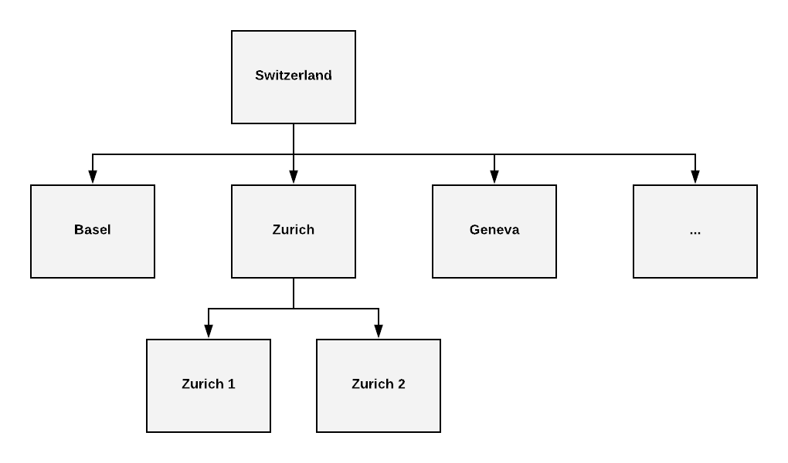

Hierarchical Business Units
===========================

Required Nice version: **2.17 and higher**

Usage
-----
Hierarchical business units can be used to restrict read- and write-access for specified entity models in a hierarchical
business unit structure. How the read/write access is restricted is defined by the chosen strategy. There are two
different strategies available. `hierarchical` and `self`. It is possible to choose different strategies for the read
access and the write access for any entity model.

**hierarchical** - With the hierarchical strategy the read/write access is restricted to entities in the
current business unit and all child business units.

**self** - With the self strategy the read/write access is restricted to the current business unit.

.. warning::
    These strategies (hierarchical, self) only can be applied to entities which are **not** business unit dependent.
    Entity models which are defined with **business-unit="single"** can't be used for these strategies.

Example
~~~~~~~

In the following picture a simple business unit structure with three levels is shown.

**Example 1:** Users should only have write access on users in the same business unit and on users in child business
units.

This means a user in the business unit `Switzerland` should have write access on all users while a user in the business
unit `Zurich` should have write access on users in the business units `Zurich`, `Zurich 1` and `Zurich 2`.

Solution: use the `hierarchical` strategy for the write access for the entity model `User`.

**Example 2:** User should only have read access on users in the same business unit and on users in child business units
but write access only on users in the same business unit.

This means a user in the business unit `Switzerland` should have read access on all users but only has write access on
users in the business unit `Switzerland`. A user in the business unit `Zurich` should have read access on users in the
business units `Zurich`, `Zurich 1` and `Zurich 2` but only has write access on users in `Zurich`.

Solution: use the `hierarchical` strategy for the read access and the `self` strategy for the write access for the entity
model `User`.

How to add Hierarchical Structures
----------------------------------

To add a hierarchical business unit handling the following steps need to be done

1) Configure a hierarchical business unit structure
2) Add relations from the desired entity model to the business unit
3) Add a contribution in the ``hivemodule.xml`` which specifies the strategy

Assume we want to apply the hierarchical business unit handling to the entity model `Address`.

Configure a hierarchical business unit structure
~~~~~~~~~~~~~~~~~~~~~~~~~~~~~~~~~~~~~~~~~~~~~~~~

Hierarchical business unit structures can easily be configured by setting the relation ``relParent`` and ``relChildren``
correctly on the business unit entities.

Add relation ``relHierarchy_business_unit``
~~~~~~~~~~~~~~~~~~~~~~~~~~~~~~~~~~~~~~~~~~~

It is necessary to add a relation to the business unit for each entity model which should be applied to the hierarchical
business unit handling. It is important to name the relation something different than `relBusiness_unit`. Otherwise
the `counter fragment` creates a counter for each business unit for that entity model which is not desired.

``Address_relBusiness_unit.xml``:

.. code-block:: XML

   <?xml version="1.0" encoding="UTF-8"?>
   <relation xmlns="http://nice2.tocco.ch/schema/relation.xsd">
     <source entity-model="User" name="relBusiness_unit_hierarchy"> <!-- a different name is needed because of counters -->
       <delete cascade="no"/>
       <display show="false"/>
     </source>
     <target entity-model="Business_unit" name="relBusiness_unit_hierarchy_user">
       <display show="false"/>
     </target>
     <cardinality>n:n</cardinality>
     <default type="query">unique_id == :currentBu</default>
   </relation>

.. hint::
   For most customers it probably makes sense to set the default to the `current business unit`.

.. hint::
   Maybe it makes sense to set the relation `mandatory`.

Add contribution to the ``hivemodule.xml``
~~~~~~~~~~~~~~~~~~~~~~~~~~~~~~~~~~~~~~~~~~

Make a contribution to the configuration-point with the id **nice2.businessunit.HierarchySpecification**.
The `hierarchySpecification` element has the following attributes:

==================== =========== ================================================================
Name                 Required    Description
==================== =========== ================================================================
entityModel              ✔       The entity model on which the strategy should be applied to
businessUnitRelation     ✔       The name of the relation to the business unit
readAccess               ✘       The strategy for the read access (**self** or **hierarchical**)
writeAccess              ✘       The strategy for the write access (**self** or **hierarchical**)
==================== =========== ================================================================

**Example 1:** use hierarchical strategy for write access on the entity model `Address`

``hivemodule.xml``:

.. code-block:: XML

   <contribution configuration-id="nice2.businessunit.HierarchySpecification">
     <hierarchySpecification
       entityModel="Address"
       writeAccess="hierarchical"
       businessUnitRelation="relBusiness_unit_hierarchy"/>
   </contribution>

**Example 2:** use hierarchical strategy for read access and self strategy for write access on the entity model `Address`

``hivemodule.xml``:

.. code-block:: XML

   <contribution configuration-id="nice2.businessunit.HierarchySpecification">
     <hierarchySpecification
       entityModel="Address"
       readAccess="hierarchical"
       writeAccess="self"
       businessUnitRelation="relBusiness_unit_hierarchy"/>
   </contribution>

**Example 3:** use hierarchical strategy for write access on the entity model `User` and `Address` and only make
`Membership` writable if either `relCompany` (Address) or `relSingle_user` (User) is writable.

``hivemodule.xml``:

.. code-block:: XML

   <contribution configuration-id="nice2.businessunit.HierarchySpecification">
     <hierarchySpecification entityModel="User" writeAccess="hierarchical" businessUnitRelation="relBusiness_unit_hierarchy"/>
     <hierarchySpecification entityModel="Address" writeAccess="hierarchical" businessUnitRelation="relBusiness_unit_hierarchy"/>
     <hierarchySpecification entityModel="Membership" writeAccess="hierarchical" businessUnitRelation="relSingle_user.relBusiness_unit_hierarchy"/>
     <hierarchySpecification entityModel="Membership" writeAccess="hierarchical" businessUnitRelation="relCompany.relBusiness_unit_hierarchy"/>
   </contribution>

Technical implementation
------------------------
Hierachical business units actually do not have anything to do with the with business unit handling itself. It is more
something built on top of the business unit.

The read and write permissions are handled by the :abbr:`GenericHierarchyPolicyProcessor (ch.tocco.nice2.businessunit.impl.hierarchy.GenericHierarchyPolicyProcessor)`.
This policy processor adds rules (:abbr:`Rule (ch.tocco.nice2.security.Rule)`) depending on the contributed
:abbr:`HierarchySpecification (ch.tocco.nice2.businessunit.impl.hierarchy.HierarchySpecification)` during the login phase.

The rules are actually created by the handlers for the different strategies (`self`, `hierarchical`) which are provided
by the :abbr:`HierarchyStrategyProvider (ch.tocco.nice2.businessunit.impl.hierarchy.strategies.HierarchyStrategyProvider)`.

Miscellaneous
-------------

* If no business unit is set, the read and write access is not restricted at all.