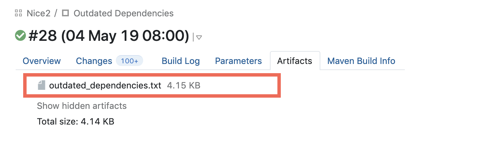

External Dependencies
=====================

Dependency management in root pom.xml
-------------------------------------

All external dependencies should be added to the ``<dependencyManagement>`` block in the root pom.xml. This way,
they can be managed in one single place which makes it much easier to keep them up to date.

Each dependency is added with the desired version number to the ``<dependencyManagement>`` block. Once defined there,
there is no version number needed in the dependency declaration in the actual module where the dependency is included.

Example
~~~~~~~

Imagine we need the dependency ``org.jsoup:jsoup`` in the module ``nice2-optional-address-impl``. We further assume,
that the current version of JSOUP is ``1.10.3``.

The dependency would be included as follows:

1. Add the dependency to the root pom.xml of the Nice2 project in the ``<dependencyManagement>`` block:

  .. code-block:: XML

   <dependencyManagement>
     ...
     <dependency>
       <groupId>org.jsoup</groupId>
       <artifactId>jsoup</artifactId>
       <version>1.10.3</version>
     </dependency>
     ...
   </dependencyManagement>

2. Include the dependency in the ``pom.xml`` of the ``nice2-optional-address-impl`` module (don't specify a version):

  .. code-block:: XML

   <dependencies>
     ...
     <dependency>
       <groupId>org.jsoup</groupId>
       <artifactId>jsoup</artifactId>
     </dependency>
     ...
   </dependencies>

.. hint::

   If you need to manage a set of dependencies which share the same version number, it makes sense to define a
   variable for that version number in the ``<properties>`` block in the root ``pom.xml`` which can be used for all
   dependencies in the ``<dependencyManagement>`` block.

.. _update_dependencies_on_a_regular_basis:

Update dependencies on a regular basis
--------------------------------------

It's important to keep all dependencies up to date. Therefore, there's a `weekly task in TeamCity`_ which generates a
list of all dependencies which are out of date. The task runs every Saturday.

.. _weekly task in TeamCity: https://tc.tocco.ch/viewType.html?buildTypeId=Nice2_OutdatedDependencies

The generated list containing all outdated dependencies can be found in ``outdated_depdencies.txt`` in the `Artifacts`
tab of the latest job run (see Screenshot below).

