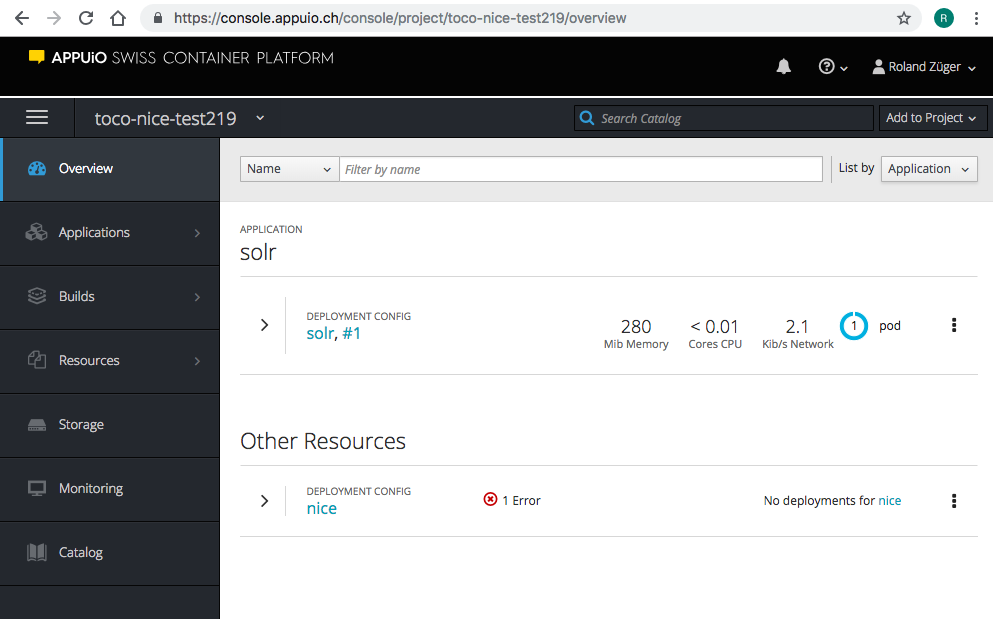
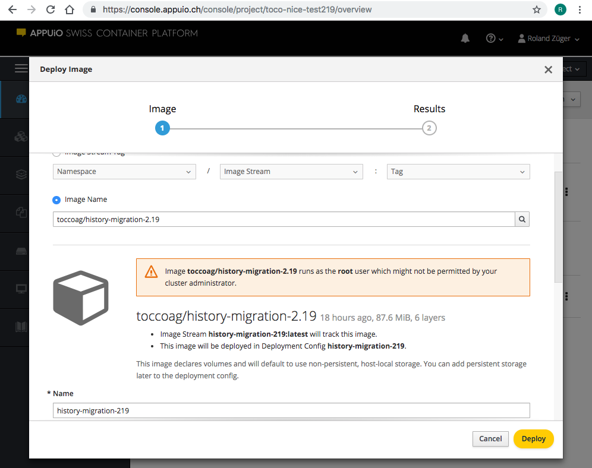
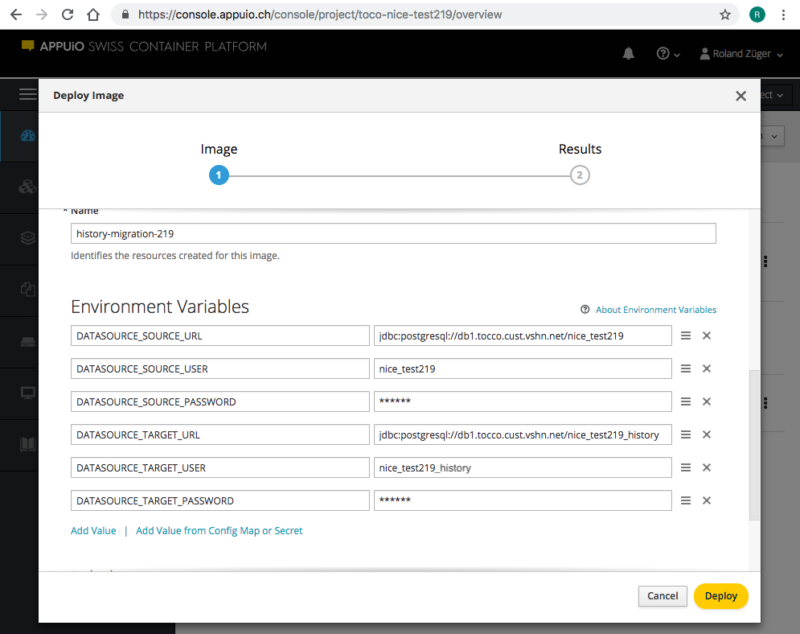

Migration to a dedicated data store (Nice v2.19)
================================================

Database initialization
-----------------------

The dedicated history database needs to be initialized before the migration.
This can be done either by running the :java:ref:`HistoryDataStoreFragment<ch.tocco.nice2.persist.history.impl.store.HistoryDataStoreFragment>`
or by manually executing these statements:

.. code:: sql

    CREATE TABLE nice_history_data (
        hash character(40) NOT NULL,
        data bytea NOT NULL,
        CONSTRAINT pk_nice_history_data PRIMARY KEY (hash)
    );

    CREATE TABLE nice_history (
        pk serial,
        username character varying(255) NOT NULL,
        ip_address character varying(255),
        insertion_time timestamp with time zone NOT NULL,
        hash character(40) NOT NULL REFERENCES nice_history_data(hash),
        entity_model character varying(255) NOT NULL,
        entity_key character varying(255) NOT NULL,
        operation character varying(255) NOT NULL,
        business_unit_id bigint,
        commit_id character varying(255) NOT NULL,
        CONSTRAINT pk_nice_history PRIMARY KEY (pk)
    );

    CREATE INDEX commit_id_idx ON nice_history (commit_id);
    CREATE INDEX model_key_idx ON nice_history (entity_model, entity_key);
    CREATE INDEX model_time_idx ON nice_history (entity_model, insertion_time desc);

Migration
---------

From version 2.19 onwards the entity history is persisted outside of the main database (in a second postgres database).
As the data volume is quite large and the migration takes a long time a dedicated `migration tool`_ has been
implemented.

.. _migration tool: https://git.tocco.ch/#/admin/projects/history-migration

There are several ways to run this tool:

- Check out the tool and run it locally
- Use the prebuilt Docker image which is published on ``toccoag/history-migration-2.19``

Check out the tool and run it locally
^^^^^^^^^^^^^^^^^^^^^^^^^^^^^^^^^^^^^

Check out the `migration tool project`_.

.. _migration tool project: https://git.tocco.ch/#/admin/projects/history-migration

An executable jar can be built using the following command on the root folder of the migration project:

.. parsed-literal::

    ./gradlew bootJar

The jar file is created in the ``build/libs`` directory.

In the next step a ``*.properties`` file should be created in the same directory as the jar file to configure
the two data sources:

.. parsed-literal::

    dataSource.source.url=jdbc:postgresql://${HOST_NAME}/${DATABASE_NAME}
    dataSource.source.user=${USER}
    dataSource.source.password=${PASSWORD}

    dataSource.target.url=jdbc:postgresql://${HOST_NAME}/${DATABASE_NAME}
    dataSource.target.user=${USER}
    dataSource.target.password=${PASSWORD}

The source database is the nice2 database that should be migrated. The target database is the (empty)
dedicated history database.

The migration can then be started in the following way:

.. parsed-literal::

    java -jar ${JAR_FILE_NAME} --spring.config.location=classpath:application.properties,${PROPERTIES_FILE_NAME}

The last parameter should point to the properties file created above.

The migration tool creates a new table in the target database to keep track of the progress of the migration.
The tool can be stopped at any time and will resume the unfinished migration when restarted. Ideally the
bulk of the history is migrated well before the actual migration.

The progress is written to the console and a log file in the ``logs`` sub directory. The primary key written
to the logs corresponds to the primary key of the ``nice_history_version`` table. The history version entities
are processed by primary key in ascending order (to facilitate simple resuming functionality).

After the nice installation has been upgraded to 2.19+ the migration tool should be run again to finish the migration.
The ``*.properties`` file created above should be amended with the following line:

.. parsed-literal::

    migration.drop.source.tables=true

This will cause the source tables to be dropped after the last entries (if any) have been migrated and completes
the history migration.

.. note::

    This drops the four ``nice_history_*`` tables. However the triggers which update the reference counters on the
    ``_nice_binary`` table are *not* executed this way (and executing a ``DELETE`` beforehand would be way too slow).
    Instead the reference counters are reset to -1 and need to be recalculated. The binaries itself are then removed by the batch job.

Use the prebuilt Docker image
^^^^^^^^^^^^^^^^^^^^^^^^^^^^^

There is a prebuilt Docker image available: ``toccoag/history-migration-2.19``

For Nice installations which run in our OpenShift cluster, the migration image can be run very easily.

Head over to the `APPUiO platform`_ and select the project of the installation to migrate.

.. _APPUiO platform: https://console.appuio.ch

    Detail page of the installation project (before the Docker image has been deployed)

Select **Add to Project** → **Deploy Image** in the top right corner and fill in the Image Name and the environment
variables as shown in the following screenshots. Please adjust the environment variables according to your current
project. Note that the environment variables correspond to the properties described in the chapter
`Check out the tool and run it locally`_ (simply written upper case and ``.`` replaced with ``_``).

Hit the **Deploy** button and switch to the Logs panel of the deployment to see what's happening inside the Docker
container.

Most probably you're going to run the migration a few days before the actual update of the Nice installation to
v2.19. Once this pre-migration has completed, scale down to 0 pods. Leave the deployed image there for the
after-migration, once the Nice installation has been updated to v2.19.

Once the Nice installation has been updated to v2.19, scale to 1 pod again to restart the migration. This time,
you can also set the additional environment variable ``MIGRATION_DROP_SOURCE_TABLES=true`` to automatically
delete the old tables after the migration (**Caution:** As the name of the variable states, the old history tables
really will be deleted. **Never** use this variable before the installation has been updated to v2.19).

.. note::

    If you'd like to build your own Docker image from the source code (see above), you can use the command
    ``./gradlew build docker`` in the project root directory.

.. note::

    If the installation you're migrating doesn't run in our OpenShift cluster, you can still use the prebuilt
    Docker image. Simply pull it from Docker hub and run it in your local Docker installation using the
    environment variables as shown above.
