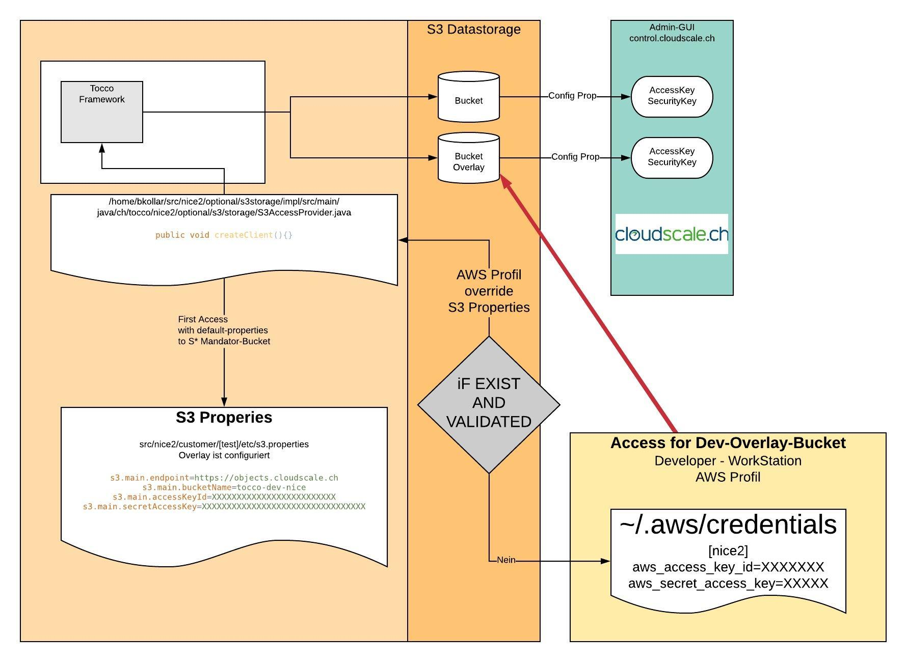

.. _s3_architecture:

Architecture
============

S3 Integration Diagram only for Developer
^^^^^^^^^^^^^^^^^^^^^^^^^^^^^^^^^^^^^^^^^

An overlay bucket is provided for the developers.
This prevents developers from writing data to the productive bucket during testing.

The S3 datastorage is created for Tocco with the following buckets.

1. A bucket for the client
2. A bucket for the developers, which is overwritten due to configuration.

S3 Integration details
^^^^^^^^^^^^^^^^^^^^^^

In the Tocco framework, the method ``createClient()`` is called from the file
src/nice2/optional/s3storage/impl/src/main/
java/ch/tocco/nice2/optional/s3/storage/S3AccessProvider.java


overrides the bucket for the overlay.

To get access to the overlay bucket, a valid credential-file must be located locally in the folder ``~/.aws``

.. note::
    Credentials from environment variables have precedence over
    credentials from the shared credentials and AWS CLI config file.
    Credentials specified in the shared credentials file have
    precedence over credentials in the AWS CLI config file.
    If AWS_PROFILE environment variable is set and the
    AWS_ACCESS_KEY_ID and AWS_SECRET_ACCESS_KEY environment variables are
    set, then the credentials provided by AWS_ACCESS_KEY_ID and AWS_SECRET_ACCESS_KEY
    will override the credentials located in the profile provided by AWS_PROFILE.

View the S3 Architecture :ref:`s3_properties`