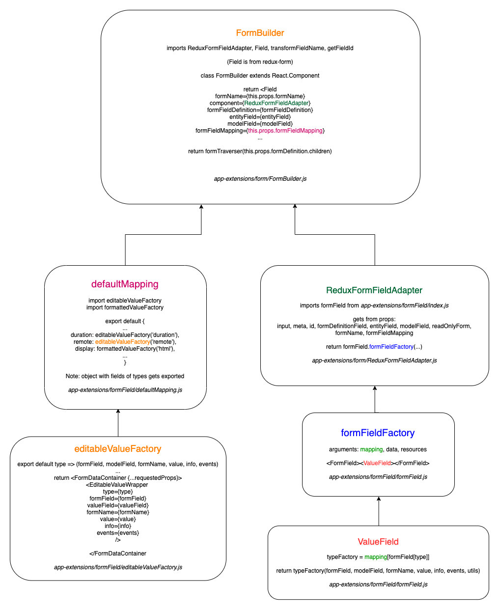

Form
=====

Introduction
-------------

  Forms such as detail or search in the tocco-client are an essential part. This documentation describes what main parts
  play together to make a form work. The three modules are formField, form and formData. Each of them are described by
  subfiles and components.

.. note::

  All the images were made with draw.io. You edit them by opening `draw.io <https://www.draw.io/>`_, downloading the corresponding
  :download:`xml file </_static/download/remote-field-form.xml>` and importing the xml file into draw.io.
  After you edited it export it as xml and png and replace it in _static/download and framework/client/resources respectively

formField
----------

  As the name indicates this module is all about the individual field in the form. What attributes, actions and components
  are behind each field is regulated here. I/O of data on the field level gets handled too.

  :download:`formField.xml </_static/download/formField.xml>`

  .. image:: ./resources/formField.png
    :width: 800
    :alt: formField

1. editableValueFactory
~~~~~~~~~~~~~~~~~~~~~~~~

  editableValueFactory allows to pass the type attributes of the different fields for all fields from one place. It
  provides the field with the requested props and gets the data from formField through the parent formField
  FormDataContainer (point 7).

  It returns the component ``<EditableValue>`` with these props:

  * type
  * value
  * info
  * events
  * options

2. formattedValueFactory
~~~~~~~~~~~~~~~~~~~~~~~~~~

  Analog to editableValueFactory for formatted values with only two props type and value.

3. defaultMapping
~~~~~~~~~~~~~~~~~~

  Here the types of form fields get mapped and exported as an object consisting of type string
  attributes and components as values. In this case values are often a call to editableValueFactory.
  This way it’s possible to map the same call to editableValueFactory multiple times and provide the same
  field to different types.

  Example:

  .. code::

    ‘longitude’: editableValueFactory(‘coordinate’),
    ‘latitude’: editableValueFactory(‘coordinate’)

4. FormFieldFactory
~~~~~~~~~~~~~~~~~~~~

  FormFieldFactory receives the mapping, data and resources by props to determine which field gets rendered. The information
  about the field and the data from FormDataContainer are passed to ``<ValueField/>`` which returns the specific field
  accessed through the mapping of the given type of the field.

5. typeEditables
~~~~~~~~~~~~~~~~~

  The typeEditables directory contains files for different field types like ‘remote’. The files contain methods to overwrite
  the default behaviour for each type. This can be done through methods that get the events, value and options or data for
  editableValueFactory. The data then is provided to each ``<EditableValue/>`` field.

form
-----

  This module regulates how the form gets put together. It processes the data from the backend and returns the requested
  form.

  :download:`form.xml </_static/download/form.xml>`

  .. image:: ./resources/form.png
    :width: 800
    :alt: form

6. FormBuilder
~~~~~~~~~~~~~~~

  The ``<FormBuilder/>`` component traverses through the formDefinition data to resolve how to render each element. It returns the
  form with ``<LayoutComponent/>`` elements, actions and ``<Field/>`` components provided by the third party library `redux-forms <https://redux-form.com/>`_.
  redux-forms requires to set the component prop to specify which component should be used to render the form field. To set
  the ``<Field/>`` prop component the ``<ReduxFormFieldAdapter/>`` is used (point 7).

7. ReduxFormFieldAdapter
~~~~~~~~~~~~~~~~~~~~~~~~~~

  The ``<ReduxFormFieldAdapter/>`` is the component that gets passed to ``<Field/>`` and returns a call to formFieldFactory (point 2).
  redux-forms allows to pass a factory as component prop. In addition to the props specific to the tocco-client other props from
  `redux-forms <https://redux-form.com/>`_ are passed as well. These props contain information about the state of the form e.g.
  if the form was edited or if the user already clicked on a field.

formData
---------

  This module handles the data from the redux-store. It serves as an intermediate layer between the store and the form.

  :download:`formData.xml </_static/download/formData.xml>`

  .. image:: ./resources/formData.png
    :width: 800
    :alt: formData

8. formData
~~~~~~~~~~~~~

  The formData parent directory contains the formData modules. Each module can have its actions, reducers, and sagas to handle
  the store data relating to data from the form.
  formData then adds the data and methods to the store.

  props:

  - relationEntities
  - tooltips
  - searchFilters
  - locations
  - formValues
  - isDirty
  - errors

  methods:

  - loadRelationEntities
  - loadTooltip
  - openAdvancedSearch
  - uploadDocument
  - changeFieldValue
  - touchField
  - loadSearchFilters
  - loadLocationsSuggestions

9. FormDataContainer
~~~~~~~~~~~~~~~~~~~~~

  The FormDataContainer connects the form components with the redux-store and provides them with data from the store
  state and actions from the formData parent directory modules. With the actions provided, the form components now can
  trigger the reducers to alter the redux-store state.

Example remote-field:
----------------------

 What parts play together to render a fully functional remote-field in the DetailForm app?

  1. In ``<DetailForm/>`` the ``<FormBuilder/>`` component (point 6) gets set. The data to set the props are provided by the redux-store
  through the corresponding DetailFormContainer which maps the mandatory data for the ``<FormBuilder/>`` to props. The required
  props for ``<FormBuilder/>`` are:

  - model
  - formName
  - formDefinition
  - formFieldMapping

  2. The prop formFieldMapping is set with defaultMapping (point 2). In defaultMappings exported object the call to
  editableValueFactory with type ‘remote’ is mapped to the string 'single-remote-field'.

  3. In editableValueFactory (point 1) the component ``<EditableValue>`` is returned with prop options from typeEditables remote
  (point 5).

  4. In ``<FormBuilder/>`` the props above are passed to the `redux-forms <https://redux-form.com/>`_
  ``<Field/>`` component. To set the ``<Field/>`` prop component the ``<ReduxFormFieldAdapter/>`` is used (point 4).

  5. In ``<ReduxFormFieldAdapter/>`` a call to formFieldFactory gets prepared with setting a formFieldData object such as
  formDefinitionField, modelField, entityField and props from the data provided by `redux-forms <https://redux-form.com/>`_
  such as dirty or touched. Then ``<ReduxFormFieldAdapter/>`` returns the call to formFieldFactory (point 7) with formFieldMapping
  and formFieldData as arguments.

  6. In ``<FormFieldFactory/>`` the ``<ValueField/>`` component gets returned and receives data provided by props.
  For the remote-field the prop modelField points to an entity where the remote-field gets its
  data from e.g. the User entity.

  :download:`this file </_static/download/remote-field-form.xml>`

