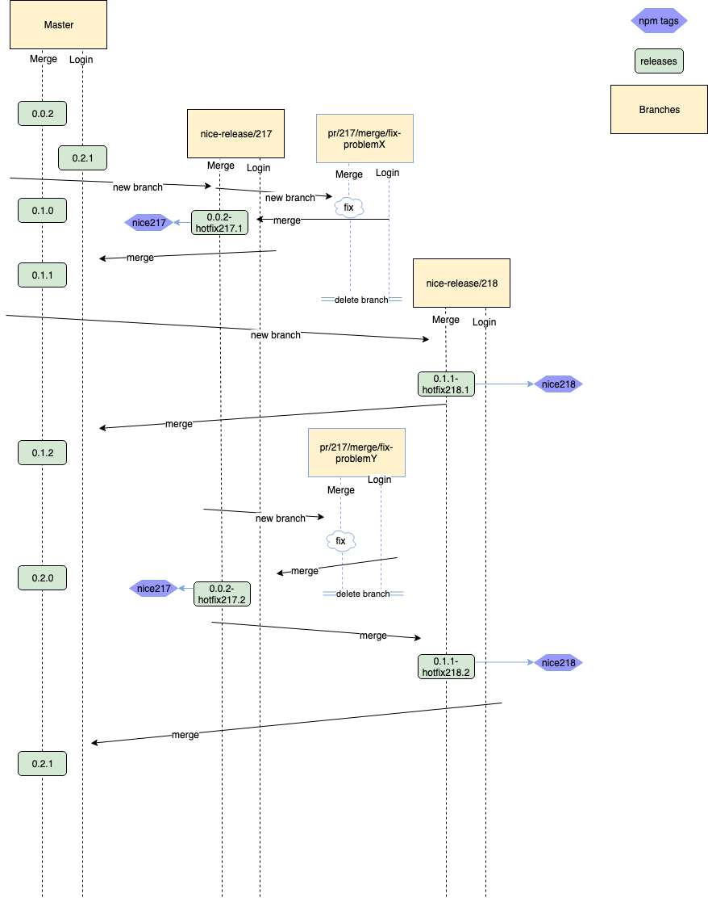

Releasing
=================

New Feature
-----------
New features will be developed in separate feature/pull-request branches. As soon as a feature is ready, a pull request is opened to rebase the feature into the master branch.
After a successful rebase the feature branch should be deleted. Only self-contained features should be rebased to master to keep master stable and packages always ready to be published.

A package will be released on master only. For more information on how to publish a package see the tocco-clients README_.

.. _README: https://github.com/tocco/tocco-client

Semantic Releases
~~~~~~~~~~~~~~~~~
A package version consists of three numbers MAJOR.MINOR.PATCH.

Increment as follows:

====== ============================
MAJOR  Will be zero for the moment
MINOR  If new features are added
PATCH  For bug fixes
====== ============================

Maintaining old versions
-------------------------
Older Nice versions are using older releases of client packages. If a critical bug is found in an older package we need to fix it in that version. It's not possible to just
fix the bug in master an install the newest package since that could lead to compatibility problems if for example the rest endpoint changes. Furthermore we dont want to
deploy all new features with the bug fix.

For each Nice release there is a release branch in the tocco-client repository. These release branches are protected and require commits to be submitted via a pull request.

.. warning::

    Release branches have to be created parallel to the Nice releases and have to be used strictly!

Bug fixing
~~~~~~~~~~~
So if a bug is found, let's say in Nice version 2.17, we have to fix this bug in 2.17, 2.18, ... and master.
Assumed it's a critical bug, otherwise it will just be fixed in master with a pull request branch.

#. Find out the oldest yet supported version of Nice that contains the package with the bug.
#. Create a fix branch based on the release branch (e.g. ``git checkout -b pr/217/login/bug nice-releases/217``)
#. Commit fix to branch. Preferably with a regression test to verify the fix.
#. Creating pull request, wait until approved and rebase into release branch.
#. Checkout release branch and publish the affected package. It's important to not increment the PATCH version for hotfixes in older versions. Chances are that this version already exists on a newer branch. Therefore a --hotfix has to added to the current version. For more info see `Naming`_ chapter.
#. Publish an npm tag for the version (e.g. ``npm dist-tag add tocco-login@1.0.2-hotfix217.1 nice217``. With this tag it's possible to change the Nice package.json to this tag instead of a specific version. New fixes will then automatically be installed.
#. Delete fix branch.
#. Merging release branch in next version and publish there as well. (this will hopefully be automated sometime)
#. Repeat until hotfix is no more relevant or the bug is fixed in newest version (master).

Example
~~~~~~~

   Bug fix release Example (Created with draw.io, source xml in resource folder)

This examples shows two packages (Merge and Login) each with an individual release program.

Performed actions:

- Minor releases in master branch (feature branch are not show in diagram)
- Bug fix with fix branches in older version of Nice.
- Npm Tags (latest tags of master releases not shown).

Naming
-------

============== ===========================================  ======
what            schema                                      example
============== ===========================================  ======
Feature Branch pr/package/description                       pr/login/loading-mask
Release Branch nice-releases/niceversion                    nice-releases/217
Fix Branch     pr/niceversion/package/descr                 pr/217/login/image-bug
Hotfix Release currentversion-hotfixVersion.HotFixNumber    1.0.2-hotfix217.2
Release Tag    niceVersion                                  nice215
============== ===========================================  ======
