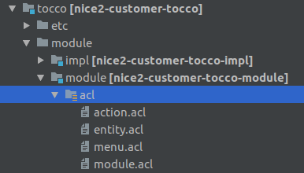
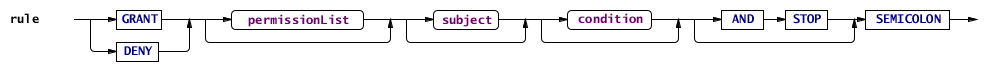

.. _acl:

ACL
===

``*.acl`` files are used to control access to certain resources (for example entities).

Folder structure
----------------

The files are contained in the ``acl`` folder of the ``module`` module:

.. figure:: resources/acl-folder-structure.png

The structure is slightly different for customer modules:

The main file that will be loaded is called ``module.acl``, but usually the ACL rules are split up
into different files (entity.acl, action.acl and so on).

.. note::

    When a new ``*.acl`` file is created it needs to be included into the ``module.acl`` file:

    .. code-block:: text

        include 'entity.acl';
        include 'action.acl';

The Access Control Language
---------------------------

For defining the access control rules, there is a language, called ACL (Access Control Language).
The top-level structure of this language is the section. A section defines the selector for the following rules,
until a new section is started. The section header looks like this:

.. code-block:: text

    entityManager(MyEntity):
      // the rules

The selector defines the security domain (in this example ``entityManager``) and the objects (in this example
the entity model ``MyEntity``) that are affected by the acl rules.

The following figure shows the syntax for the rules:

So, each rule starts with the keyword ``grant`` or ``deny``, optionally followed by a list of permissions, optionally
followed by the keyword ``to`` and a list of subjects (role name or '&' + principal name), optionally followed
by the keyword ``if`` and a condition (or ``unless`` and a condition, which is a shortcut for ``if not (...))`` and finally
terminated by a semicolon.

Optionally, a rule may end with ``and stop``, which declares a rule final. If a final rule applies,
processing of rules stops at this point.

Example:

.. code-block:: text

    entity(User):
        deny access(write) to usermanager if deleted and stop;

This rule applies to all ``User`` entities.

    * When ``grant`` is used access will allowed; when ``deny`` is used access will be forbidden if the rule matches
    * ``access(write)`` is the name of the permission. The different security domains offer different permissions.
    * ``to usermanager`` defines that the rule should only be applied to principals with a certain role.
    * ``if deleted`` is the condition. The rule is only applied if the secured objects matches the condition. Not every security domain supports conditions.
    * ``and stop`` marks this rule as final (see above).

.. note::
    All security features are disabled when the ``privileged()`` invoker of the :nice:`SecurityManager <ch/tocco/nice2/security/SecurityManager>`
    is used.

Keywords
^^^^^^^^

The following words are ACL keywords: ``grant``, ``deny``, ``include``, ``to``, ``if``, ``unless``, ``principal``, ``null``,
``true``, ``false``, ``or``, ``and``, ``not``, ``role``, ``implies``.
Also, the keyword ``permission`` is currently reserved, but unused.

Security domains
----------------

Different objects are secured with different :nice:`SecurityDomains <ch/tocco/nice2/security/spi/SecurityDomain>`. A security domain defines which permissions are
available and how or if conditions can be applied to a rule.

entityManager
^^^^^^^^^^^^^

The target of this domain is an :nice:`EntityModel <ch/tocco/nice2/persist/model/EntityModel>`.
It provides the ``create`` permission, which allows creating a new instance of an entity.
Conditions are not supported.

.. code-block:: text

    entityManager(User):
        grant create to usermanager;

This permission is checked when a new entity instance is created:

.. code-block:: java

    context.getEntityManager("User").create();

entity
^^^^^^

This domain controls the read and write access to persisted entities and provides the ``access`` and ``delete`` permissions.
The ``access`` permission takes an optional parameter to specify whether the rule targets read or write permission.
If no parameter is given both read and write permissions are affected.

For example this rule affects the write operation only:

.. code-block:: text

    entity(User):
        deny access(write);

.. note::

    The combinations ``deny access(read)`` and ``grant access(write)`` are not allowed, because it does not make
    sense to deny only read access (but allow write access) or to grant only write access (but deny read access).

.. _entity-conditions:

Conditions
..........

This domain supports conditions to restrict the affected entities with a TQL like syntax.
For example:

.. code-block:: text

    entity(User):
        deny access(write) if exists(relAddress) and enabled;

Using the keyword ``principal.user_id`` the primary key of the currently logged in user can
be used in the condition.

The keyword ``now`` specifies the current date/time. It's fields are actually operators which operate on that object.
These can be combined freely, e.g. ``now.yesterday.date`` means yesterday at 0.00.

The following "path elements" (operators) are available:

    * *date* Keep the date as-is, set the time to 0:00.
    * *time* Keep the time as-is, set the date to January 1st, 1970.
    * *tomorrow* Plus one day.
    * *yesterday* Minus one day.

The applicable conditions are added to every query for a given entity model, so that only readable
entities are returned from the database.

Updating relations
..................

When an entity is added to or removed from a :nice:`Relation <ch/tocco/nice2/persist/entity/Relation>` the
permissions of the *both* sides of the relation are combined:

    * ``GRANT`` + ``GRANT`` = ``GRANT``
    * ``GRANT`` + ``NO_RULE`` = ``GRANT``
    * ``GRANT`` + ``DENY`` = ``DENY``
    * ``NO_RULE`` + ``DENY`` = ``DENY``
    * ``NO_RULE`` + ``NO_RULE`` = ``NO_RULE``
    * ``DENY`` + ``DENY`` = ``DENY``

If the combined result is not ``GRANT`` the relation may not be changed.

This has the following implications:

    * A relation may be updated through its reverse side unless there is an explicit ``DENY`` rule.
    * For new entities ``GRANT`` is assumed, so new entities may always be added to a relation unless there is an explicit ``DENY`` rule.

.. note::

    The rules of this security domain do not affect entities which are in state ``CONCEPTION.``

entityPath
^^^^^^^^^^

The ``entityPath`` domain is related to the ``entity`` domain as it also affects entity instances and provides the same
``access`` permission (but no ``delete`` permission).
But while the latter affects entities as a whole, the former affects access to single fields or relations of an entity.

The same :ref:`entity-conditions` are supported as for the ``entity`` domain (obviously referencing the
entity containing the field and not the field itself).

.. code-block:: text

    entityPath(User, email):
        deny access(write);

This denies write access only to a single field of an entity (*email* in this case).

These rules are checked whenever ``getValue()`` or ``setValue()`` (or a similar method like ``getString()``) is
called on the :nice:`Entity <ch/tocco/nice2/persist/entity/Entity>`.

.. note::
    When a user has been granted access to an entity (through the ``entity`` security domain) and there are no
    specific rules for a field, the entity rules are also applicable for the field.

    Otherwise the two security domains are evaluated independently and the ``entityPath`` domain can override the
    rules of the ``entity`` domain for specific fields.

Additional domains
^^^^^^^^^^^^^^^^^^

adminMenu
.........

Controls the visibility of menu items in the admin menu:

.. code-block:: text

    adminMenu(settings,
                settings-address,
                    settings-address-address,
                        settings-address-address-region):
        grant display to configurator;

netuiactions
............

Controls whether actions may be executed:

.. code-block:: text

    netuiactions("nice2.businessunit.CopyBusinessUnitValuesAction"):
        grant netuiPerform to configurator;

infoBoxes
.........

Controls to whom infoboxes are displayed on the home page:

.. code-block:: text

    infoBoxes(welcomebox, sysreqinfobox, securityinfobox):
        grant boxDisplay;

reports
.......

Controls whether a specific report may be generated:

.. code-block:: text

    reports("report.schooling"):
        grant generateReport to eventmanager, eventguest;

Policy
------

All ACL rules are compiled into a security :nice:`Policy <ch/tocco/nice2/security/Policy>`.
The rules are applied in the order they were defined in the ``*.acl`` files (and depending on module
dependencies). So it is always possible to override an earlier rule (unless ``and stop`` was defined
on a rule).

Because the full policy (stored in the :nice:`SecurityManager <ch/tocco/nice2/security/SecurityManager>`) for all possible principals and all possible objects may get very big for a full-scale application,
this policy will be reduced whenever possible. There are two points, where some important facts get known that allow to filter out rules that won't apply anyway:

    * After login, the exact principal is known. At this point, a new policy will be generated for that user (stored in the :nice:`SecurityContext <ch/tocco/nice2/security/SecurityContext>`) that doesn't contain any rules anymore that don't affect that principal.
    * When a guard is needed, the exact object is known. At this point, all rules that don't affect this object will be filtered out using the selector (stored in the :nice:`Guard <ch/tocco/nice2/security/Guard>`).

Therefore, in practice, the policy for a concrete object will finally be relatively compact.

Checking permissions manually
-----------------------------

Normally the permissions are checked automatically when querying or updating data. But sometimes it is necessary
to check permissions manually. This can be done by obtaining a :nice:`Guard <ch/tocco/nice2/security/Guard>` from
the :nice:`SecurityContext <ch/tocco/nice2/security/SecurityContext>`.
The :nice:`Guard <ch/tocco/nice2/security/Guard>` instance can then be used to evaluate permissions.

