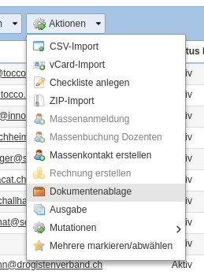
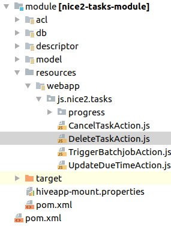
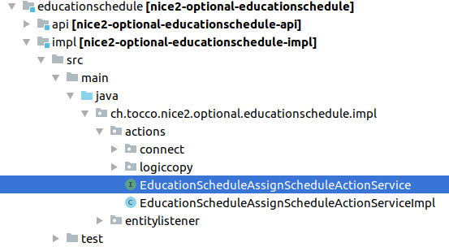

.. _DWR: https://en.wikipedia.org/wiki/DWR_(Java)

.. _ExtJs: https://docs.sencha.com/extjs/3.4.0/

.. _Collections: https://docs.oracle.com/javase/8/docs/api/?java/util/Collections.html

.. _Actions:

Actions
=======

Actions may be used to add custom functionality to list or detail pages. Actions are created in Java-Script by extending the ``AbstractEntityExplorerAction``.
Most actions communicate with the backend using DWR Java Services.

Actions are usually part of the "Actions" menu of the respective form.

The following components are commonly used in ExtJs actions.

* JavaScript_ that will be executed when the action is executed
* DWR-Service_ that is used to interact with the java backend
* Form_ amendment to define where the action is displayed
* ACL_ to define who may use this action
* hivemodule contributions to register javascript and dwr serivces

JavaScript
----------

Actions are written in ExtJs_ javascript. The action javascript will usually be stored in the ``resources/webapp/js`` folder
in the module description.

Every javascript file needs to be registered in ``hivemodule.xml`` to be loaded.

.. code-block:: xml

   <contribution configuration-id="nice2.web.core.JavaScripts">
     <javascript source="[#self]/webapp/js/nice2/optional/test/actions/TestAction.js" package="nice2.optional.test"/>
   </contribution>

Please find below an example of a simple JavaScript action that calls a dwr service to process the selection.

.. code-block:: javascript

   Ext.ns('nice2.optional.test');
   nice2.optional.test.TestAction = Ext.extend(nice2.modules.entityExplorer2.actions.AbstractEntityExplorerAction, {
       _doPerform: function() {
           this.requireSingleSelection();
           nice2.netui.dwr.RemoteService.call({
               remoteService: 'nice2_optional_test_TestService',
               method: 'testMethod',
               args: [ this.getSelection() ],
               mask: false,
               scope: this,
               successMessage: getText('actions.test.TestAction.success'),
               success: Ext.emptyFn
           });
       }
   });
   NetuiActionRegistry.register('nice2.optional.test.TestAction', nice2.optional.test.TestAction);

``AbstractEntityExplorerAction`` contains various utility functions that may be used when creating an action:

* ``getSelection()`` returns the current selection. This selection may directly be sent to a DWR service
* ``requireSingleSelection()`` this method may be called to evaluate the selection. If not exactly one entity is selected, an error will be shown.
* ``requireSingleOrNoSelection()`` requires the selection to be 0 or 1 entity
* ``requireSelectionWithMaximum(max)`` requires the selection to be between ``0`` and ``max`` entities
* ``requireSingleOrUpToMaxSelection(max)`` requires the selection to be between ``1`` and ``max`` entities
* ``createAutoHeightWindow()`` can be used to create an extjs window
* ``createFormWindow()`` can be used to create an extjs window that renders a form

.. _DWR-Service:

DWR-Communication
-----------------

DWR_ is used to connect the ExtJs_ frontend with our java backend. If an action requires any backend interaction, i.e. if any
data should be checked or amended, it will be done using DWR.

Java-Script
^^^^^^^^^^^

Accessing DWR services in javascript may be done using the ``nice2.netui.dwr.RemoteService.call`` method as followed.

.. code-block:: javascript

   nice2.netui.dwr.RemoteService.call({
       remoteService: 'nice2_optional_test_TestService',
       method: 'testMethod',
       args: [ this.getSelection() ],
       mask: false,
       scope: this,
       successMessage: getText('actions.test.TestAction.success'),
       success: function(response) {

       }
   });

In this example the method ``testMethod`` of the DWR Service ``nice2_optional_test_TestService`` is called with the current
selection as parameter.

Java
^^^^

If a DWR service is created exclusively to be called from an action, it usually will be created in an ``actions`` package. To
create a DWR service the methods to be called must be defined in an interface and its implementation is usually in a correspondening
``Impl`` class right next to it.

Please find below a minimal example with a method that takes a selection and returns a string

**Interface:**

.. code-block:: java

   public interface TestActionService {
       String testDwrMethod(EntityExplorerActionSelection selection);
   }

**Implementation:**

.. code-block:: java

   public class TestActionServiceImpl implements TestActionService {
       private final EntityExplorerActionSelectionService selectionService;

       public TestActionServiceImpl(EntityExplorerActionSelectionService selectionService) {
           this.selectionService = selectionService;
       }

       @Override
       String testDwrMethod(EntityExplorerActionSelection selection) {
           EntityList entities = selectionService.getSelectionEntityList(selection);
           //method content
           return "Test";
       }
   }

**hivemodule.xml registration**

In ``hivemodule.xml`` a service point as well as a contribution to ``nice2.netui.RemoteServices`` is required.

.. code-block:: xml

   <service-point id="TestActionService" interface="ch.tocco.nice2.optional.test.impl.actions.TestActionService">
     <invoke-factory>
       <construct class="ch.tocco.nice2.optional.test.impl.actions.TestActionServiceImpl"/>
     </invoke-factory>
   </service-point>
   <contribution configuration-id="nice2.netui.RemoteServices">
     <remote-service service-id="TestActionService"/>
   </contribution>

Data-Types
^^^^^^^^^^
DWR by default only supports basic Data-Types e.g ``String``, ``int`` or ``long`` and simple Collections_ of those. This means
that for example ``Entity`` objects cannot be passed as a return value to the ExtJs frontend. If a method needs to return multiple
values (e.g. multiple fields of an entitiy) ``Maps`` are commonly used.

.. warning::

   An outbound java ``List`` will be converted to a javascript array. An inbound javascript array will be converted to a java array.
   Return values of dwr methods can be ``Collections``, parameters can only be simple types, custom beans or arrays of those.

.. code-block:: java

   @Override
   Map<String, String> testDwrMethod(String[] params) {
       //method content
       return null
   }

Custom Beans
^^^^^^^^^^^^
If an object of multiple values needs to be passed to the frontend or from the frontend to a DWR service this can be achieved
by creating a custom bean. These beans are simple pojo beans that are registered respectively in the ``hivemodule.xml``.

**Java Bean**

.. code-block:: java

   public class MembershipBean {
       private String key;
       private String email;
       private String currentUserKey;

       public String getKey() {
           return key;
       }

       public void setKey(String key) {
           this.key = key;
       }

       public String getEmail() {
           return email;
       }

       public void setEmail(String email) {
           this.email = email;
       }

       public String getCurrentUserKey() {
           return currentUserKey;
       }

       public void setCurrentUserKey(String currentUserKey) {
           this.currentUserKey = currentUserKey;
       }
   }

**hivemodule.xml registration**

In ``hivemodule.xml`` a converter needs to be registered.

* **class-pattern:** the java class that should be converted
* **implementation:** the converter to be used. ``org.directwebremoting.convert.BeanConverter`` can be used for all simple bean conversions
* **javascript:** the javascript "class" to be associated with the configured bean

.. code-block:: xml

   <contribution configuration-id="nice2.netui.Converters">
     <converter class-pattern="ch.tocco.nice2.customer.sps.impl.actions.MembershipBean"
                implementation="instance:org.directwebremoting.convert.BeanConverter,javascript=nice2.customer.sps.MembershipBean"/>
   </contribution>

**Bean in JavaScript**

.. code-block:: javascript

   var bean = new nice2.customer.sps.MembershipBean();
   Ext.apply(bean, {
       key: recipient.key,
       email: recipient.email,
       currentUserKey: recipient.currentUserKey
   });

.. _Form:

Standard-Integration
--------------------

Adding an action to a form.xml is as easy defining a new ``<action>`` in the corresponding action group (usually ``actiongroup_actions``)

.. code-block:: xml

   <action name="actiongroup_actions" label="actiongroup.actions" icon="cog_go">
     <action path="nice2.optional.test.TestAction" label="actions.test_action.title" icon="email_open"/>
   </action>

* **path** the path of the action. corresponds with the service point.
* **label** The label of this action (textresource key).
* **icon** the icon of the action.
* **group** the action group to put this action in.
* **default** a default action can be defined for a group. If defined, the group will be displayed as split button where this action is directly executable and the other actions in the group will be displayed in the dropdown menu.
* **showConfirmMessage** if ``true``, a confirmation box will be displayed before the action is executed.
* **confirmationText** the text resource key for the text of the confirmation box. Only will be considered if the ``showConfirmationMessage`` attribute is set to ``true``.

ACL
---

To grant access to a created action, a ``netuiactions`` acl rule has to be created in the ``action.acl`` file. If no
``action.acl`` exists it may be created and added to the ``module.acl`` (``include 'action.acl';``).

.. code-block:: text

   netuiactions("nice2.optional.test.TestAction"):
       grant netuiPerform to configurator;

ActionFactories
---------------

If an action needs to be dynamically added to multiple forms, if it needs to be added to each row or if you need to overwrite
a standard action (e.g. ``New``) custom ``ActionFactories`` may be created as shown below.

.. code-block:: java

   /**
    * create action to mark entity and display mark on detail
    */
   public class SingleMarkActionFactory extends AbstractActionFactory {

       private final Context ctx;

       public SingleMarkActionFactory(@NotNull ActionsBuilder actionBuilder,
                                      @NotNull Context ctx) {
           super(actionBuilder);
           this.ctx = ctx;
       }

       /**
        * Create a new {@link ch.tocco.nice2.netui.actions.ActionGroupModel} for the specified situation.
        *
        * @return <code>null</code> if this factory provides no actions for this situation.
        */
       @Override
       public Collection<ActionModel> createActions(@NotNull Situation situation) {
           try {
               if(and(instanceOf(EntityNameSituation.class), not(isScreen("explorer-modal"))).apply(situation)) {
                   EntityManager markEM = ctx.getEntityManager(((EntityNameSituation) situation).getEntityName());
                   NiceEntityModel markEntityModel = (NiceEntityModel) markEM.getModel();
                   if (markEntityModel != null && markEntityModel.isMarkable()) {
                       if (isScope("update").apply(situation) && situation instanceof EntitySituation) {
                           String icon;
                           Entity entity = markEM.get(PrimaryKey.createPrimary(markEntityModel, ((EntitySituation) situation).getPrimaryKey()));
                           if(!entity.resolve("relMark").execute().isEmpty()) {
                               icon = "star";
                           } else {
                               icon = "star_grey";
                           }
                           ActionModel markAction = actionBuilder.newAction("nice2.marking.MarkSingleAction", "nice2.marking.MarkSingleAction");
                           markAction.setEnabled(true);
                           markAction.setIcon(icon);
                           markAction.setShortDescription("actions.mark.markBox");
                           markAction.setName("");
                           return asCollection(markAction);
                       } else if (isScope("list").apply(situation)) {
                           ActionGroupModel actionGroupModel = actionBuilder.getNiceGroup(ActionsBuilder.NiceGroup.ACTIONS);
                           ActionModel markMultipleAction = actionBuilder.newAction("nice2.marking.MarkMultipleAction", "actions.marking.MarkMultipleAction");
                           markMultipleAction.setEnabled(true);
                           markMultipleAction.setIcon("star_half_grey");
                           actionGroupModel.addAction(markMultipleAction);
                           return asCollection(actionGroupModel);
                       }
                   }
               }
           } catch(PersistException e) {
               return null;
           }
           return null;
       }
   }

.. code-block:: xml

   <service-point id="SingleMarkActionFactory" interface="ch.tocco.nice2.netui.spi.actions.ActionFactory">
     <invoke-factory>
       <construct class="ch.tocco.nice2.marking.impl.action.SingleMarkActionFactory"/>
     </invoke-factory>
   </service-point>
   <contribution configuration-id="nice2.netui.ActionFactories">
     <action-factory id="markingAction" factory="service:SingleMarkActionFactory"/>
   </contribution>

Dependencies
------------

hivemodule.xml
^^^^^^^^^^^^^^
In the ``hivemodule.xml`` of the module containing the action, the following amendments are required to run actions.

**Imports:**

.. code-block:: xml

   <contribution configuration-id="hiveapp.ClassLoader">
     <import feature="ch.tocco.nice2.model.entity" version="*"/>
     <import feature="ch.tocco.nice2.persist" version="*"/>
     <import feature="ch.tocco.nice2.netui.bind" version="*"/>
     <import feature="ch.tocco.nice2.netui.spi.bind" version="*"/>
     <import feature="ch.tocco.nice2.netui.actions" version="*"/>
   </contribution>

**Java-Script:**

The following contribution enables backend javascript for this module.

.. code-block:: xml

   <contribution configuration-id="nice2.web.core.JavaScriptModules">
     <module name="nice2-admin">
       <package name="nice2.optional.test"/>
     </module>
   </contribution>

pom.xml
^^^^^^^
In the impl ``pom.xml`` of the module containing the action, the following dependencies are required to compile DWR services.

.. code-block:: xml

   <dependency>
     <groupId>ch.tocco.nice2.persist.core</groupId>
     <artifactId>nice2-persist-core-api</artifactId>
     <version>${project.version}</version>
     <type>jar</type>
     <scope>provided</scope>
   </dependency>
   <dependency>
     <groupId>ch.tocco.nice2.model.entity</groupId>
     <artifactId>nice2-model-entity-api</artifactId>
     <version>${project.version}</version>
     <type>jar</type>
     <scope>provided</scope>
   </dependency>
   <dependency>
     <groupId>ch.tocco.nice2.netui</groupId>
     <artifactId>nice2-netui-api</artifactId>
     <version>${project.version}</version>
     <type>jar</type>
     <scope>provided</scope>
   </dependency>
   <dependency>
     <groupId>ch.tocco.nice2.netui</groupId>
     <artifactId>nice2-netui-spi</artifactId>
     <version>${project.version}</version>
     <type>jar</type>
     <scope>provided</scope>
   </dependency>

How to enable legacy actions in the new client
----------------------------------------------

Legacy actions are not enabled by default in the new client.

Set the application property ``nice2.forms.legacyActionsEnabled=true`` to enable them.

If legacy actions are enabled, disable specific legacy actions by adding them to the configuration point
``nice2.model.form.DisabledLegacyActions`` (e.g. once they've been reimplemented with React).

Customer legacy actions aren't enabled automatically even if ``nice2.forms.legacyActionsEnabled=true`` is set.
You need to whitelist them **additionally** to the application property via the configuration point
``nice2.model.form.EnabledCustomerLegacyActions``.
