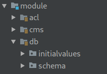
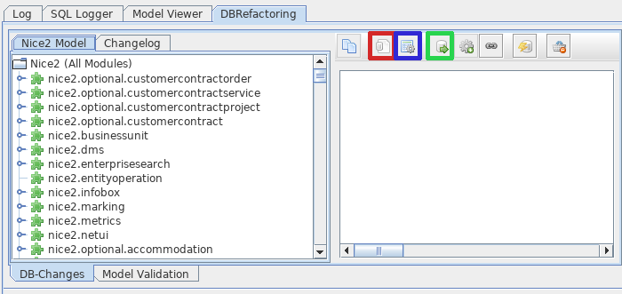
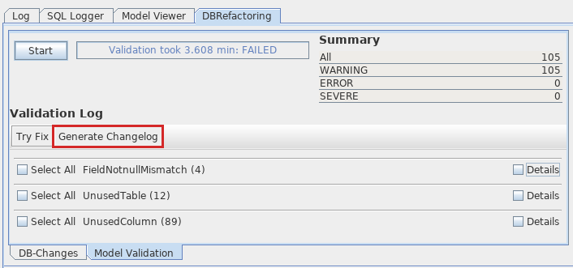

Changesets
==========

We use Liquibase_ to create our database, adjust the database schema, insert initial values and adjust existing records.
Liquibase runs so called changelog files. These are versioned XML files and they contain all instructions necessary for
a database to be created or updated.

.. warning::

    While initial values used to be handled through Liquibase, we have since decided to switch to storing the initial
    values in separate files. These provide a more consistent way of defining initial values at any given point in time.
    All functionality in this documentation about initial value changesets still work, but should not be used anymore.
    See :ref:`InitialValues` for further information.

The `Liquibase documentation`_ provides details on all its capabilities, although most parts of the changelogs can be
created automatically (see `Automatic creation`_).

Format
------

The smallest possible changelog file, without any actual changesets in it, contains the following lines.

.. code-block:: xml

    <?xml version="1.0" encoding="UTF-8"?>
    <databaseChangeLog xmlns="http://www.liquibase.org/xml/ns/dbchangelog"
                       xmlns:xsi="http://www.w3.org/2001/XMLSchema-instance"
                       xsi:schemaLocation="http://www.liquibase.org/xml/ns/dbchangelog http://www.liquibase.org/xml/ns/dbchangelog/dbchangelog-2.0.xsd">
        <!-- changesets go here -->
    </databaseChangeLog>

Any number of changesets can then be added to this changelog, but they should generally
pertain to roughly the same topic. A changeset always needs to contain its author, an id (see Changeset-ID_),
a context (see Context_), a precondition (see Preconditions_) and some actual instructions to run.

.. code-block:: xml

    <changeSet author="ln" dbms="postgresql" id="example_changeset/1.2.3.4">
        <preConditions onFail="MARK_RAN">
            <sqlCheck expectedResult="0">
                SELECT count(*)
                FROM some_table
            </sqlCheck>
        </preConditions>
        <insert tableName="some_table">
            <column name="a_column" value="value"/>
        </insert>
    </changeSet>

See Examples_ for complete real life examples.

File locations
^^^^^^^^^^^^^^

Changelog files are stored under ``<path of module>/module/db`` in one of the folders ``initialvalues`` or ``schema``.

As the name suggests, ``schema`` contains all changelogs that change the database schema (creating tables, altering
constraints, removing columns, etc.), while ``initialvalues`` contains all changelogs that work with the data itself.

Filename
^^^^^^^^

The name of a changelog file consists of the version (as specified in the ``current-version.txt`` file in the
repository) the changelog will be run in, a name that describes the work the changesets do and the ending ``.xml``, all
separated by underscores. Examples of a good filename would be ``2.12.2_add_peer_mail_fks.xml`` or
``2.4.50_change_education_amount_to_duration.xml``.

Changeset-ID
^^^^^^^^^^^^

Each changeset in a changelog must have an id that is unique in its module, although it is preferred if the id is unique
in the entire repository.

The id must end with the version the changeset should be run in. In contrast to the version
from the filename, the id can have more detailed sub-versions so ensure the order the changesets are run in, e.g.
``2.4.5.2`` instead of just ``2.4.5``. The first three sub-versions will generally match the version from the filename,
although any version can be used when needed for special cases.

The part of the id in front of the version can be any alpha-numerical text. It needs to be separated from the version
by a slash and should not be overly long. Examples of good ids would be ``changeFieldTypeFromTimeToLong/2.4.50`` or
``add_fk_column_fk_email_template_invitation_peer-l9URpWVvvJO/2.12.2.0``.

Context
^^^^^^^

While a context is not actually necessary to run changesets, we use them to order our changesets in a given version.
It is therefore always necessary to think about the context of a changeset. We use 2 different contexts,
``schemaDefinition`` and ``schemaConstraints``, with the absence of a context signifying a changeset that works with
data instead of the schema. When running the changesets for a version, all changesets with the context
``schemaDefinition`` are run first, then those without a context, then those with ``schemaConstraints``. As an example,
this allows the creation of non-nullable columns in existing tables, by creating the column in ``schemaDefinition``,
filling it with some data, and then only setting the NOT NULL constraint in ``schemaConstraints``.

Preconditions
^^^^^^^^^^^^^

Each changeset needs to contain a precondition that only allows the changeset to run when it is actually able to finish
correctly, for instance checking that a column does not exist before adding it or asserting that a unique value is only
inserted if it does not exist yet. These preconditions should always be marked as ``onFail="MARK_RAN"`` so they do not
interrupt our deployments.

File resources in changesets
^^^^^^^^^^^^^^^^^^^^^^^^^^^^

There are moments when we need to write files to the database as initial values (mostly used to upload images used in
report generation). This can be done by creating a changeset in version ``9.9.9.9`` (since the rest of the database must
must be up to date for the DMS services to work) and using the custom change
:nice:`AddEntityDocChange <ch/tocco/nice2/dbrefactoring/impl/liquibase/AddEntityDocChange>`. This custom change
then uploads the file to the DMS and sets the hash on the given entity.

Working with Liquibase
----------------------

Running changesets
^^^^^^^^^^^^^^^^^^

Changeset usually only run once against a single database. A hash is generated from the changeset, and if it ever
changes Liquibase will throw an error. This can be circumvented by marking a changeset with ``runOnChange="true"``,
which is necessary for changesets that might actually change (like localized columns which get added once for each
installed language), but should otherwise be avoided.

Changesets can be run in one of three ways.

Custom changelog (DevCon)
    Press the button ``Apply custom changelog`` (highlighted in red). Run a single changelog by copying it into the text
    area that opens up.

Changelogs of modules from a version on (DevCon)
    Select the modules you want to run the changesets for on the left. Press the button ``Install Module(s)``
    (highlighted in green). Run all changelogs from the version that you enter (no version means running all versions).
    Additionally, with this action you can define which fragments (see InstallFragment_) should run. Do not deactivate
    ``SchemaUpgradeFragment``, that's the fragment that actually runs changesets.

All changesets
    Setup Nice2 to run in update mode (``-Dch.tocco.nice2.runenv=update``). The system will then start and run all
    changelogs from all modules.

Automatic creation
^^^^^^^^^^^^^^^^^^

Writing changesets by hand can be tedious work. The better way to create changesets is to adjust the model however you
want (see :doc:`entities-relations`) and then let the changesets be generated.

The DevCon will show you any differences between the data model and the actual tables and columns in the database.
From there you can select all changes you'd like to generate changesets for and press the ``Generate Changelog``
button (highlighted in red).

This does not work for a few changes, such as:

* renaming a column (generated changesets will just drop the old column and create a new one)
* changing a relation from multi to single or the other way around (data will not be migrated automatically)
* migrating data when changing the data type to something that postgres can't handle by itself

Whatever you do, always check the generated changesets for their correctness and check the result after running them.

Additionally, you can create changesets for initial values by evaluation a TQL query by pressing the
button ``Initial Values for Query`` (highlighted in blue) in the tab seen in the `Running changesets`_ image.

History of ran changesets
^^^^^^^^^^^^^^^^^^^^^^^^^

It is possible to see what changesets have already ran against a database by checking the ``databasechangelog`` table.
By looking for a record where the ``id`` column starts with the id of a changeset we can see if it was ever ran against
the database. The column ``exectype`` either contains ``EXECUTED``, for changesets that were actually ran, or
``MARK_RAN``, for changesets that failed their precondition.

Tocco-specific extensions
-------------------------

ChangesetNodeProcessor
^^^^^^^^^^^^^^^^^^^^^^

These processors run against the changesets when they're being run. They can add new tags, remove unnecessary ones and
do whatever's deemed necessary.

* ApplyRunOnChangeProcessor
    marks all changesets, that have any columns with the remark ``localized``, with ``runOnChange="true"``
* DuplicateLanguagesProcessor
    duplicates any columns with the remark ``localized`` for each installed language
* ExtendLocalizedValuesProcessor
    checks if an insert or update statement on localized columns are missing values for installed languages and copies
    the value of an existing language so it has some value to use.
* KeepDefaultLangProcessor
    removes any drop column instructions that would drop the default language if it has the remark ``nodefault``
* LocalizedColumnNameProcessor
    updates any localized column names so they contain their language identifier
* PreconditionProcessor
    tries to generate a precondition if none exists yet by looking for identifier columns
* RemoveLanguagesProcessor
    removes any column definition for languages that are not installed
* RemoveRemarksProcessor
    removes any remarks from all changesets after they've been handled
* VersionContextProcessor
    adds version to context

CustomTaskChange
^^^^^^^^^^^^^^^^

Custom changes can be used in changesets to call some java logic with parameters. Check their JavaDoc for exact
information on what arguments each uses.

* AddEntityDocChange
    used to upload binaries and attach them to an entity
* CopyToBusinessUnitChange
    copies entities between business units
* LocalizeFieldChange
    used to localize a column after it has been created
* MigrateLocalizedEntityChange
    copy localized entities between tables
* RunFragmentChange
    run a InstallFragment_
* SingleToMultiRelationChange
    migrates data from a single relation to a multi relation, it does not create the n:n table
* UpdateLocalizedFieldChange
    updates a localized column

AbstractPrecondition
^^^^^^^^^^^^^^^^^^^^

These are customized preconditions written in java.

* ImprovedForeignKeyExistsPrecondition
    a replacement for the foreignKeyConstraintExists precondition that is optimized for postgres

InstallFragment
^^^^^^^^^^^^^^^

Fragments are some java logic that runs database commands. These are usually things that need to run before or after
all the changesets, for instance creating business units or fixing counters.

* AddContentReferenceSourceFksFragment
    add foreign key columns to Content_reference_source to entity models that have at least one html field
* AddDmsFksFragment
    add foreign key columns needed for entity doc relations
* AddForeignKeyIndexFragment
    creates indexes for all foreign keys
* AddOrderColumnIndexFragment
    creates index for each model on its update timestamp field
* BinaryFkFragment
    creates a foreign key to the binary table for each field of type binary
* CreateBusinessUnitFragment
    creates business units as defined in application.properties
* CreateEntityFoldersFragment
    creates empty folders to store entity docs in for each entity
* FixCountersFragment
    resets all counter entities
* LinkAdminRolesFragment
    links all manager roles to the tocco principal
* RenameDefaultLanguageColumns
    renames all localized columns that do not yet have a language identifier so they belong to the default language
    (e.g. ``label`` to ``label_de``)
* SchemaUpgradeFragment
    run changesets
* UpgradeLanguageFragment
    attempts to install a new language by running changesets

Others
^^^^^^

* BusinessUnitChangelogPostProcessor
    copies a changeset marked with ``runForEachBu="true"`` for each business unit and replaces any occurrence of
    ``%BUSINESS_UNIT%`` with the unique id of the business unit it is copying to

Examples
--------

Create a table
^^^^^^^^^^^^^^

.. code-block:: xml

  <!-- add table -->
  <changeSet author="lz" context="schemaDefinition" dbms="postgresql" id="init_schema_definition/2.5.61">
    <preConditions onFail="MARK_RAN">
      <not>
        <tableExists tableName="nice_event_source"/>
      </not>
    </preConditions>
    <createTable tableName="nice_event_source">
      <column name="_nice_version" type="bigint"/>
      <column name="_nice_create_timestamp" type="timestamp with time zone"/>
      <column name="_nice_update_timestamp" type="timestamp with time zone"/>
      <column name="_nice_create_user" type="VARCHAR(255)"/>
      <column name="_nice_update_user" type="VARCHAR(255)"/>
      <column name="unique_id" remarks="identifier" type="VARCHAR(255)"/>
      <column name="sorting" type="int"/>
      <column name="label" remarks="localized" type="VARCHAR(255)"/>
      <column name="pk" type="bigserial">
        <constraints primaryKey="true"/>
      </column>
    </createTable>
  </changeSet>

  <!-- add constraints -->
  <changeSet author="lz" context="schemaConstraints" dbms="postgresql" id="init_constr/2.5.61" runOnChange="true">
    <preConditions onFail="MARK_RAN">
      <not>
        <foreignKeyConstraintExists foreignKeyName="nice_event_fk_event_source_fkey" foreignKeyTableName="nice_event"/>
      </not>
    </preConditions>
    <addForeignKeyConstraint baseColumnNames="fk_event_source" baseTableName="nice_event" constraintName="nice_event_fk_event_source_fkey" onDelete="RESTRICT" referencedColumnNames="pk" referencedTableName="nice_event_source"/>
    <addNotNullConstraint columnName="_nice_version" remarks="" tableName="nice_event_source"/>
    <addNotNullConstraint columnName="_nice_create_timestamp" remarks="" tableName="nice_event_source"/>
    <addNotNullConstraint columnName="_nice_update_timestamp" remarks="" tableName="nice_event_source"/>
    <addNotNullConstraint columnName="_nice_create_user" remarks="" tableName="nice_event_source"/>
    <addNotNullConstraint columnName="_nice_update_user" remarks="" tableName="nice_event_source"/>
    <addNotNullConstraint columnName="unique_id" remarks="identifier" tableName="nice_event_source"/>
    <addUniqueConstraint columnNames="unique_id" constraintName="nice_event_source_unique_id_key" tableName="nice_event_source"/>
    <addNotNullConstraint columnName="pk" remarks="" tableName="nice_event_source"/>
  </changeSet>

  <!-- add not null constraint for localized fields -->
  <changeSet author="lz" context="schemaConstraints" dbms="postgresql" id="labels/2.5.61">
    <addNotNullConstraint columnName="label" remarks="localized" tableName="nice_event_source"/>
  </changeSet>

Add a localized column (with default value)
^^^^^^^^^^^^^^^^^^^^^^^^^^^^^^^^^^^^^^^^^^^

.. code-block:: xml

  <changeSet author="ng" context="schemaDefinition" dbms="postgresql" id="add_column_entity_label_de-j69IK4c/2.11.161.0" runOnChange="true">
    <preConditions onFail="MARK_RAN">
      <not>
        <columnExists columnName="entity_label" remarks="localized" tableName="nice_output_job"/>
      </not>
    </preConditions>
    <addColumn tableName="nice_output_job">
      <column defaultValue="" name="entity_label" remarks="localized" type="VARCHAR(255)"/>
    </addColumn>
    <dropDefaultValue columnName="entity_label" remarks="localized" tableName="nice_output_job"/>
  </changeSet>

Localize a column
^^^^^^^^^^^^^^^^^

.. code-block:: xml

  <changeSet author="dg" context="schemaDefinition" dbms="postgresql" id="localize_fields/2.3.12" runOnChange="true">
    <preConditions onFail="MARK_RAN">
      <columnExists tableName="nice_correspondence_template" columnName="attachment"/>
    </preConditions>
    <customChange class="ch.tocco.nice2.dbrefactoring.impl.liquibase.LocalizeFieldChange">
      <param name="tableName" value="nice_correspondence_template"/>
      <param name="columnName" value="attachment"/>
      <param name="columnType" value="text"/>
    </customChange>
  </changeSet>

Remove a column
^^^^^^^^^^^^^^^

.. code-block:: xml

  <changeSet author="sisa" context="schemaDefinition" dbms="postgresql" id="drop_column_fk_article-QRqkGV1HZ/2.11.47.0">
    <preConditions onFail="MARK_RAN">
      <columnExists columnName="fk_article" tableName="nice_article_document"/>
    </preConditions>
    <dropColumn columnName="fk_article" tableName="nice_article_document"/>
  </changeSet>

Add a lookup entity
^^^^^^^^^^^^^^^^^^^

.. code-block:: xml

  <changeSet author="rofr" dbms="postgresql" id="values-CdReLeMhDfR/2.16">
    <preConditions onFail="MARK_RAN">
      <sqlCheck expectedResult="0">select count(*) from nice_report_resources_text where unique_id = 'membership_statistic_deadline'</sqlCheck>
    </preConditions>
    <insert tableName="nice_report_resources_text">
      <column name="unique_id" remarks="identifier" value="membership_statistic_deadline"/>
      <column name="label" value=""/>
      <column name="text" remarks="lang:de" value="Stichtag"/>
      <column name="_nice_version" valueNumeric="0"/>
      <column name="_nice_create_timestamp" valueComputed="NOW()"/>
      <column name="_nice_update_timestamp" valueComputed="NOW()"/>
      <column name="_nice_create_user" value="tocco"/>
      <column name="_nice_update_user" value="tocco"/>
      <column name="fk_report_resources" valueComputed="(select pk from nice_report_resources where unique_id = 'membership')"/>
    </insert>
  </changeSet>

Update a lookup entity
^^^^^^^^^^^^^^^^^^^^^^

.. code-block:: xml

  <changeSet author="jere" dbms="postgresql" id="values-TULjr1lE/2.9.67.0">
    <preConditions onFail="MARK_RAN">
      <sqlCheck expectedResult="1">select count(*) from nice_event_status where unique_id = 'open'</sqlCheck>
    </preConditions>
    <update tableName="nice_event_status">
      <column name="label" remarks="lang:de" value="Definitiv"/>
      <where>unique_id = 'open'</where>
    </update>
  </changeSet>

Add a binary to entity
^^^^^^^^^^^^^^^^^^^^^^

.. code-block:: xml

  <!-- create entity -->
  <changeSet author="ln" dbms="postgresql" id="values-5hrydw4wWb/2.10.80.0">
    <preConditions onFail="MARK_RAN">
      <sqlCheck expectedResult="0">select count(*) from nice_report_resources_image where unique_id = 'modules_grades_header'</sqlCheck>
    </preConditions>
    <insert tableName="nice_report_resources_image">
      <column name="unique_id" remarks="identifier" value="modules_grades_header"/>
      <column name="label" value=""/>
      <column name="_nice_version" valueNumeric="1"/>
      <column name="_nice_create_timestamp" valueComputed="NOW()"/>
      <column name="_nice_update_timestamp" valueComputed="NOW()"/>
      <column name="_nice_create_user" value="tocco"/>
      <column name="_nice_update_user" value="tocco"/>
      <column name="fk_report_resources" valueComputed="(select pk from nice_report_resources where unique_id = 'qualification')"/>
    </insert>
  </changeSet>

  <!-- upload file to binary -->
  <changeSet author="ln"  dbms="postgresql" id="addEntityDocs1and-ASlkjd2cawsdwadjwkjlkasd/9.9.9.9" runOnChange="true">
    <preConditions onFail="MARK_RAN">
      <sqlCheck expectedResult="1">SELECT count(*) FROM nice_report_resources_image WHERE unique_id = 'modules_grades_header'</sqlCheck>
    </preConditions>
    <customChange class="ch.tocco.nice2.dbrefactoring.impl.liquibase.AddEntityDocChange">
      <param name="publishStatus" value="published"/>
      <param name="fileName" value="nice2.customer.bbg:/db/resources/modules_grades_header.png"/>
      <param name="entityModel" value="Report_resources_image"/>
      <param name="uniqueId" value="modules_grades_header"/>
      <param name="binaryFieldName" value="single_image"/>
      <param name="resourceName" value="single_image"/>
    </customChange>
  </changeSet>

Migrate single relation to multi
^^^^^^^^^^^^^^^^^^^^^^^^^^^^^^^^

.. code-block:: xml

  <!-- create n:n table -->
  <changeSet author="anbo" context="schemaDefinition" dbms="postgresql" id="add_table_nice_registration_to_absence_reason-QYrs3z/2.12.28.0">
    <preConditions onFail="MARK_RAN">
      <not>
        <tableExists tableName="nice_registration_to_absence_reason"/>
      </not>
    </preConditions>
    <createTable tableName="nice_registration_to_absence_reason">
      <column name="fk_registration" remarks="" type="bigint"/>
      <column name="fk_absence_reason" remarks="" type="bigint"/>
    </createTable>
  </changeSet>

  <!-- constraints on n:n table -->
  <changeSet author="anbo" context="schemaConstraints" dbms="postgresql" id="add_table_nice_registration_to_absence_reason_constr-OxNY2MD8m/2.12.28.0">
    <preConditions onFail="MARK_RAN">
      <not>
        <foreignKeyConstraintExists foreignKeyName="nice_registration_to_absence_reason_fk_registration_fkey" foreignKeyTableName="nice_registration_to_absence_reason"/>
      </not>
    </preConditions>
    <addForeignKeyConstraint baseColumnNames="fk_registration" baseTableName="nice_registration_to_absence_reason" constraintName="nice_registration_to_absence_reason_fk_registration_fkey" onDelete="RESTRICT" referencedColumnNames="pk" referencedTableName="nice_registration"/>
    <addForeignKeyConstraint baseColumnNames="fk_absence_reason" baseTableName="nice_registration_to_absence_reason" constraintName="nice_registration_to_absence_reason_fk_absence_reason_fkey" onDelete="RESTRICT" referencedColumnNames="pk" referencedTableName="nice_absence_reason"/>
    <addNotNullConstraint columnName="fk_registration" tableName="nice_registration_to_absence_reason"/>
    <addNotNullConstraint columnName="fk_absence_reason" tableName="nice_registration_to_absence_reason"/>
    <addPrimaryKey columnNames="fk_registration,fk_absence_reason" tableName="nice_registration_to_absence_reason"/>
  </changeSet>

  <!-- run custom change for data migration -->
  <changeSet author="anbo" context="schemaDefinition" id="registration_to_absence_reason_single_to_multi-DFssdre3z/2.12.28.1">
    <preConditions onFail="MARK_RAN">
      <columnExists columnName="fk_absence_reason" tableName="nice_registration"/>
    </preConditions>
    <customChange class="ch.tocco.nice2.dbrefactoring.impl.liquibase.SingleToMultiRelationChange">
      <param name="sourceTableName" value="nice_registration"/>
      <param name="singleRelationFkName" value="fk_absence_reason"/>
      <param name="multiRelationTableName" value="nice_registration_to_absence_reason"/>
      <param name="fkNameToSourceTable" value="fk_registration"/>
      <param name="fkNameToTargetTable" value="fk_absence_reason"/>
    </customChange>
  </changeSet>

  <!-- drop old single relation column -->
  <changeSet author="anbo" context="schemaDefinition" dbms="postgresql" id="drop_column_fk_absence_reason-uDezn9KbOuj/2.12.28.2">
    <preConditions onFail="MARK_RAN">
      <columnExists columnName="fk_absence_reason" tableName="nice_registration"/>
    </preConditions>
    <dropColumn columnName="fk_absence_reason" tableName="nice_registration"/>
  </changeSet>

Change datatype
^^^^^^^^^^^^^^^

.. code-block:: xml

  <changeSet author="crz" context="schemaDefinition" dbms="postgresql" id="fix_datatype_valid_from/2.5.58.0">
    <preConditions onFail="MARK_RAN">
      <columnExists columnName="valid_from" tableName="nice_address_user"/>
    </preConditions>
    <modifyDataType columnName="valid_from" newDataType="date" tableName="nice_address_user"/>
  </changeSet>

.. _Liquibase: https://www.liquibase.org/
.. _`Liquibase documentation`: https://www.liquibase.org/documentation/
