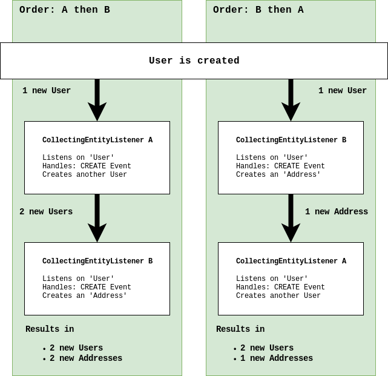
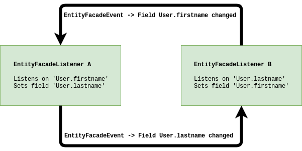

Entity Listener
===============

Entity listener are used to make changes to entities or run logic when they get created, updated or deleted before the
database transaction is committed (except `CollectingAfterCommitListener`_). Listeners listen to events (create, update,
delete) of defined entities. A listener is registered on at least one entity model. It is possible to register the same
listener on multiple entity models.

Listeners are hivemind services which are contributed to the configuration point ``nice2.persist.core.EntityListeners``.

See :ref:`Listeners` for a more technical documentation of the listener.

.. warning::
   Do not use Entity Listeners if the goal also can be reached by :ref:`Default-Values`

Dependencies
------------

Adding entity listeners requires the following dependency in the ``pom.xml`` of the ``impl`` module.

.. code-block:: XML

   <dependency>
     <groupId>ch.tocco.nice2.persist.core</groupId>
     <artifactId>nice2-persist-core-api</artifactId>
     <version>1.0-SNAPSHOT</version>
     <type>jar</type>
     <scope>provided</scope>
   </dependency>

Additionally the module has to be imported in the file ``hivemodule.xml``

.. code-block:: XML

   <contribution configuration-id="hiveapp.ClassLoader">
     <import feature="ch.tocco.nice2.persist" version="*"/>
   </contribution>

CollectingEntityListener
------------------------

Collecting entity listeners fetch all :nice:`EntityFacadeEvent <ch/tocco/nice2/persist/entity/events/EntityFacadeEvent>` until
the current transaction is about to commit. This means a collecting entity listener is executed only once right before
the commit. All :nice:`EntityFacadeEvents <ch/tocco/nice2/persist/entity/events/EntityFacadeEvent>` which are produced later,
for example by an other collecting entity listener which runs after the current, are discarded.

To add a :nice:`CollectingEntityListener <ch/tocco/nice2/persist/util/CollectingEntityListener>` add a Java class which
extends the class :nice:`CollectingEntityListener <ch/tocco/nice2/persist/util/CollectingEntityListener>`. Add the
class in the ``impl`` module where you working on. The method ``onBeforeCommit`` must be overwritten. This is the method
which gets called by the nice2 framework just before the commit takes place.

.. code-block:: Java

   public class MyCollectingEntityListener extends CollectingEntityListener {
       @Override
       public void onBeforeCommit(Transaction tx) {
           // your code goes here
       }
   }

The created listener must be registered as hivemind service in the file ``hivemodule.xml``.

.. code-block:: XML

   <service-point id="MyCollectingEntityListener" interface="ch.tocco.nice2.persist.entity.events.EntityFacadeListener">
     <invoke-factory model="threaded">
       <construct class="ch.tocco.nice2.path.to.entitylistener.MyCollectingEntityListener"/>
     </invoke-factory>
   </service-point>

.. important::
   The service model must be ``threaded`` on collecting entity listeners (``model="threaded"``). This means that the service
   is instantiated once per :abbr:`Thread (java.lang.Thread)` and bound to this :abbr:`Thread (java.lang.Thread)`
   only. This is needed because the collecting entity listener fetches every :nice:`EntityFacadeEvent <ch/tocco/nice2/persist/entity/events/EntityFacadeEvent>`
   of one transaction only. For more information about hivemind service models see `Threaded Service Model`_.

Now the service needs to be contributed as Listener. With the contribution also the entity model on which the listener
should listen must be defined. The example below shows how the registered listener ``MyCollectingEntityListener`` can
be contributed as listener.

.. code-block:: XML

   <contribution configuration-id="nice2.persist.core.EntityListeners">
     <listener listener="service:MyCollectingEntityListener" filter="User"/>
   </contribution>

.. list-table:: <listener/>
   :header-rows: 1

   * - Attribute
     - Description
   * - listener
     - The service which extends the class CollectingEntityListener.
   * - filter
     - A comma separated list of entity models which the listener should listen to.

Handle Events
^^^^^^^^^^^^^

The class :nice:`CollectingEntityListener <ch/tocco/nice2/persist/util/CollectingEntityListener>` provides some useful
methods to handle the :abbr:`EntityFacadeEvents (ch.tocco.nice2.persist.history.impl.tasks.FacadeEvent)` correctly.
The most important methods are described here. Open the class ``ch.tocco.nice2.persist.util.CollectingEntityListener`` to
see all methods.

Get all Created Entities
++++++++++++++++++++++++

The method ``getCreatedEntities`` returns all **created** entities with the entity model which the listener
was contributed to listen to.

.. code-block:: Java
   :emphasize-lines: 4

   public class MyCollectingEntityListener extends CollectingEntityListener {
       @Override
       public void onBeforeCommit(Transaction tx) {
           getCreatedEntities().forEach(entity -> {
               // Your code goes here
           });
       }
   }

Get all Updated Entities
++++++++++++++++++++++++

The method ``getUpdatedEntities`` returns all **updated** entities with the entity model which the listener was
contributed to listen to.

.. code-block:: Java
   :emphasize-lines: 4

   public class MyCollectingEntityListener extends CollectingEntityListener {
       @Override
       public void onBeforeCommit(Transaction tx) {
           getUpdatedEntities().forEach(entity -> {
               // Your code goes here
           });
       }
   }

Get all Deleted Entities
++++++++++++++++++++++++

The method ``getUpdatedEntities`` returns all **deleted** entities with the entity model which the listener was
contributed to listen to.

.. code-block:: Java
   :emphasize-lines: 4

   public class MyCollectingEntityListener extends CollectingEntityListener {
       @Override
       public void onBeforeCommit(Transaction tx) {
           getDeletedEntities().forEach(entity -> {
               // Your code goes here
           });
       }
   }

Get Affected Entities
+++++++++++++++++++++

The method ``getAffectedEntities`` returns all **created** and **updated** entities with the entity model which the
listener was contributed to listen to.

.. code-block:: Java
   :emphasize-lines: 4

   public class MyCollectingEntityListener extends CollectingEntityListener {
       @Override
       public void onBeforeCommit(Transaction tx) {
           getAffectedEntities().forEach(entity -> {
               // Your code goes here
           });
       }
   }

Get All Affected Entities
+++++++++++++++++++++++++

The method ``getAllAffectedEntities`` returns all **created**, **updated** and **deleted** entities with the entity
model which the listener was contributed to listen to.

.. code-block:: Java
   :emphasize-lines: 4

   public class MyCollectingEntityListener extends CollectingEntityListener {
       @Override
       public void onBeforeCommit(Transaction tx) {
           getAllAffectedEntities().forEach(entity -> {
               // Your code goes here
           });
       }
   }

Using the ``Context`` in Collecting Entity Listeners
^^^^^^^^^^^^^^^^^^^^^^^^^^^^^^^^^^^^^^^^^^^^^^^^^^^^

The context can be received by the :nice:`Transaction <ch/tocco/nice2/persist/tx/Transaction>` passed to the
``onBeforeCommit`` method.

.. code-block:: Java

   public class MyCollectingEntityListener extends CollectingEntityListener {
       @Override
       public void onBeforeCommit(Transaction tx) {
           Context context = tx.getContext();
           // Your code goes here
       }
   }

.. important::
   Do not inject the :nice:`Context <ch/tocco/nice2/persist/Context>` in a CollectingEntityListener but get it from
   the passed :nice:`Transaction <ch/tocco/nice2/persist/tx/Transaction>`

The Order of Collecting Entity Listeners
^^^^^^^^^^^^^^^^^^^^^^^^^^^^^^^^^^^^^^^^

It is not possible to define a specific order in which the collecting entity listeners are processed. This means
collecting entity listeners could behave differently depending on the order they run. The next image shows how the result
can be different if two collecting entity listeners run in different order.

In the left example the first listener creates a second user entity if a user was created before. The second listener
creates an address for each created user. This results in two users and two addresses.

In the right example the first listener creates an address entity. After the first listener is finished, one new created
user and one new created address entity exists. The second listener creates a new user entity but does nothing with the
newly created address from the first listener. Because collecting entity listeners only run once per transaction the first
listener does not process the user created by the second listener.

InterruptibleEntityFacadeAdapter
--------------------------------

An :nice:`InterruptibleEntityFacadeAdapter <ch/tocco/nice2/persist/entity/events/InterruptibleEntityFacadeAdapter>` is
executed for every :abbr:`EntityFacadeEvent (ch.tocco.nice2.persist.history.impl.tasks.FacadeEvent)` which belongs to
the entity on which the listener is contributed to listen to. This means every time ``setValue`` or a similar method
is called on the entity the :nice:`InterruptibleEntityFacadeAdapter <ch/tocco/nice2/persist/entity/events/InterruptibleEntityFacadeAdapter>`
is executed.

.. note::
   The :nice:`InterruptibleEntityFacadeAdapter <ch/tocco/nice2/persist/entity/events/InterruptibleEntityFacadeAdapter>`
   is almost the same as the :nice:`EntityFacadeListener <ch/tocco/nice2/persist/entity/events/EntityFacadeListener>`
   but handles rolled-back transactions and InterruptedExceptions itself. Always use the
   :nice:`InterruptibleEntityFacadeAdapter <ch/tocco/nice2/persist/entity/events/InterruptibleEntityFacadeAdapter>` if
   there is not a good reason to not use it.

To add a :nice:`InterruptibleEntityFacadeAdapter <ch/tocco/nice2/persist/entity/events/InterruptibleEntityFacadeAdapter>`
add a Java class which extends the class. Add the class in the ``impl`` module where you working on.

.. code-block:: Java

   public class MyEntityFacadeAdapter extends InterruptibleEntityFacadeAdapter {}

The listener needs to be registered as hivemind service in the file ``hivemodule.xml``.

.. code-block:: XML

   <service-point id="MyEntityFacadeAdapter" interface="ch.tocco.nice2.persist.entity.events.EntityFacadeListener">
     <invoke-factory>
       <construct class="ch.tocco.nice2.path.to.MyEntityFacadeAdapter"/>
     </invoke-factory>
   </service-point>

Now the service needs to be contributed as Listener. With the contribution also the entity model on which the listener
should listen to must be defined. The example below shows how the registered listener ``MyEntityFacadeAdapter`` can
be contributed as listener.

.. code-block:: XML

   <contribution configuration-id="nice2.persist.core.EntityListeners">
     <listener listener="service:MyEntityFacadeAdapter" filter="User"/>
   </contribution>

.. list-table:: <listener/>
   :header-rows: 1

   * - Attribute
     - Description
   * - listener
     - The service which extends the class CollectingEntityListener.
   * - filter
     - A comma separated list of entity models which the listener should listen to.

Now depending on what the listener needs to do there are several methods which can be overridden.

entityCreatingInterruptible
^^^^^^^^^^^^^^^^^^^^^^^^^^^

This method gets called if a new entity was created.

.. code-block:: Java
   :emphasize-lines: 3

   public class MyEntityFacadeAdapter extends InterruptibleEntityFacadeAdapter {
       @Override
       public void entityCreatingInterruptible(EntityFacadeEvent event) throws InterruptedException {
           Entity user = event.getSource();
           // do something with `user`
       }
   }

entityDeletingInterruptible
^^^^^^^^^^^^^^^^^^^^^^^^^^^

This method gets called if an entity was deleted.

.. code-block:: Java
   :emphasize-lines: 3

   public class MyEntityFacadeAdapter extends InterruptibleEntityFacadeAdapter {
       @Override
       public void entityDeletingInterruptible(EntityFacadeEvent event) throws InterruptedException {
           Entity user = event.getSource();
           // do something with `user`
       }
   }

entityChangingInterruptible
^^^^^^^^^^^^^^^^^^^^^^^^^^^
This method gets called if any changes are made to an entity.

.. code-block:: Java
   :emphasize-lines: 3

   public class MyEntityFacadeAdapter extends InterruptibleEntityFacadeAdapter {
       @Override
       public void entityChangingInterruptible(EntityChangedEvent event) throws InterruptedException {
           if ("field_name".equals(event.getField().getName())) {
               // do something with `user`
           }
      }
   }

EntityChangedEvent
++++++++++++++++++

It is important to only process the listener if it is really necessary. Lets say a listener must set a flag ``isAdult``
on ``Users`` if they're older than 18 years. This could be done like this:

.. code-block:: Java

   // Bad example
   public class MyEntityFacadeAdapter extends InterruptibleEntityFacadeAdapter {
       @Override
       public void entityChangingInterruptible(EntityChangedEvent event) throws InterruptedException {
           Entity user = event.getSource();
           if (isAdult(user) {
               user.setValue("is_adult", true);
           }
       }
   }

This would work without any problems. But most probably this listener would be executed a lot of times even it would not
be necessary. Because :nice:`InterruptibleEntityFacadeAdapters <ch/tocco/nice2/persist/entity/events/InterruptibleEntityFacadeAdapter>`
are executed every time ``setValue`` is called on the entity, this listener is also executed if for example only the name
of the user was changed. The name has nothing to do with the age of user.

A :nice:`EntityChangedEvent <ch/tocco/nice2/persist/entity/events/EntityChangedEvent>` is passed to the method
``entityChangingInterruptible`` which has some additional methods over the
:nice:`EntityFacadeEvent <ch/tocco/nice2/persist/entity/events/EntityFacadeEvent>` to work with. The above example
can be rewritten to the following:

.. code-block:: Java
   :emphasize-lines: 4,5

   // Good example
   public class MyEntityFacadeAdapter extends InterruptibleEntityFacadeAdapter {
       @Override
       public void entityChangingInterruptible(EntityChangedEvent event) throws InterruptedException {
           if ("birthdate".equals(event.getField().getName())) {
              LocaleDate birthdate = (LocalDate) event.getNewValue();
              if (isAdult(birthdate) {
                  user.setValue("is_adult", true);
              }
           }
       }
   }

Before the whole logic (setting the adult flag) is processed, we check if the change which is done to the entity belongs to
the field ``brithdate`` because this is the only field which is relevant for this listener. Then instead of reading the
field ``birthdate`` from the entity we just call the method ``getNewValue`` on the
A :nice:`EntityChangedEvent <ch/tocco/nice2/persist/entity/events/EntityChangedEvent>`. Because ``getNewValue`` returns
an :abbr:`Object (java.lang.Object)` it needs to be casted first.

entityRelationChangingInterruptible
^^^^^^^^^^^^^^^^^^^^^^^^^^^^^^^^^^^

This method gets called if a relation on the entity was changed.

.. code-block:: Java

   public class MyEntityFacadeAdapter extends InterruptibleEntityFacadeAdapter {
       @Override
       public void entityRelationChangingInterruptible(EntityRelationChangedEvent event) throws InterruptedException {
           if("relRelation_name".equals(event.getRelation().getName())) {
               // Your code goes here
           }
       }
   }

EntityRelationChangedEvent
++++++++++++++++++++++++++

A :nice:`EntityRelationChangedEvent <ch/tocco/nice2/persist/entity/events/EntityRelationChangedEvent>` is passed to
the method ``entityRelationChangingInterruptible`` which has some additional methods over the
:nice:`EntityFacadeEvent <ch/tocco/nice2/persist/entity/events/EntityFacadeEvent>` to work with.

To check what relation was changed the method ``getRelation`` can get called on the
:nice:`EntityRelationChangedEvent <ch/tocco/nice2/persist/entity/events/EntityRelationChangedEvent>`.

.. code-block:: Java

   public class MyEntityFacadeAdapter extends InterruptibleEntityFacadeAdapter {
       @Override
       public void entityRelationChangingInterruptible(EntityRelationChangedEvent event) throws InterruptedException {
           Relation relation = event.getRelation();
           String relationName = relation.getName(); // e.g. `relUser`
       }
   }

There also methods to check how the relation got changed.

.. code-block:: Java

   public class MyEntityFacadeAdapter extends InterruptibleEntityFacadeAdapter {
       @Override
       public void entityRelationChangingInterruptible(EntityRelationChangedEvent event) throws InterruptedException {
           if (event.isAdded()) {
               // code is executed when the relation was added to the entity.
               // E.g. User.relUser_status was set to `active`
           }

           if (event.isRemoved()) {
              // code is executed when the relation was removed.
              // E.g. User.relUser_status was cleared
           }

           if (event.isAdjusting()) {
              // code is executed if the relation was changed.
              // E.g. User.relUser_status was changed from `active` to `archived`
           }
       }
   }

Using the ``Context`` in Entity Facade Listeners
^^^^^^^^^^^^^^^^^^^^^^^^^^^^^^^^^^^^^^^^^^^^^^^^

The context can be received by the :nice:`EntityFacadeEvent <ch/tocco/nice2/persist/entity/events/EntityFacadeEvent>`
passed to the overwritten methods.

.. code-block:: Java

   public class MyEntityFacadeAdapter extends InterruptibleEntityFacadeAdapter {
       @Override
       public void entityChangingInterruptible(EntityChangedEvent event) throws InterruptedException {
           Context context = event.getSource().getContext();
       }
   }

.. important::
   Do not inject the :nice:`Context <ch/tocco/nice2/persist/Context>` in a
   :nice:`InterruptibleEntityFacadeAdapter <ch/tocco/nice2/persist/entity/events/InterruptibleEntityFacadeAdapter>`
   but get it from the source entity.

Avoid Infinite Loops
^^^^^^^^^^^^^^^^^^^^

With :nice:`InterruptibleEntityFacadeAdapters <ch/tocco/nice2/persist/entity/events/InterruptibleEntityFacadeAdapter>`
it is possible to create infinite loops. Because these listeners are executed every time a change has made to the entity
which the listener listens to. In the picture below an example of an infinite loop is shown (example does not make any
sense).

Both listeners listen to changes on the entity ``User``. Listener ``A`` listens on changes on the field ``firstname`` and
sets a value on the field ``lastname``. Listener ``B`` listens to the field ``lastname`` which was set from the listener
``A`` and sets a value on the field ``firstname``. Now listener ``A`` again is executed and so on.

CollectingAfterCommitListener
-----------------------------

:nice:`CollectingAfterCommitListeners <ch/tocco/nice2/persist/util/CollectingAfterCommitListener>` are fired after the
transaction was committed. This can be useful if something only must be done if something else was persisted before.
For example mails are sent often with :nice:`CollectingAfterCommitListeners <ch/tocco/nice2/persist/util/CollectingAfterCommitListener>`.
Lets say a user should receive an e-mail if he was registered to an event. This could be done within a
:nice:`InterruptibleEntityFacadeAdapter <ch/tocco/nice2/persist/entity/events/InterruptibleEntityFacadeAdapter>` or
:nice:`CollectingEntityListener <ch/tocco/nice2/persist/util/CollectingEntityListener>`.

.. code-block:: Java

   public class MyCollectingEntityListener extends CollectingEntityListener {
       @Override
       public void onBeforeCommit(Transaction tx) {
           getCreatedEntities().forEach(registration -> {
               sendMailTo(registration); // what if later in an other entity listener something goes wrong?
           });
       }
   }

But if the current transaction for some reason fails, it will be rolled back and the registration entity is not persisted.
In this case the user would have received an e-mail but was not actually registered to the event.

That is when :nice:`CollectingAfterCommitListeners <ch/tocco/nice2/persist/util/CollectingAfterCommitListener>` are
useful.

:nice:`CollectingAfterCommitListeners <ch/tocco/nice2/persist/util/CollectingAfterCommitListener>` need to be registered
and contributed as listener the same way as :nice:`CollectingEntityListener <ch/tocco/nice2/persist/util/CollectingEntityListener>`
are.

.. code-block:: XML

   <service-point id="MyAfterCollectingEntityListener" interface="ch.tocco.nice2.persist.entity.events.EntityListener">
     <invoke-factory model="threaded">
       <construct class="ch.tocco.nice2.path.to.entitylistener.MyAfterCollectingEntityListener"/>
     </invoke-factory>
   </service-point>

.. code-block:: XML

   <contribution configuration-id="nice2.persist.core.EntityListeners">
     <listener listener="service:MyAfterCollectingEntityListener" filter="Registration"/>
   </contribution>

The listener must extend the class
:nice:`CollectingAfterCommitListener <ch/tocco/nice2/persist/util/CollectingAfterCommitListener>` and overwrite the
method ``getAfterCommitTask`` which returns an :nice:`AfterCommitTask <ch/tocco/nice2/persist/util/AfterCommitTask>`.

.. code-block:: Java

   public class MyCollectingAfterCommitListener extends CollectingAfterCommitListener {
       public MyEntityFacadeAdapter(CommandExecutor commandExecutor) {
           super(commandExecutor);
       }

       @Override
       protected AfterCommitTask getAfterCommitTask() {
           return new AfterCommitTask() {
               @Override
               public void onAfterCommit(CommandContext commandContext) throws Exception {
                   // Your code goes here
               }
           };
       }
   }

.. note::
   A :nice:`CollectingAfterCommitListener <ch/tocco/nice2/persist/util/CollectingAfterCommitListener>` does not know
   what has changed on the entities itself. But if the entity got created, updated or deleted is known.

.. _Threaded Service Model: https://hivemind.apache.org/hivemind1/services.html#Threaded+Service+Model

