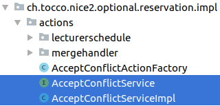
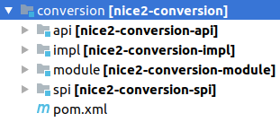
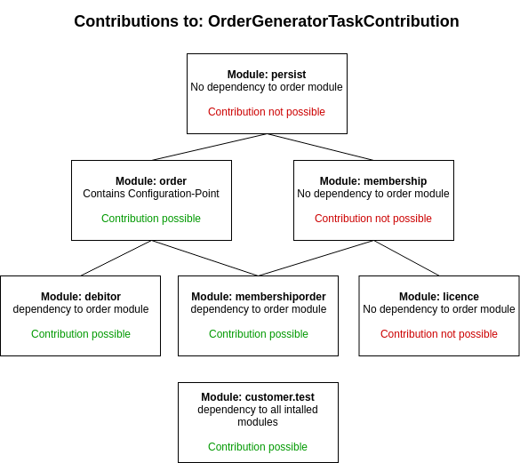

.. _Java-Services:

.. _HiveMind-Services: https://hivemind.apache.org/hivemind1/services.html
.. _HiveMind-Configuration-Points: https://hivemind.apache.org/hivemind1/configurations.html

Java-Services
=============
In HiveMind, a service is simply an object that implements a particular interface, the service interface.
You supply the service interface (packaged as part of a module). You supply the core implementation of the interface
(in the same module, or in a different module). At runtime, HiveMind puts it all together.

Please see the HiveMind-Services_ documentation for a more detailed description on how this works. This documentation will
only contain some tocco specific examples and tipps.

Depending on where from the service needs to be accessed, the interface can be put in the ``impl`` (only used in the current module)
the ``spi`` or the ``api`` module. The implementation should always be in the ``impl`` module.

Hivemodule-Registration
-----------------------

Services can be registered in ``hivemodule.xml`` as shown below.

.. code-block:: xml

   <service-point id="AcceptConflictService" interface="ch.tocco.nice2.optional.reservation.impl.actions.AcceptConflictService">
     <invoke-factory>
       <construct class="ch.tocco.nice2.optional.reservation.impl.actions.AcceptConflictServiceImpl"/>
     </invoke-factory>
   </service-point>

Invoke-Factory
^^^^^^^^^^^^^^

Invoke factories are usually used to instantiate services in nice2. The two most commonly used models in nice2 are ``singelton`` and
``threaded``. For other ways of instantiating services please see the HiveMind-Services_ documentation.

* **<invoke-factory model="singelton">** the service will be instantiated as soon as it is first called (Singleton). This is the default behaviour. If no model is defined ``singleton`` will be used.
* **<invoke-factory model="threaded">** the service will be instantiated once per request. This is for example required for ``CollectingEntityListeners``.

.. warning::
   Most services are singeltons and singletons should always be stateless. (E.g. we should never hold any data in member variables)

Accessing a Service
-------------------

The two most common ways of accessing services in tocco are by autowiring and by passing it to a ``hivemodule.xml`` contribution.

Autowiring works with all singleton services that have exatly one implementation. These services may just be listed in the constructor
of another service and HiveMind / hiveapp will try to automatically provide these services. For it to work your service needs access
to the service-interface that is to be injected.

.. code-block:: java

   public TestServiceImpl implements TestService {
      private final Context context;
      private final Logger log;
      private final EntityDefaultValueService entityDefaultValueService;

      public TestServiceImpl(Context context,
                             Logger log,
                             EntityDefaultValueService entityDefaultValueService) {
          this.context = context;
          this.log = log;
          this.entityDefaultValueService = entityDefaultValueService;
      }
   }

To get access to a service from another module, the interface of the other service needs to be in the ``api`` or ``spi`` module. This module
needs to be added as a dependency to the ``pom.xml`` of the target module. Furthermode the dependency needs to be resolved in ``hivemodule.xml``.
This is most commonly done by defining a feature to export in the source module (e.g. ``nice2.types``) and importing this feature in the target
module.

**pom.xml dependency**

.. code-block:: xml

   <dependency>
     <groupId>ch.tocco.nice2.types</groupId>
     <artifactId>nice2-types-api</artifactId>
     <version>${project.version}</version>
     <scope>provided</scope>
   </dependency>

**defining the feature (source module)**

.. code-block:: xml

   <contribution configuration-id="hiveapp.ClassLoader">
     <!-- directly exporting packages -->
     <export package="ch.tocco.nice2.types" version="1.0"/>
     <export package="ch.tocco.nice2.types.spi" version="1.0"/>
     <export package="ch.tocco.nice2.types.spi.password" version="1.0"/>
     <export package="ch.tocco.nice2.types.spi.geolocation" version="1.0"/>
     <export package="ch.tocco.nice2.types.test" version="1.0"/>

     <!-- defining features containing packages -->
     <feature name="ch.tocco.nice2.types" version="1.0">
       <package name="ch.tocco.nice2.types"/>
     </feature>
     <feature name="ch.tocco.nice2.types.spi" version="1.0">
       <package name="ch.tocco.nice2.types.spi"/>
       <package name="ch.tocco.nice2.types.spi.password"/>
       <package name="ch.tocco.nice2.types.spi.geolocation"/>
     </feature>

     <!-- exporting packages in a group -->
     <group id="impl">
       <export package="ch.tocco.nice2.types.impl" version="1.0"/>
       <export package="ch.tocco.nice2.types.impl.config" version="1.0"/>
       <export package="ch.tocco.nice2.types.impl.conversions" version="1.0"/>
       <export package="ch.tocco.nice2.types.impl.handlers" version="1.0"/>
       <export package="ch.tocco.nice2.types.impl.typeadapters" version="1.0"/>
     </group>

     <!-- defining a feature containing a group -->
     <feature name="ch.tocco.nice2.types.impl" version="1.0">
       <group id="impl"/>
     </feature>
   </contribution>

**importing the feature (target module)**

.. code-block:: xml

   <contribution configuration-id="hiveapp.ClassLoader">
     <import feature="ch.tocco.nice2.types" version="*"/>
   </contribution>

.. tip:: If the maven dependency is not correct, there will be compile time errors. If the hivemodule dependencies are not
   configured correctly, runtime errors will be thrown.

.. warning:: Circular dependencies are illegal and will lead to build errors.

Service-Configuration
---------------------

Further configuration can be provided to a service by providing it in the ``hivemodule.xml``. This can be used to pass fixed
values or contributions.

Please read the official documentation on HiveMind-Configuration-Points_ for more informations on configuration points and contributions.
This chapter will contain some hiveapp / tocco specific informaiton and examples.

Contributions are used to add configuration that depends on other installed modules. Contributions may be made from any module
that has a dependency to the module containing the configuration point. Generally speaking, if a configuration-point is in a core module,
contributions may be made from all optional and customer modules. If a configuration-point is in an optional module, contributions may
be made from all customer modules and from all optional modules that have a dependency to the configuration-point module. Please find below
a visualisation for the configuration-point ``OrderGeneratorTaskContribution`` that is defined in the order module.

All additional service configuration may be set by adding subelements to the ``<construct>`` element. These subelements consist of
the ``property`` attribute and a value. The service must contain a seter for each property that should be set. For example: if ``property=limit``
is configured, a seter ``public void setLimit(Type limit)`` must exists.

.. tip::

   If a configuration does not work, it is always a good idea to set a breakpoint on the first line of the respective setter.

Fixed-Values
^^^^^^^^^^^^

Fixed values can be set by adding ``<set>`` or ``<set-object>`` subelements to the ``<construct>`` element.

The following types of Fixed-Values may be passed to a service:

* File-References_
* Application-Properties_
* Other services using the ``service:ServiceName`` annotation

Please find below an example of a fictional service that is configured by all these

.. code-block:: xml

   <service-point id="TestService" interface="ch.tocco.nice2.optional.test.TestService">
     <invoke-factory>
       <construct class="ch.tocco.nice2.optional.test.impl.TestServiceImpl">
         <set property="limit" value="${nice2.dms.FolderSizeBatchJob.limit}"/> <!-- application.properties value -->
         <set-object property="customerResource" value="vfs:[#etc]/hikaricp.properties"/> <!-- file reference -->
         <set-object property="defaultBuilder" value="service:DefaultChildOfConditionBuilder"/> <!-- specific service -->
       </construct>
     </invoke-factory>
   </service-point>

Application-Properties
^^^^^^^^^^^^^^^^^^^^^^

Application-Properties are automatically mapped as hivemodule symbols and may be passed to a service using the ``${key}`` notation.

For each application property a default value can be defined by contributing to ``hivemind.FactoryDefaults``.

**Example:**

**application.properties:**

.. code-block:: text

   nice2.testservice.limit=10000

**default value contribution**

.. code-block:: xml

  <contribution configuration-id="hivemind.FactoryDefaults">
    <default symbol="nice2.testservice.limit" value="5000"/>
  </contribution>

**passing the value to a service**

.. code-block:: xml

   <service-point id="TestService" interface="ch.tocco.nice2.optional.test.TestService">
     <invoke-factory>
       <construct class="ch.tocco.nice2.optional.test.impl.TestServiceImpl">
         <set property="limit" value="${nice2.testservice.limit}"/>
       </construct>
     </invoke-factory>
   </service-point>

**using the value**

.. code-block:: java

   public class TestServiceImpl implements TestService {
       private long limit;

       @Override
       public boolean isLimitExceeded(long actualSize) {
           return actualSize > limit;
       }

       @SupressWarning("unused")
       public void setLimit(long limit) {
           this.limit = limit;
       }
   }

File-References
^^^^^^^^^^^^^^^

Files can be passed to a service using ``vfs`` references.

``vfs`` references are references to a file in the project structure. 

* ``[#etc]`` - the ``etc`` directory of the currently running customer
* ``[#share]`` - the ``share`` directory of the currently running customer
* ``[#self]`` - the ``module`` directory of the current module
* ``[nice2.any.module]`` - the module directory of any given module (e.g. ``[nice2.persist.backend.postgres]``)

**Examples:**

* ``vfs:[nice2.persist.backend.postgres]/hikaricp.properties``
* ``vfs:[#etc]/hikaricp.properties``

**hivemodule.xml:**

.. code-block:: xml

   <service-point id="HibernatePropertiesProvider" interface="ch.tocco.nice2.persist.hibernate.HibernatePropertiesProvider">
     <invoke-factory>
       <construct class="ch.tocco.nice2.persist.hibernate.bootstrap.HibernatePropertiesProviderImpl">
         <set-object property="baseResource" value="vfs:[nice2.persist.backend.postgres]/hikaricp.properties"/>
         <set-object property="customerResource" value="vfs:[#etc]/hikaricp.properties"/>
         <set-object property="localResource" value="vfs:[#etc]/hikaricp.local.properties"/>
       </construct>
     </invoke-factory>
   </service-point>

**Java:**

.. code-block:: java

   @SuppressWarnings("unused")
   public void setBaseResource(Resource baseResource) {
       this.baseResource = baseResource;
   }

   @SuppressWarnings("unused")
   public void setCustomerResource(Resource customerResource) {
       this.customerResource = customerResource;
   }

   @SuppressWarnings("unused")
   public void setLocalResource(Resource localResource) {
       this.localResource = localResource;
   }

Simple Configuration-Point
^^^^^^^^^^^^^^^^^^^^^^^^^^

Configuration-Points define the schema of a contribution and how each contribution will be mapped to java objects. Simple
configuration points can be used to create ``Maps`` or ``Lists`` of single values and will be mapped implicitly.

To create a ``List`` of values you can simply define a configuration point with one element that contains one attribute
as shown in the example below.

**configuration-point:**

.. code-block:: xml

   <configuration-point id="ContentTreeContextProvider">
     <schema>
       <element name="provider">
         <attribute name="implementation" required="true" translator="object"/>
         <rules>
           <push-attribute attribute="implementation"/>
           <invoke-parent method="addElement"/>
         </rules>
       </element>
     </schema>
   </configuration-point>

**contribution:**

.. code-block:: xml

   <contribution configuration-id="ContentTreeContextProvider">
     <provider implementation="service:DmsContentTreeContextProvider"/>
   </contribution>

**Java:**

.. code-block:: java

   @SuppressWarnings("unused")
   public void setContentTreeContextProviders(List<ContentTreeContextProvider> providers) {
       this.providers = providers;
   }

To autmatically create a ``Map`` an additional attribute is required. One of the attributes will become the
``key-attribute`` the other one the ``value-attribute``. The ``key-attribute`` must be defined as such on the
element. The ``value-attribute`` must be defined as ``push-attribute``.

**configuration-point:**

.. code-block:: xml

   <configuration-point id="ChildOfConditionBuilders">
     <schema>
       <element name="builder" key-attribute="entity-model">
         <attribute name="entity-model" required="true"/>
         <attribute name="builder" translator="object" required="true"/>
         <rules>
           <push-attribute attribute="builder"/>
           <invoke-parent method="addElement"/>
         </rules>
       </element>
     </schema>
   </configuration-point>

**contribution:**

.. code-block:: xml

   <contribution configuration-id="ChildOfConditionBuilders">
     <builder entity-model="Resource" builder="service:ResourceChildOfConditionBuilder"/>
   </contribution>

**Java:**

.. code-block:: java

   @SuppressWarnings("unused")
   public void setChildOfConditionBuilders(Map<String, ChildOfConditionBuilder> childOfConditionBuilders) {
       this.childOfConditionBuilders = childOfConditionBuilders;
   }

Custom Configuration-Point
^^^^^^^^^^^^^^^^^^^^^^^^^^

If more than 2 Arguments are required, a custom configuration-point can be defined. In a custom configuration point,
The schema will be mapped manually to java beans. In the java service, a ``List`` of those beans will be available.

**configuration-point:**

.. code-block:: xml

   <configuration-point id="OutputTemplates">
     <schema>
       <element name="outputTemplate">
         <attribute name="uniqueId" required="true"/>
         <attribute name="less" translator="vfs"/>
         <attribute name="freemarker" translator="vfs"/>
         <attribute name="label"/>
         <attribute name="active"/>
         <attribute name="outputTemplateFormat"/>
         <attribute name="outputTemplateLayout"/>
         <attribute name="outputTemplateUsage //default value"/>
         <attribute name="fileFormat" required="true"/>
         <attribute name="hideLogoCheckbox"/>
         <attribute name="enableLogoCheckbox"/>
         <element name="document">
           <attribute name="name" required="true"/>
           <attribute name="label" required="true"/>
           <attribute name="sorting"/>
           <attribute name="file" translator="vfs"/>
           <rules>
             <create-object class="ch.tocco.nice2.reporting.description.OutputTemplateContribution$OutputTemplateDocument"/>
             <read-attribute attribute="name" property="name"/>
             <read-attribute attribute="label" property="label"/>
             <read-attribute attribute="sorting" property="sorting"/>
             <read-attribute attribute="file" property="file"/>
             <invoke-parent method="addOutputTemplateDocument"/>
           </rules>
         </element>
         <rules>
           <create-object class="ch.tocco.nice2.reporting.description.OutputTemplateContribution"/>
           <read-attribute attribute="uniqueId" property="uniqueId"/>
           <read-attribute attribute="less" property="less"/>
           <read-attribute attribute="freemarker" property="freemarker"/>
           <read-attribute attribute="label" property="label"/>
           <read-attribute attribute="active" property="active"/>
           <read-attribute attribute="outputTemplateFormat" property="outputTemplateFormat"/>
           <read-attribute attribute="outputTemplateLayout" property="outputTemplateLayout"/>
           <read-attribute attribute="outputTemplateUsage" property="outputTemplateUsage"/>
           <read-attribute attribute="fileFormat" property="fileFormat"/>
           <read-attribute attribute="hideLogoCheckbox" property="enableLogoCheckbox"/>
           <invoke-parent method="addElement"/>
         </rules>
       </element>
     </schema>
   </configuration-point>

**contribution:**

.. code-block:: xml

   <contribution configuration-id="nice2.reporting.OutputTemplates">
     <outputTemplate uniqueId="diploma_sfb"
                     label="outputtemplate.diploma_sfb"
                     less="[#self]/outputtemplate/diploma_sfb.less"
                     freemarker="[#self]/outputtemplate/diploma_sfb.ftl"
                     fileFormat="pdf"
                     outputTemplateFormat="a4_portrait"
                     outputTemplateLayout="diploma_sfb"
                     outputTemplateUsage="correspondence"/>

As seen in the configuration-point example above, for each element a set of rules is defined, which defines how the attributes
of the element are read. The ``create-object`` defines which element will be mapped to which java bean.

.. tip::

   If the element content needs to be read ``<read-content property="expression"/>`` can be used.

**Java:**

.. code-block:: java

   public class OutputTemplateContribution implements SynchronisationDescription {
       private String uniqueId;
       private String label;
       private Resource less;
       private Resource freemarker;
       private String outputTemplateFormat;
       private String outputTemplateLayout;
       private String outputTemplateUsage = "report"; //default value
       private boolean hideLogoCheckbox = false; //default value
       private boolean enableLogoCheckbox = false; //default value
       private String fileFormat = "pdf"; //default value
       private boolean active = true; //default value

       private final List<OutputTemplateDocument> documents = Lists.newArrayList();

       public String getUniqueId() {
           return uniqueId;
       }

       public void setUniqueId(String uniqueId) {
           this.uniqueId = uniqueId;
       }

       public String getLabel() {
           if (Strings.isNullOrEmpty(label)){
               return String.format("outputTemplate.%s", uniqueId);
           }
           return label;
       }

       public void setLabel(String label) {
           this.label = label;
       }

       public Resource getLess() {
           return less;
       }

       public void setLess(Resource less) {
           this.less = less;
       }

       public Resource getFreemarker() {
           return freemarker;
       }

       public void setFreemarker(Resource freemarker) {
           this.freemarker = freemarker;
       }

       public String getOutputTemplateFormat() {
           return outputTemplateFormat;
       }

       public void setOutputTemplateFormat(String outputTemplateFormat) {
           this.outputTemplateFormat = outputTemplateFormat;
       }

       public String getOutputTemplateLayout() {
           return outputTemplateLayout;
       }

       public void setOutputTemplateLayout(String outputTemplateLayout) {
           this.outputTemplateLayout = outputTemplateLayout;
       }

       public String getOutputTemplateUsage() {
           return outputTemplateUsage;
       }

       public void setOutputTemplateUsage(String outputTemplateUsage) {
           this.outputTemplateUsage = outputTemplateUsage;
       }

       public boolean isHideLogoCheckbox() {
           return hideLogoCheckbox;
       }

       public void setHideLogoCheckbox(boolean hideLogoCheckbox) {
           this.hideLogoCheckbox = hideLogoCheckbox;
       }

       public boolean isEnableLogoCheckbox() {
           return enableLogoCheckbox;
       }

       public void setEnableLogoCheckbox(boolean enableLogoCheckbox) {
           this.enableLogoCheckbox = enableLogoCheckbox;
       }

       public String getFileFormat() {
           return fileFormat;
       }

       public void setFileFormat(String fileFormat) {
           this.fileFormat = fileFormat;
       }

       public boolean isActive() {
           return active;
       }

       public void setActive(boolean active) {
           this.active = active;
       }

       public void addOutputTemplateDocument(OutputTemplateDocument document) {
           documents.add(document);
       }

       public List<OutputTemplateDocument> getDocuments() {
           return documents;
       }

       public static class OutputTemplateDocument {
           private String name;
           private String label;
           private Integer sorting;
           private Resource file;

           public String getName() {
               return name;
           }

           public void setName(String name) {
               this.name = name;
           }

           public String getLabel() {
               return label;
           }

           public void setLabel(String label) {
               this.label = label;
           }

           public Integer getSorting() {
               return sorting;
           }

           public void setSorting(Integer sorting) {
               this.sorting = sorting;
           }

           public Resource getFile() {
               return file;
           }

           public void setFile(Resource file) {
               this.file = file;
           }
       }
   }