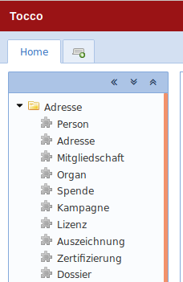
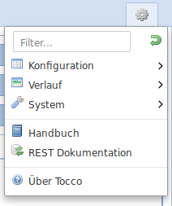

Menu
====

Entities can be accessed over the menu. There are two different menus where menu entries can be added.

* ``modules`` menu
* ``settings`` menu

The modules menu provides access to entities while the settings menu provides access to ``lookup`` entities.

.. hint::
   Menus can be extended over the whole module structure.

Add Modules Menu Entry
----------------------

Module menu entries are added in the files called ``modules.extend.xml``. This files can be found under ``MODULE/module/model/menu``
for optional modules or under ``CUSTOMER/share/model/menu`` for customer modules. If the file does not exist it can be
created.

The modules menu can be found on the left inside the home tab of the admin view.

A possible ``modules.extend.xml`` file could look like this:

.. code-block:: XML

   <?xml version="1.0" encoding="UTF-8"?>
   <extend-menu xmlns="http://nice2.tocco.ch/schema/menuModel.xsd">
     <append to="modules">
       <menu name="education" position="400">
         <entity-explorer name="event" position="10" entity="Event"/>
         <entity-explorer name="registration" position="30" entity="Registration"/>
         <entity-explorer name="lecturer_booking" position="50" entity="Lecturer_booking"/>
       </menu>
     </append>
   </extend-menu>

**Explanation:**

* ``<append to="modules">`` defines that this menu will be appended to the **modules** menu.
* ``<menu name="education" position="400">`` defines that the menu entries will be added to the submenu **education**
* ``<entity-explorer name="event" position="10" entity="Event"/>`` is a menu entry with the name **event** which opens the entity explorer for the Entity **Event**

See `Elements and Attributes`_ for the full documentation.

Add the menu in the ``menu.acl`` file of the module to define who can see it. See chapter :ref:`acl`.

.. warning::
   Make sure xml files are build into the snapshot by adding xml files as resource in the module pom.xml.

   .. todo::
      add reference as soon as modules chapter is written.

.. hint::
   Module menu entries are not nested. This means no nested menu-tags.

.. hint::
   The modules menu can be opened by the shortcut Ctrl+M

Add Settings Menu Entry
-----------------------

The settings menu provides access to ``lookup`` entities. This menu is intended for users with the role ``configurator``.

The settings menu can be found on the top right of the admin view.

Setting menu entries are added in the files called ``settings.extend.xml``. This file can be found under ``MODULE/module/model/menu``
for optional modules or under ``CUSTOMER/share/model/menu`` in customer modules.

A possible ``modules.extend.xml`` file could look like this:

.. code-block:: XML

   <?xml version="1.0" encoding="UTF-8"?>
   <extend-menu xmlns="http://nice2.tocco.ch/schema/menuModel.xsd">
     <append to="settings">
       <menu name="event" position="150">
         <menu name="event" position="10">
           <entity-explorer name="target_group" position="10" entity="Target_group"/>
           <entity-explorer name="event_status" position="20" entity="Event_status"/>
           <entity-explorer name="event_type" position="30" entity="Event_type"/>
         </menu>
         <menu name="registration" position="20">
           <entity-explorer name="registration_status" position="10" entity="Registration_status"/>
           <entity-explorer name="registration_type" position="15" entity="Registration_type"/>
           <entity-explorer name="referrer" position="40" entity="Referrer"/>
         </menu>
         <menu name="lecturer_booking" position="30">
           <entity-explorer name="lecturer_status" position="10" entity="Lecturer_status"/>
           <entity-explorer name="invoice_status" position="20" entity="Invoice_status"/>
         </menu>
         <entity-explorer name="lecturer_booking_report_status" position="40" entity="Lecturer_booking_report_status"/>
       </menu>
       <menu name="address" position="100">
         <menu name="user" position="10">
           <menu name="competence" position="180">
             <entity-explorer name="competence_qualification" position="10" entity="Competence_qualification"/>
             <entity-explorer name="competence_level" position="20" entity="Competence_level"/>
           </menu>
           <entity-explorer name="user_council_council" position="200" entity="User_council_council"/>
         </menu>
       </menu>
     </append>
   </extend-menu>

**Explanation:**

* ``<append to="settings">`` defines that this menu will be appended to the **settings** menu.
* The menu entries are added in different submenus (event, registration, lecturer_booking, address)
* settings->address->user->competence is a nested menu structure.

Add the menu in the ``menu.acl`` file of the module to define who can see it. See chapter :ref:`acl`.

.. warning::
   Make sure xml files are built into the snapshot by adding xml files as resource in the module pom.xml.

   .. todo::
      add reference as soon as modules chapter is written.

.. hint::
   Setting menu entries are often nested. This means nested menu-tags.

Elements and Attributes
-----------------------

All the elements and their attributes are defined in the file ``menuModel.xsd``.

Menu Element - <menu/>
^^^^^^^^^^^^^^^^^^^^^^

.. list-table::
   :header-rows: 1

   * - Attribute
     - Required
     - Description
   * - name
     - ✔
     - A unique name for the menu. If a menu should be extended, the name must be the same as the one of the extending menu.
   * - position
     - ✔
     - The position of the menu as Integer value. The higher the number, the lower it will appear in the menu.
   * - icon
     -
     - The icon

Append Element - <append/>
^^^^^^^^^^^^^^^^^^^^^^^^^^

.. list-table::
   :header-rows: 1

   * - Attribute
     - Required
     - Description
   * - to
     - ✔
     - Name of the menu to which this menu should be added ("modules" or "settings")

Element Entity-Explorer - <entity-explorer/>
^^^^^^^^^^^^^^^^^^^^^^^^^^^^^^^^^^^^^^^^^^^^

.. list-table::
   :header-rows: 1

   * - Attribute
     - Required
     - Description
   * - name
     - ✔
     - A unique name for the menu entry.
   * - position
     - ✔
     - The position of the menu as Integer value. The higher the number, the lower it will appear in the menu.
   * - entity
     - ✔
     - The name of the entity which should be opened.
   * - icon
     -
     - The icon
   * - form-name
     -
     - The name of the forms to use within the explorer. Default are ENTITY_NAME_detail.xml, ENTITY_NAME_list.xml and ENTITY_NAME_search.xml
   * - tree-provider
     -
     - The name of the tree provider to use within the explorer.
