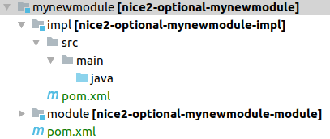

Modules
=======

Different Types of Modules
--------------------------

Nice2 is split into different type of modules.

Core Modules
^^^^^^^^^^^^

Core modules provide the basic functionality of a Nice2 installation. All core modules are always installed on every
installation. A Nice2 installation would not work without them.

Core modules can be found in: ``nice2-project/*``

Optional Modules
^^^^^^^^^^^^^^^^

Optional modules (also called marketing modules) are, as the name lets guess, optional. An optional module represents a
feature or functionality which a customer can add to his installation depending on his demand.

Optional modules can be found in: ``nice2-project/optional/*``

Customer Modules
^^^^^^^^^^^^^^^^

For every customer installation a customer module exists. A customer module configures the installation of the customer.
A customer module defines which optional modules (marketing modules) are installed. Also customer specific adjustments
which only belong to the customer are done in customer modules.

Customer modules can be found in: ``nice2-project/customer/*``

Between Modules
^^^^^^^^^^^^^^^

A between module is always needed if a feature or functionality should be added **automatically** if two or more specific
modules are installed and this new feature should **not be licenced separately**.
For example if there are two modules ``A`` and ``B`` which both contain different entity models and a new action should
be added which needs the entity models of both modules automatically if both modules are installed a ``between module``
needs to be added which depends on the modules ``A`` and ``B``.

If the feature would be licenced separately it could just be a new optional module with dependencies on the modules ``A``
and ``B``.

The name of a between module consists of the names of the depending modules. For example the module ``licencecorrespondence``
depends on the modules ``licence`` and ``correspondence``.

Between modules can be found in: ``nice2-project/optional/*``

.. hint::
   **A between module**

   * adds functionality automatically if at leas two other specific optional modules are installed
   * depends on at least two other modules
   * is not licenced separately (otherwise it could be an optional module)
   * has a name that consists of the names of the depending modules

Adding a New Module
-------------------

.. warning::
   This section describes how to add a module. It can be used for both ``customer`` and ``optional`` modules. Always keep
   in mind that the folder structure form an optional and customer module differs!

.. hint::
   This section explains how a new module is added manually. There is also a `script`_ which can be used to add a new module.

Adding a new module contains the following steps:

.. list-table::
   :header-rows: 1
   :widths: 10 10 10 70

   * - Nr
     - Required (optional)
     - Required (customer)
     - Description
   * - 1
     - ✔
     - ✔
     - `Add Module in Backoffice`_
   * - 2
     - ✔
     - ✔
     - `Create Basic Folder Structure`_
   * - 3
     - ✔
     - ✔
     - `Add new Module to the Root Pom`_
   * - 4
     - ✔
     -
     - `Add new Module to the Test Customer`_
   * - 5
     -
     - ✔
     - `Add Application Properties`_
   * - 6
     -
     - ✔
     - `Add HikariCP Properties`_
   * - 7
     -
     -
     - `Add Content to module Folder`_
   * - 8
     -
     -
     - `Add Java Source Folders`_
   * - 9
     - ✔ **if 5 is done**
     - ✔ **if 5 is done**
     - `Build Resources into Target Snapshot`_

Add Module in Backoffice
^^^^^^^^^^^^^^^^^^^^^^^^

Each existing module (core, optional and core) must be documented in our backoffice. This is important because depending
on the documented modules the pom.xml will be generated for customer modules.

* Open the Entity ``Module`` in the backoffice

  .. figure:: resources/modules/modules-module-menu.png

* Create a new Module entitiy
* Set a good technical name. The technical name should be the same as it will be called in the folder structure of the nice project
* Set the correct type of the module. One of ``core``, ``optional``, ``customer`` or ``between``.

  .. figure:: resources/modules/modules-set-module-type.png

* Add all depending modules. Depending modules are all modules which are used by the new module. This is important because
  if this module later is added to a customer all depending modules also need to be added to the customer.

  .. figure:: resources/modules/modules-depending-modules.png

Create Basic Folder Structure
^^^^^^^^^^^^^^^^^^^^^^^^^^^^^

.. warning::
   In customer modules ``mynewmodule/module`` must be ``customermodule/module/module``

Assume the new module is called ``mynewmodule`` and it is an optional module.

Add a new folder ``mynewmodule``  inside ``nice2-project/optional`` with the following file structure

  .. figure:: resources/modules/basic-folder-structure-optional.png

If it would be a customer module, the basic folder structure would look like this:

  .. figure:: resources/modules/basic-folder-structure-customer.png

Open the file ``mynewmodule/pom.xml`` and add the following content.

.. literalinclude:: resources/modules/pom1.xml
   :language: XML

Open the file ``mynewmodule/module/pom.xml`` and add the following content.

.. literalinclude:: resources/modules/pom2.xml
   :language: XML

Open the file ``mynewmodule/module/hiveapp-mount.properties`` and add the following content.

.. literalinclude:: resources/modules/hiveapp-mount.properties

Open the file ``mynewmodule/module/descriptor/hivemodules.xml`` and add the following content.

.. literalinclude:: resources/modules/hivemodule.xml
   :language: XML

Add new Module to the Root Pom
^^^^^^^^^^^^^^^^^^^^^^^^^^^^^^

.. warning::
   This must not be done if the module is of the type **customer**.

Each module must be registered in the root pom file. Open the file ``nice2-project/pom.xml`` and add your module to it.
The modules are ordered alphabetical and are separated by core and optional modules.

.. code-block:: XML
   :emphasize-lines: 6

   <modules>
     <!-- ... more modules -->
     <module>optional/membershiphierarchylicence</module>
     <module>optional/membershiporder</module>
     <module>optional/membershipsms</module>
     <module>optional/mynewmodule</module>
     <module>optional/netmobile</module>
     <module>optional/news</module>
     <module>optional/newsletter</module>
     <module>optional/newsletterrecipient</module>
     <!-- ... more modules -->
   </modules>

Add new Module to the Test Customer
^^^^^^^^^^^^^^^^^^^^^^^^^^^^^^^^^^^

.. warning::
   This must not be done if the module is of the type **customer** or **core**. It must be only be done for **optional**
   modules.

The test customer has all possible modules installed. So a newly created optional module must be added to it. Open the
file ``nice2-project/customer/test/pom.xml`` and add the new module at the right place as dependency to it. All modules
are added in alphabetical order.

.. code-block:: XML
   :emphasize-lines: 10, 11, 12, 13, 14, 15, 16

    <dependencies>
      <!-- ... more modules -->
      <dependency>
        <groupId>ch.tocco.nice2.optional.membershipsms</groupId>
        <artifactId>nice2-optional-membershipsms-module</artifactId>
        <version>${project.parent.version}</version>
        <type>appmodule</type>
        <scope>compile</scope>
      </dependency>
      <dependency>
        <groupId>ch.tocco.nice2.optional.mynewmodule</groupId>
        <artifactId>nice2-optional-mynewmodule-module</artifactId>
        <version>${project.parent.version}</version>
        <type>appmodule</type>
        <scope>compile</scope>
      </dependency>
      <dependency>
        <groupId>ch.tocco.nice2.optional.cms</groupId>
        <artifactId>nice2-optional-cms-module</artifactId>
        <version>${project.parent.version}</version>
        <type>appmodule</type>
        <scope>compile</scope>
      </dependency>
      <!-- ... more modules -->
    </dependencies>

Add Application Properties
^^^^^^^^^^^^^^^^^^^^^^^^^^

For each customer module an ``application.properties`` file exists. The content of this file are properties which configure
the customer installation. Create a file ``application.properties`` in ``nice2-project/customer/CUSTOMERNAME/etc`` and
add the following content.

.. literalinclude:: resources/modules/application.properties

Add HikariCP Properties
^^^^^^^^^^^^^^^^^^^^^^^

`HikariCP`_ the JDBC connection pool used in Nice2. In order to work correctly with the customer installation, some
database properties must be set. For each customer module a ``hikaricp.properties`` file exists. Create a file
``hikaricp.properties`` in ``nice2-project/customer/CUSTOMERNAME/etc`` and add the following content.

.. literalinclude:: resources/modules/hikaricp.properties

Add Content to module Folder
^^^^^^^^^^^^^^^^^^^^^^^^^^^^

Inside the module folder ``nice2-project/optional/mynewmodule/module/`` different folders which configure the module can
be added. Here are the most common use cases:

**model**

The model folder must be added as soon as you need to

* add or adjust entities or relations -> see :ref:`Entities and Relations`
* add or adjust text resources -> see :ref:`Text-Resources`
* add or adjust forms (list, search, detail) -> TODO (add reference when chapter is written)
* add or extend a menu (settings or modules) -> see :ref:`Menu`
* add reports -> see :ref:`Reports`

**db**
Inside the db folder changesets are placed. See chapter :ref:`Changesets`.

**acl**
Inside the acl folder all acl rule files are located. See chapter :ref:`acl`

**resources**
Inside the resources folder JS files are placed. For actions and public flows.

**outputtemplate**
Inside this folder ``ftl`` templates are placed which for example can be used for reports.

Add Java Source Folders
^^^^^^^^^^^^^^^^^^^^^^^

As soon as any Java code is needed (e.g. for listeners, actions, services, rest-resources, ...) a Java module has to
be added to the module. There are three different types of Java modules which can be added.

* api -> defines services which can be injected by other modules
* spi -> defines classes which other modules can use or extend.
* impl -> the implementation of the module specific Java code

Add a new folder (impl, api, spi) to ``nice2-project/optional/mynewmodule`` and add the following folder structure.

now the impl module has to be added to the module pom. Open the file ``nice-project/optional/mynewmodule/pom.xml``
and add the impl module to the modules element.

.. code-block:: XML
   :emphasize-lines: 3

   <modules>
     <module>module</module>
     <module>impl</module>
   </modules>

Now the impl module also has to be added as dependency to the module pom. Open the file
``nice-project/optional/mynewmodule/module/pom.xml`` and add the impl module as dependency.

.. code-block:: XML

   <dependencies>
     <dependency>
       <groupId>ch.tocco.nice2.optional.mynewmodule</groupId>
       <artifactId>nice2-optional-mynewmodule-impl</artifactId>
       <version>1.0-SNAPSHOT</version>
       <type>jar</type>
       <scope>compile</scope>
     </dependency>
   </dependencies>

Now Java files can be added in the folder ``java``.

.. hint::
   The process would be the same for an ``api`` or ``spi`` module.

Build Resources into Target Snapshot
^^^^^^^^^^^^^^^^^^^^^^^^^^^^^^^^^^^^

All static files must be built into the target snapshot. Otherwise the module would not work if it is deployed somewhere.
Static files are ``*.xml``, ``*.acl``, ``*.properties``, ``*.js``, ``*.ftl``.

To build static files into the target snapshot open the file ``nice2-project/optional/mynewmodule/module/pom.xml``.

Add all resource types you have added in your module folder by appending them to the ``build`` element. Take a look at
the following example:

.. code-block:: XML

   <build>
     <resources>
       <resource>
         <directory>descriptor</directory>
         <includes>
           <include>hivemodule.xml</include>
         </includes>
         <targetPath>.</targetPath>
       </resource>
       <resource>
         <directory>model</directory>
         <includes>
           <include>**/*.xml</include>
           <include>**/*.properties</include>
         </includes>
         <targetPath>model</targetPath>
       </resource>
       <resource>
         <directory>acl</directory>
         <includes>
           <include>*.acl</include>
         </includes>
         <targetPath>acl</targetPath>
       </resource>
       <resource>
         <directory>db</directory>
         <includes>
           <include>**/*.xml</include>
         </includes>
         <targetPath>db</targetPath>
       </resource>
    </resources>
  </build>

* create a ``resource`` element for each folder with resources
* inside the ``directory`` element the folder which contains any resources must be set.
* inside the ``include`` element it is specified what kind of files from this folder are built to the target snapshot.

Add Module with Script
----------------------

A module can be generated by running the mkappmodule script. This script is located in ``nice2-project/src/bin/mkappmodule.sh``.
To run the script open a terminal and go to the directory and run the following command.

.. code-block:: shell

   ./mkappmodule.sh

Then follow the scripts instructions.

.. _script: `Add Module with Script`_
.. _HikariCP: https://github.com/brettwooldridge/HikariCP
