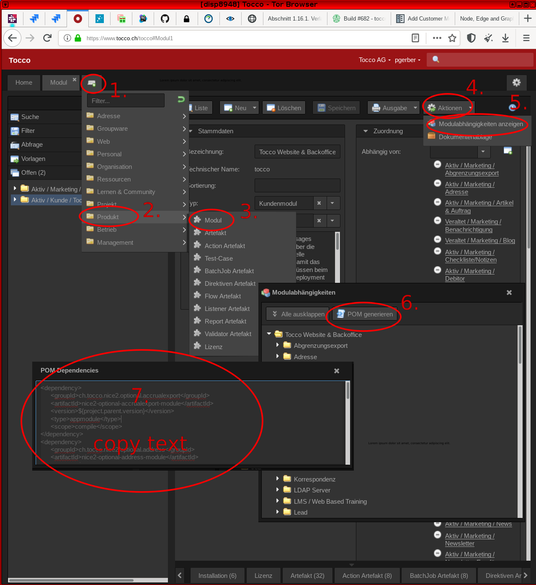

.. |pathToModuleFolder| replace:: ``customer/${CUSTOMER}``
.. |pathToModuleModuleFolder| replace:: ``customer/${CUSTOMER}/module/module``
.. |pathToModulePom| replace:: ``customer/${CUSTOMER}/pom.xml``
.. |pathToModuleModulePom| replace:: ``customer/${CUSTOMER}/module/module/pom.xml``
.. |pathToImplFolder| replace:: ``customer/${CUSTOMER}/module/impl``
.. |pathToImplPom| replace:: ``customer/${CUSTOMER}/module/impl/pom.xml``

Add Customer Module
===================

Adding a new module contains the following steps:

.. list-table::
   :header-rows: 1
   :widths: 10 10 80

   * - Nr
     - Required
     - Description
   * - 1
     - ✔
     - `Add Module in Backoffice`_
   * - 2
     - ✔
     - `Create Basic Folder Structure`_
   * - 3
     - ✔
     - `Add new Module to the Parent Pom`_
   * - 4
     -
     - `Add Content to module Folder`_
   * - 5
     -
     - `Add Java Source Folders`_
   * - 6
     - ✔ **if 5 is done**
     - `Include Resources in Maven Archive`_

.. include:: add-module-in-backoffice.rst.template

Create Basic Folder Structure
^^^^^^^^^^^^^^^^^^^^^^^^^^^^^

Create module file hierarchy::

    $ mkdir customer/${CUSTOMER}
    $ cd customer/${CUSTOMER}
    $ ../../src/bin/mkappmodule.sh

This creates the following files within ``customer/${CUSTOMER}``:

======================================== ==========================================================
 etc/application.properties               Customer specific application configuration
 etc/customer.acl                         Customer specific ACLs
 etc/hikaricp.properties                  DB connection settings
 etc/hikaricp.history.properties          DB connection setting for secondary DB used to
                                          store a change history (See :tocco-manual:`manual
                                          <core_anleitung_verlaufeinsehen.html>`)
 etc/s3.properties                        S3 object storage configuration
 module/module/desriptor/hivemodule.xml   :term:`HiveApp` configuration
 module/module/hiveapp-mount.properties   Make resources available in virtual filesystem
                                          provided by :term:`HiveApp`. This allows mounting
                                          files and directories defined in other modules.
 module/module/pom.xml                    Configuration of resources.
 impl/                                    Submodule containing customer specific
                                          implementations.  Can be used to override classes
                                          defined elsewhere.
 pom.xml                                  Module configuration including dependency
                                          configuration.
======================================== ==========================================================

Add new Module to the Parent Pom
^^^^^^^^^^^^^^^^^^^^^^^^^^^^^^^^

Each customer module must be registered in ``customer/pom.xml``.

.. code-block:: XML
   :emphasize-lines: 6

     <modules>
       <!-- ... more modules -->
       <module>maltech</module>
       <module>neptun</module>
       <module>nhk</module>
       <module>${MODULE}</module>
       <module>nvs</module>
       <module>odags</module>
       <module>odaszh</module>
       <!-- ... more modules -->
     </modules>

Add dependencies
^^^^^^^^^^^^^^^^

As mentioned earlier, for every customer module you create, there needs to be a corresponding
module defined in :term:`BO`. This definition includes dependencies on all optional modules
(called marketing modules in BO) that a customer has licensed.  This information can be used
to generate the dependencies for inclusion in ``pom.xml``. For this go to the customer module
and generate the dependencies as shown in the following screenshot:

     POM generation in BO

.. important::

    The generated dependencies can be incorrect under certain circumstances. Go through them and ensure
    they are correct.

.. todo::

       I've been told dependencies generated can be wrong but what can be wrong there? Is there anything
       in particular for which to look?

Add dependencies to existing ``customer/${CUSTOMER}/pom.xml``:

.. code-block:: xml

    <?xml version="1.0" encoding="UTF-8"?>

    <project xmlns="http://maven.apache.org/POM/4.0.0"
             xmlns:xsi="http://www.w3.org/2001/XMLSchema-instance"
             xsi:schemaLocation="http://maven.apache.org/POM/4.0.0 http://maven.apache.org/xsd/maven-4.0.0.xsd">

      <!-- … -->

      <dependencies>
        <!-- add generated dependencies here -->
      </dependencies>

      <!-- … -->

    </project>

Configure Application
^^^^^^^^^^^^^^^^^^^^^

``${CUSTOMER}/etc/application.properties`` was created, edit it as needed::

    i18n.locale.available=de-CH,en,fr-CH,it-CH  # languages available on the system
    i18n.locale.default=de-CH                   # fall back language

    email.default.from=info@CUSTOMER.ch         # global fallback sender address
    email.noreply.from=noreply@CUSTOMER.ch      # default noreply mail address
    email.allowedFromDomainsRegex=CUSTOMER\.ch  # regex of domains: domain1\.ch|domain2\.net

    nice2.dbrefactoring.businessunits=unit1,unit2  # comma separated list of Business Units

Languages and business units can bo found in :term:`BO` on *Installation*.

.. todo::

    Where can the information about the mail domains and default mail addresses be found?

See also :ref:`application-properties`.

.. include:: add-content-to-module-folder.rst.template

Add Java Source Folders
^^^^^^^^^^^^^^^^^^^^^^^

As soon as any Java code is needed (e.g. for listeners, actions, services, rest-resources, ...) a Java module has to
be added to the module. There are three different types of Java modules which can be added.

* impl -> the implementation of the module specific Java code

To add a new impl module, create |pathToImplFolder| and add the following folder structure.

.. figure:: resources/impl-folder-structure.png

Open the file |pathToImplPom| and add the following content.

.. literalinclude:: resources/customer-module-impl-pom.xml
   :language: XML

Now the impl module has to be added to the module pom. Open the file |pathToModulePom| and add the impl module to the
modules element.

.. code-block:: XML
   :emphasize-lines: 3

   <modules>
     <module>module</module>
     <module>impl</module>
   </modules>

Now the impl module also has to be added as dependency to the module pom. Open the file |pathToModuleModulePom| and add
the impl module as dependency.

.. code-block:: XML

   <dependencies>
     <dependency>
       <groupId>ch.tocco.nice2.customer.${CUSTOMER}</groupId>
       <artifactId>nice2-customer-${CUSTOMER}-impl</artifactId>
       <version>${project.version}</version>
       <type>jar</type>
       <scope>compile</scope>
     </dependency>
   </dependencies>

Now Java files can be added in the folder ``java``.

.. include:: include-resources-in-maven-archive.rst.template

.. _HikariCP: https://github.com/brettwooldridge/HikariCP
