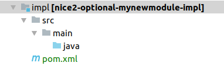

.. |pathToModuleFolder| replace:: ``optional/${MODULE}``
.. |pathToModuleModuleFolder| replace:: ``optional/${MODULE}/module``
.. |pathToModulePom| replace:: ``optional/${MODULE}/pom.xml``
.. |pathToModuleModulePom| replace:: ``optional/${MODULE}/module/pom.xml``
.. |pathToImplFolder| replace:: ``optional/${MODULE}/impl``
.. |pathToImplPom| replace:: ``optional/${MODULE}/impl/pom.xml``

Add Non-Customer Module
=======================

Adding a new module contains the following steps:

.. list-table::
   :header-rows: 1
   :widths: 10 10 80

   * - Nr
     - Required
     - Description
   * - 1
     - ✔
     - `Add Module in Backoffice`_
   * - 2
     - ✔
     - `Create Basic Folder Structure`_
   * - 3
     - ✔
     - `Add new Module to the Root Pom`_
   * - 4
     - ✔
     - `Add new Module to the Test Customer`_
   * - 5
     -
     - `Add Content to module Folder`_
   * - 6
     -
     - `Add Java Source Folders`_
   * - 7
     - ✔ **if 5 is done**
     - `Include Resources in Maven Archive`_

.. include:: add-module-in-backoffice.rst.template

Create Basic Folder Structure
^^^^^^^^^^^^^^^^^^^^^^^^^^^^^

.. note::

    For the purpose of this example, an optional module is created. For intermediate modules only
    the name differs and for core modules the path differs. Namely, core module are placed outside
    the ``optional`` directory.

Create module file hierarchy::

    $ mkdir optional/${MODULE}
    $ cd optional/${MODULE}
    $ ../../src/bin/mkappmodule.sh

This creates the following files within ``opitonal/${MODULE}``:

======================================== ==========================================================
 module/desriptor/hivemodule.xml          :term:`HiveApp` configuration
 module/hiveapp-mount.properties          Make resources available in virtual filesystem
                                          provided by :term:`HiveApp`. This allows mounting
                                          files and directories defined in other modules.
 module/pom.xml                           Configuration of build-time resources.
 api/                                     Submodule containing APIs
 impl/                                    Submodule containing module specific implementations.
 spi/                                     Submodule containing classes for use by other modules
 pom.xml                                  Module configuration including dependency
                                          configuration.
======================================== ==========================================================

Add new Module to the Root Pom
^^^^^^^^^^^^^^^^^^^^^^^^^^^^^^

Each module must be registered in the root pom file. Open the file ``pom.xml`` and add your module to it.
The modules are ordered alphabetically and are separated by core and optional modules.

.. code-block:: XML
   :emphasize-lines: 6

     <modules>
       <!-- ... more modules -->
       <module>optional/membershiphierarchylicence</module>
       <module>optional/membershiporder</module>
       <module>optional/membershipsms</module>
       <module>optional/${MODULE}</module>
       <module>optional/netmobile</module>
       <module>optional/news</module>
       <module>optional/newsletter</module>
       <module>optional/newsletterrecipient</module>
       <!-- ... more modules -->
     </modules>

Add new Module to the Test Customer
^^^^^^^^^^^^^^^^^^^^^^^^^^^^^^^^^^^

The test customer has all available modules installed. So a newly created optional module must be added to it. Open the
file ``customer/test/pom.xml`` and add the new module at the right place as dependency to it. All modules
are added in alphabetical order.

.. code-block:: XML
   :emphasize-lines: 10, 11, 12, 13, 14, 15, 16

      <dependencies>
        <!-- ... more modules -->
        <dependency>
          <groupId>ch.tocco.nice2.optional.membershipsms</groupId>
          <artifactId>nice2-optional-membershipsms-module</artifactId>
          <version>${project.parent.version}</version>
          <type>appmodule</type>
          <scope>compile</scope>
        </dependency>
        <dependency>
          <groupId>ch.tocco.nice2.optional.${MODULE}</groupId>
          <artifactId>nice2-optional-${MODULE}-module</artifactId>
          <version>${project.parent.version}</version>
          <type>appmodule</type>
          <scope>compile</scope>
        </dependency>
        <dependency>
          <groupId>ch.tocco.nice2.optional.cms</groupId>
          <artifactId>nice2-optional-cms-module</artifactId>
          <version>${project.parent.version}</version>
          <type>appmodule</type>
          <scope>compile</scope>
        </dependency>
        <!-- ... more modules -->
      </dependencies>

.. include:: add-content-to-module-folder.rst.template

Add Java Source Folders
^^^^^^^^^^^^^^^^^^^^^^^

As soon as any Java code is needed (e.g. for listeners, actions, services, rest-resources, ...) a Java module has to
be added to the module. There are three different types of Java modules which can be added.

* api -> defines services which can be injected by other modules
* spi -> defines classes which other modules can use or extend.
* impl -> the implementation of the module specific Java code

For instance, to create an impl module, create |pathToImplFolder| and add the following folder structure.
If an api or spi module has to be added, replace ``impl`` with ``api`` or ``spi`` respectively.

Open the file |pathToImplPom| and add the following content.

.. literalinclude:: resources/optional-module-impl-pom.xml
   :language: XML

Now the impl module has to be added to the module pom. Open the file |pathToModulePom| and add the impl module to the
modules element.

.. code-block:: XML
   :emphasize-lines: 3

   <modules>
     <module>module</module>
     <module>impl</module>
   </modules>

Now the impl module also has to be added as dependency to the module pom. Open the file |pathToModuleModulePom| and add
the impl module as dependency.

.. code-block:: XML

   <dependencies>
     <dependency>
       <groupId>ch.tocco.nice2.optional.${MODULE}</groupId>
       <artifactId>nice2-optional-${MODULE}-impl</artifactId>
       <version>1.0-SNAPSHOT</version>
       <type>jar</type>
       <scope>compile</scope>
     </dependency>
   </dependencies>

Now Java files can be added in the folder ``java``.

.. include:: include-resources-in-maven-archive.rst.template
