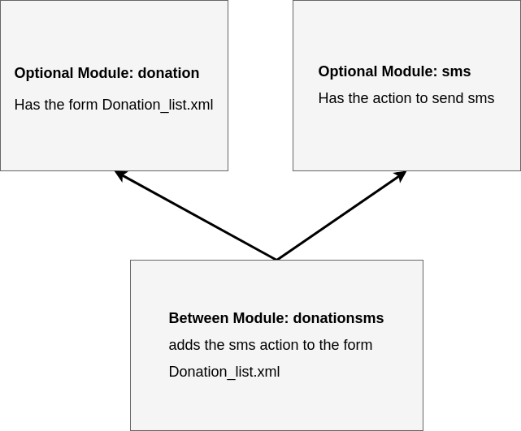

Different Module Types
======================

Nice2 is split into different type of modules.

Core Modules
^^^^^^^^^^^^

Core modules provide the basic functionality of a Nice2 installation. All core modules are always installed on every
installation. A Nice2 installation would not work without them.

Core modules can be found in: ``path/to/nice2/*``

Optional Modules
^^^^^^^^^^^^^^^^

Optional modules (also called marketing modules) are, as the name lets guess, optional. An optional module represents a
feature or functionality which a customer can add to his installation depending on his demand.

Optional modules can be found in: ``path/to/nice2/optional/*``

Customer Modules
^^^^^^^^^^^^^^^^

For every customer installation a customer module exists. A customer module configures the installation of the customer.
A customer module defines which optional modules (marketing modules) are installed. Also customer specific adjustments
which only belong to the customer are done in customer modules.

Customer modules can be found in: ``path/to/nice2/customer/*``

Between Modules
^^^^^^^^^^^^^^^

A between module is always needed if a feature or functionality should be added **automatically** if two or more specific
modules are installed and this new feature should **not be licenced separately**. If the feature was licenced separately
it could just be an optional module.

**Example:**
There are two modules ``donation`` and ``sms``. The module ``donation`` has an entity donation and a form ``donation_list.xml``
which displays the donations. The module ``sms`` has an action to send sms. See the following picture.

Now if a customer has installed both modules (sms and donation), the action to send sms should automatically be available
on the form ``donation_list.xml``. Now a new between module ``donationsms`` which depends on the modules ``sms`` and
``donation`` adds this action to the form.

The name of a between module consists of the names of the depending modules. For example the module ``licencecorrespondence``
depends on the modules ``licence`` and ``correspondence``.

Between modules can be found in: ``path/to/nice2/optional/*``

.. hint::
   **A between module**

   * adds functionality automatically if at least two other specific optional modules are installed
   * depends on at least two other modules
   * is not licenced separately (otherwise it could be an optional module)
   * has a name that consists of the names of the depending modules
