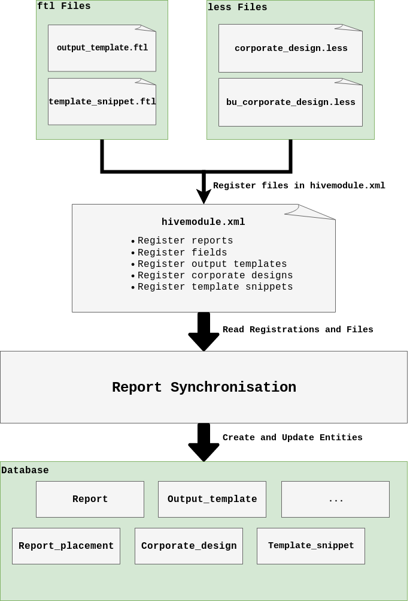
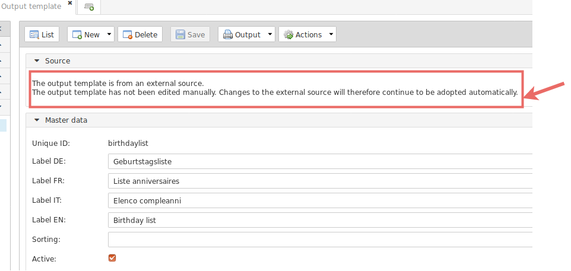
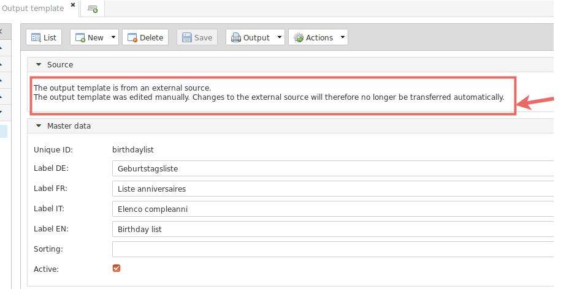
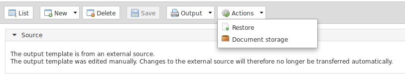
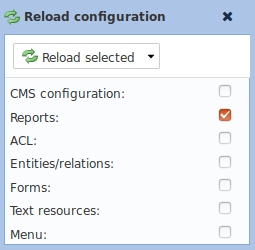
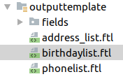

.. _Reports:

Reports
=======

.. warning::
   This chapter does not explain how to create reports in the admin view or how to write `Freemarker`_. This can be found
   in the Tocco manual. The manual can be found under https://VERSION.docs.tocco.ch/de . Replace VERSION with the nice2
   version you working on (e.g. 218 for V2.18).

Report Synchronization
----------------------

A report is a combination of different entities. Reports consist of the following entities

* Report
* Report_placement
* Report_format
* Output_template
* Output_template_field
* Output_template_format
* Output_template_layout
* Corporate_design
* Corporate_design_business_unit

It would be possible to create these entities manually in the admin view and add them by :ref:`Changesets` like initial
values. But it is cumbersome to adjust report entities by changesets. It is even more cumbersome to review a changeset
which adjusts a report. An initial values changeset for an output template looks like this.

.. code-block:: XML
   :emphasize-lines: 10, 11

   <changeSet author="author" dbms="postgresql" id="values-8sStU434An/2.13.5.0">
     <preConditions onFail="MARK_RAN">
       <sqlCheck expectedResult="0">select count(*) from nice_output_template where unique_id = 'einsatzplanung_kursleitende'</sqlCheck>
     </preConditions>
     <insert tableName="nice_output_template">
       <column name="unique_id" remarks="identifier" value="einsatzplanung_kursleitende"/>
       <column name="label" remarks="lang:de" value="Einsatzplanung Kursleitende"/>
       <column name="sorting" valueNumeric="NULL"/>
       <column name="active" value="true"/>
       <column name="less" value="@font-size-base: 10pt;&#10;@base-document-margin-right: 15mm;&#10;@base-document-margin-left: 25mm;&#10;@correspondence-document-padding-top: 50mm;&#10;@header-height: 25mm;&#10;@footer-height: 20mm;&#10;.ul li{margin-bottom:10px; border:solid 1px;}&#10;.sign {border-bottom:solid 1px;}&#10;.tpos&#10;{&#10;  margin-top: -20px;&#10;}"/>
       <column name="freemarker_template" value="&lt;div class=&quot;document-wrapper correspondence&quot;&gt;&#10;   &#9;[@templateSnippet id=&quot;correspondence_variables&quot;/]&#10;    [@templateSnippet id=&quot;correspondence_content&quot;/]&#10;    &lt;table border=&quot;0&quot; width=&quot;100%&quot;&gt;  &#10;    &lt;tr&gt;&#10;      &lt;td&gt;[@templateSnippet id=&quot;correspondence_location_date&quot;/]&lt;/td&gt;    &#10;    &lt;/tr&gt;&#10;    &lt;tr&gt;&#10;      &lt;td&gt;[@templateSnippet id=&quot;correspondence_signatures&quot;/]&lt;/td&gt;&#10;    &lt;/tr&gt;    &#10;  &lt;/table&gt; &#10;  &lt;table border=&quot;0&quot; width=&quot;100%&quot; class=&quot;tpos&quot;&gt;  &#10;  &#9;&lt;tr&gt;&lt;td class=&quot;sign&quot;&gt;&lt;/td&gt;&lt;td&gt;&amp;nbsp;&lt;/td&gt;&lt;/tr&gt;&#10;  &#9;&lt;tr&gt;&lt;td width=&quot;50%&quot;&gt;Vorname und Nachname&lt;/td&gt;&lt;td&gt;&amp;nbsp;&lt;/td&gt;&lt;/tr&gt;&#10;  &lt;/table&gt;&#10;&lt;/div&gt;"/>
       <column name="hide_logo_checkbox" value="false"/>
       <column name="enable_logo_checkbox" value="false"/>
       <column name="external" value="false"/>
       <column name="edited" value="false"/>
       <column name="_nice_version" valueNumeric="29"/>
       <column name="_nice_create_timestamp" valueComputed="NOW()"/>
       <column name="_nice_update_timestamp" valueComputed="NOW()"/>
       <column name="_nice_create_user" value="tocco"/>
       <column name="_nice_update_user" value="tocco"/>
       <column name="fk_output_template_format" valueComputed="(select pk from nice_output_template_format where unique_id = 'a4_portrait')"/>
       <column name="fk_report_file_format" valueComputed="(select pk from nice_report_file_format where unique_id = 'wkhtmltopdf.pdf')"/>
       <column name="fk_output_template_layout" valueComputed="(select pk from nice_output_template_layout where unique_id = 'header_footer')"/>
       <column name="fk_output_template_entitydocs" valueComputed="(select pk from nice_folder where nice_folder.??? = '???')"/>
     </insert>
   </changeSet>

Especially the fields ``less`` and ``freemarker_template`` are extremely long. These fields contain the whole styling
and content of the output template. It is almost impossible to review this.

The report synchronization solves this problem. Output templates and template snippets can be written in ``*.ftl`` files,
the whole styling can be written in ``*.less`` files and reports can be registered in the file ``hivemodule.xml``. The
reports then will be synchronized with the applications related database. This means the report synchronization creates,
updates entities on the basis of the written files and sets the correct relations (e.g. Report_placement).

Synchronized entities are

* ``Report``
* ``Output_template``
* ``Output_template_layout``
* ``Output_template_field``
* ``Template_snippet``
* ``Corporate_design``
* ``Business_unit_corporate_design``

.. hint::
   Entities which are created manually are not synchronized at all. Only entities which are created by the report
   synchronization will be synchronized further. Therefore the entities have a hidden flag ``external`` which is set
   by the report synchronization.

The following image shows the basic process of the report synchronization.

The report synchronization does not synchronize all entities automatically. If such an entity was adjusted manually by
any user a hidden flag ``edited`` is set to ``true``. On a detail form of a synchronized entity it is always visible if
the entity was edited by an user or if it is synchronized.

**Example of a synchronized entity**

The message on the top of the detail form displays if the output template was edited manually. The report synchronization
does synchronize this entity.

**Example of an manually edited Output template**

The message on the top of the detail form displays if the output template was edited manually. The report synchronization
does not synchronize this entity anymore.

Reset a Manually Edited Entity
^^^^^^^^^^^^^^^^^^^^^^^^^^^^^^

To synchronize a manually edited entity call the action ``Restore`` in the detail from. After the entity was restored,
the synchronization synchronizes this entity again.

.. warning::
   All manual adjustments made by any user are lost if restore action is called.

Starting the Report Synchronization
^^^^^^^^^^^^^^^^^^^^^^^^^^^^^^^^^^^

The report synchronization is done with the :java:ref:`ReportSynchronizer<ch.tocco.nice2.reporting.impl.sync.ReportSynchronizer>`
service. This service is registered as ``starter`` but synchronizes the reports only in the ``RunEnv`` mode
``production`` and ``test`` during the start up.

Starting Manually
+++++++++++++++++

The report synchronization also can be triggered manually by calling the config reload action ``reports``. Go to the
system menu and choose **Reload configuration**. Select **Reports** and press **Reload selected**.

Register Reports
----------------

A report can be registered as follows in the file ``hivemodule.xml`` of the module where the report should be added.

.. code-block:: XML

   <contribution configuration-id="nice2.reporting.Reports">
     <report id="birthdaylist"
             outputTemplate="birthdaylist"
             synchronize="true"
             label="actions.report.birthdaylist"
             roles="addressmanager, addressguest, usermanager, userguest"
             outputLanguagePath="relCorrespondence_language">
       <placement location="list" entityModel="User" sorting="BEFORE:report.employeelist"/>
     </report>
   </contribution>

.. list-table::
   :header-rows: 1

   * - Attribute
     - Description
   * - id
     - A unique id for the report. This is the ``unique_id`` on the ``Report`` entity.
   * - label
     - A text resource key. The label of the report will be set with the corresponding text resource.
   * - outputTemplate
     - The output template which is set on the report entity. See `Register Output Templates`_
   * - synchronize
     - ``true`` if this report should be synchronized. ``false`` otherwise.
   * - roles
     - If set, only users with these roles can generate the report. If not set, every user can generate this report.
   * - outputlanguagePath
     - Defines which locale is used to generate the report.

Register Output Templates
-------------------------

Output templates are written in `Freemarker`_ and saved in ``*.ftl`` files. Output templates are located in the folder
``outputtemplates``.

* In optional modules: ``path/to/nice-project/optional/MODULE_NAME/module/outputtemplate``
* In customer modules: ``path/to/nice-project/customer/CUSTOMER_NAME/module/module/outputtemplate``

An output template can be registered as follows in the file ``hivemodule.xml`` of the module where the report should be
added.

.. code-block:: XML

   <contribution configuration-id="nice2.reporting.OutputTemplates">
     <outputTemplate uniqueId="birthdaylist"
                     label="report.birthdaylist.maintitle"
                     freemarker="[#self]/outputtemplate/birthdaylist.ftl"
                     fileFormat="wkhtmltopdf.pdf"
                     outputTemplateFormat="a4_landscape"
                     outputTemplateLayout="header_footer"
                     outputTemplateUsage="report"/>
   </contribution>

.. list-table::
   :header-rows: 1

   * - Attribute
     - Description
   * - id
     - A unique id for the output template. This is the ``unique_id`` on the ``Output_template`` entity.
   * - label
     - A text resource key. The label of the output template will be set with the corresponding text resource.
   * - freemarker
     - The path to the ``*.ftl`` file. The content of the ftl file will be set on the ``Output_template`` entity.
   * - fileFormat
     - Defines to what format the template will be rendered. Possible formats are ``wkhtmltopdf.pdf``, ``pdf``, ``xml``, ``csv``, ``xls``, ``taf``.
   * - outputTemplateFormat
     - Defines the format of the output template. See entity ``Output_template_format`` for available values.
   * - outputTemplateLayout
     - Defines layout in which the output template is wrapped in. See entity ``Output_template_layout`` for available values.
   * - outputTemplateUsage
     - Defines whether this output template is used in a report or correspondence.

Register Output Templates
-------------------------

.. todo::
   Write chapter

Register Fields
---------------

Fields are written in `Freemarker`_ and saved in ``*.ftl`` files. Fields are located in the folder ``outputtemplate/fields``.

* In optional modules: ``path/to/nice-project/optional/MODULE_NAME/module/outputtemplate/fields``
* In customer modules: ``path/to/nice-project/customer/CUSTOMER_NAME/module/module/outputtemplate/fields``

A field can be registered as follows in the file ``hivemodule.xml`` of the module where the report should be
added.

.. code-block:: XML

   <field outputTemplate="birthdaylist"
          uniqueId="birthdaylist.firstname"
          snippetId="birthdaysnippet"
          title="report.birthdaylist.firstname"
          sorting="20"
          width="22"
          freemarker="[#self]/outputtemplate/fields/birthdaylist.firstname.ftl"/>

.. list-table::
   :header-rows: 1

   * - Attribute
     - Description
   * - uniqueId
     - A unique id for the output template field. This is the ``unique_id`` on the ``Output_template_field`` entity.
   * - outputTemplate
     - Defines to which output template this field belongs.
   * - snippetId
     - Simple text which can be defined if the two fields with the same name must are used in the same output template.
   * - title
     - A text resource key. The title of the output template field will be set with the corresponding text resource.
   * - sorting
     - Defines the sorting of the field. The higher the sorting, the more right it will appear on the list.
   * - width
     - Defines the width of the field.
   * - freemarker
     - The path to the ``*.ftl`` file. The content of the ftl file will be set on the ``Output_template_field`` entity.

Register Template Snippets
--------------------------

Template snippets are written in `Freemarker`_ and saved in ``*.ftl`` files. Template snippets are located in the folder
``templatesnippet``.

* In optional modules: ``path/to/nice-project/optional/MODULE_NAME/module/templatesnippet``
* In customer modules: ``path/to/nice-project/customer/CUSTOMER_NAME/module/module/templatesnippet``

A template snippet can be registered as follows in the file ``hivemodule.xml`` of the module where the report should be
added.

.. code-block:: XML

   <contribution configuration-id="nice2.reporting.TemplateSnippets">
     <templateSnippets uniqueId="bill_address_recipient"
                       freemarker="[#self]/templatesnippet/Bill_address_recipient.ftl"
                       categories="finance_report"
                       label="templatesnippet.bill_address_recipient"/>

.. list-table::
   :header-rows: 1

   * - Attribute
     - Description
   * - uniqueId
     - A unique id for the template snippet field. This is the ``unique_id`` on the ``Template_snippet`` entity.
   * - freemarker
     - The path to the ``*.ftl`` file. The content of the ftl file will be set on the ``Template_snippet`` entity.
   * - categories
     - Defines to which categories the template snippet belongs. Check the entity ``Template_snippet_category`` for available values.
   * - label
     - A text resource key. The label of the template snippet will be set with the corresponding text resource.

Register Corporate Designs
--------------------------

Corporate designs are written in ``Less`` and saved in ``*.less`` files. Corporate designs are located in the folder
``corporatedesign``

* In customer modules: ``path/to/nice-project/customer/CUSTOMER_NAME/module/module/corporatedesign``
* In optional modules: -

.. todo::
   Write chapter

.. _Freemarker: https://freemarker.apache.org
