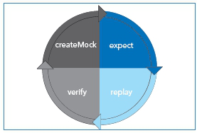

.. _TestNG: https://testng.org/
.. _EasyMock: https://easymock.org/
.. _`H2 Database Engine`: http://www.h2database.com/
.. _`Embedded Postgres`: https://github.com/zonkyio/embedded-postgres
.. _`EasyMock Lifecycle Description`: https://dzone.com/refcardz/junit-and-easymock?chapter=10

Unit-Tests
==========

For every piece of java code that is written using the tocco framework a unit test should be written.

We usually use the following technologies:

* TestNG_ as unit test framework (**not Junit!**)
* EasyMock_ to create mocks / dummies / stubs
* `H2 Database Engine`_ for most of our unit test specific databases
* `Embedded Postgres`_ for our unit test databases that require postgres specific features

TestNG
------

Please find a more comprehensive documentation of what TestNG_ does and how it works on the official website. In this
documentation some of the most common features of TestNG_ that are used when creating unit tests in the tocco framework
are described.

Common annotations
++++++++++++++++++

* **@BeforeClass:** The annotated method will be run before the first test method in the current class is invoked.
* **@AfterClass:** The annotated method will be run after all the test methods in the current class have been run.
* **@BeforeMethod:** The annotated method will be run before each test method.
* **@AfterMethod:** The annotated method will be run after each test method.
* **@Test:** Marks a class or a method as part of the test.

DataProvider
++++++++++++

DataProviders can be used to create parameterized tests using TestNG_. To make this work, the annotation parameter
``dataProvider`` can be added to the ``@Test`` annotation. The data that is passed to a parameterized test can then
be defined in a corresponding ``@DataProvider``. To link a ``@DataProvider`` implicitly to a given unit test, the
method name must be equal to the dataProvider parameter value.

E.g.

.. code-block:: java

   @Test(dataProvider = "testDataProvider")
   public void test() { }

   @DataProvider
   public Object[][] testDataProvider { }

If the method name does not match it can be set explicitly as a parameter of the ``@DataProvider`` method. Please find
a working real life example of a simple unit test with its corresponding ``@DataProvider``.

.. code-block:: java

   @Test(dataProvider = "fileNameDataProvider")
   public void testNormalizeFilename(String raw, String normalized) {
       String normalizedFilename = PathNormalizer.normalizeFilename(raw);
       assertEquals(normalizedFilename, normalized);
   }

   @DataProvider(name="fileNameDataProvider")
   public Object[][] getFileNames() {
       return new Object[][]{
           {"Question mark?.doc", "Question mark.doc"},
           {"<Technical brackets>.doc", "Technical brackets.doc"},
           {"Asteri*sk.doc", "Asterisk.doc"},
           {"Col:on.doc", "Colon.doc"}
       };
   }

DataProvider methods are executed when preparing the unit test execution and before the fake datamodel / fake database
are setup. This implies that it is not possible to pass parts of the datamodel or entities as parameters to unit tests.

EasyMock
--------

Please find a more comprehensive documentation of what EasyMock_ does and how it works on the official website. In this
documentation some of the most common features of EasyMock_ that are used when creating unit tests in the tocco framework
are described.

Types of mocks
++++++++++++++
* **mock** an object for which each method call and its return values need to be predefined
* **dummy** an object that works similar to a mock but it accepts all method calls and returns null values if nothing else is defined.
* **stubs** an object that returns the same value whenever a method is called. In EasyMock_ "stub" methods can be defined for mocks as well as dummies.

Lifecycle of EasyMock mocks
+++++++++++++++++++++++++++

EasyMock mock objects follow a simple four step lifecycle as described below. (Source: `EasyMock Lifecycle Description`_)

* **Create Mock** This phase creates the mock object.
* **Expect** This phase records the expected behaviors of the mock object. These will be verified at the end.
* **Replay** Replays the previously recorded expectations.
* **Verify** In order for a test to pass, the expected behaviors must have been executed. The verify phase confirms the execution of the expected calls.

Creating a mock
+++++++++++++++

There are different methods to create EasyMock mock objects. When using the ``EasyTestCase`` the specific ``setupMock``
must be used if the mock object should be replayed / verified automatically by the ``EasyTestCase``.

.. code-block:: java

   //use setup mock of EasyTestCase
   Test testMock1 = setupMock(Test.class);

   //direct mock creation
   Test testMock2 = EasyMock.createMock(Test.class); //create a "normal" mock using static method
   Test testDummy1 = EasyMock.createNiceMock(Test.class); //create a dummy using static method

   //using controls
   IMocksControl control = EasyMock.createControl(); //create normal mock control
   Test testMock4 = control.createMock(Test.class);

   IMocksControl control = EasyMock.createNiceControl() //create dummy control
   Test testDummy2 = control.createMock(Test.class);

Expect
++++++

Recording expected behaviour consists of multiple can be done by using ``expect`` for functions or ``expectLastCall``
for methods (functions without return value).

For both methods and functions you can define how often a given call is expected to be called using the following
methods:

* ``once()`` exactly once (default if nothing is specified)
* ``times(n)`` exactly ``n`` times
* ``times(min, max)`` between ``min`` and ``max`` times
* ``atLeastOnce()`` between 1 and n times
* ``anyTimes()`` between 0 and n times

To define a fake behaviour the following methods can be used:

* ``andReturn`` return a static value (only works for functions)
* ``andAnswer`` execute a function when the method was called as expected and compute the return value
* ``andThrow`` throw an exception if the method was called as defined

If you want to turn your mock object into a stub the following methods can be used.

* ``andStubReturn`` return a static value (only works for functions)
* ``andStubAnswer`` execute a function when the method was called as expected and compute the return value
* ``andStubThrow`` throw an exception if the method was called as defined
* ``asStub`` do nothing (only works for methods)

.. code-block:: java

   public interface Test {
       String function(String param);
       String function(String param1, Integer param2);
       void method(String param);
       void method(Integer param);
   }

.. code-block:: java

   //use static import
   import static org.easymock.EasyMock.*;

   //create mock
   Test testMock = setupMock(Test.class);

   //record expected behaviour

   //when "function" is called with param "test" it will return "return value"
   expect(testMock.function("test")).andReturn("return value");

   //when "function" is called with any other param it will return the string
   //that was passed as parameter
   expect(testMock.function(anyObject())).atLeastOnce().andAnswer(() -> {
      String param = (String) getCurrentArguments()[0];
      return param;
   });

   //when "function" is called with param1 = "test" and any integer as param2
   //it will return "string integer rv". to mix "fixed" values and wildcards
   //or captures "eq" must be used
   expect(testMock.function(eq("test"), anyObject())).andReturn("string integer rv").times(2, 4);

   //define that "method" will be called with a string once
   testMock.method(anyObject(String.class));

   //define that the mock should throw an illegal argument exception whenever "bad string" is passed to it
   testMock.method("bad string");
   expectLastCall().andStubThrow(new IllegalArgumentException("bad string was used"));

   //define that "method" will be called with an integer twice
   testMock.method(anyObject(Integer.class));
   expectLastCall().times(2);

Captures
++++++++

Captures can be used to capture values that were passed to a mock object to check them later.

When creating a capture the CaptureType can be defined:

* **NONE** do not capture anything
* **LAST** default behaviour. will capture the argument of the last matching call
* **FIRST** will capture the argument of the first matching call
* **ALL** will capture, in order, the arguments of each matching calls

To get the captured values ``getValue`` (for single values) or ``getValues`` (for multiple values) can be used.

.. code-block:: java

   public interface Test {
       String function(String param);
       String function(String param1, Integer param2);
       void method(String param);
       void method(Integer param);
   }

.. code-block:: java

   //use static imports
   import static com.google.common.truth.Truth.*;
   import static org.easymock.EasyMock.*;

   //create capture
   Capture<String> stringCapture = newCapture(CaptureType.ALL);

   //create mock
   Test testMock = setupMock(Test.class);

   //expect method call with capture
   testMock.method(capture(stringCapture))
   expectLastCall().times(2);

   //EasyTestCase will ready the mocks for us
   runLogicWithoutReturn(service -> {
       testMock.method("test1");
       testMock.method("test2");
   });

   //list contains "test1", "test2"
   List<String> passedStrings = stringCapture.getValues();
   assertThat(passedStrings).containsExactly("test1", "test2");

Replay / Verify / Reset
+++++++++++++++++++++++

To replay a mock you can simply call ``control.replay()`` / ``control.verify()`` / ``control.reset()`` on the control or
``EasyMock.replay(mock1, mock2, ...)`` / ``EasyMock.verify(mock1, mock2, ...)`` /
``EasyMock.reset(mock1, mock2, ...)`` for "independent" mock objects.

These steps are automated / built in if you use an ``EasyTestCase`` test class and its ``setupMock`` method.

.. code-block:: java

   Test testMock1 = createMock(Test.class); //independent

   IMocksControl control = EasyMock.createControl(); //mock control
   Test testMock2 = control.createMock(Test.class);

   // ... define expectations here

   EasyMock.replay(testMock1); //replay testMock1
   control.replay(); //replay all mocks of control

   // ... use your mocks / call your logic here

   // verify the mocks, this could be done in an @AfterMethod method
   EasyMock.verify(testMock1);
   control.verify();

   // reset the mocks, this is only required if a mock object is defined
   // globally and used by multiple tests. This could be done in a @BeforeMethod method
   EasyMock.reset(testMock1);
   control.reset();

Tocco Specific Test Classes
---------------------------

There are some abstract classes that may be used to conveniently emulate parts of the tocco framework in unit tests.
Among other things these classes may be used to setup a simplified datamodel that works with a real database to grant
the ability to test code that accesses or writes data.

AbstractInjectingTestCase
+++++++++++++++++++++++++

.. note::
   EasyTestCase and its derivatives are recommended over direct AbstractInjectingTestCase usage. As all other described
   tocco specific test classes extend the AbstractInjectingTestCase, the features described here apply to them as well.

The ``AbstractInjectingTestCase`` is the base class that is used by all other classes. It provides a method
``setupTestModules`` that must be overridden and contains all modules that are required for a unit test and may
contain additional bindings using the ``bind`` methods.

All installed or bound services may be injected into the unit test using the ``@Resource`` annotation.

Please find below some example code of how these bindings may be used.

.. code-block:: java

    public class Test {
        @Resource
        private Context context;
        @Resource
        private QueryBuilderFactory queryBuilderFactory;
        @Resource
        private ConditionBuilder conditionBuilder;
        @Resource
        private TextResources textResources;

        @Override
        protected void setupTestModules() {
            //standard embedded db module that installs db related services (e.g. Context or QueryBuilderFactory)
            install(FixtureModules.embeddedDbModules(false));
            bindDataModel(TestDataModel.class);

            bind(ConditionBuilder.class, ConditionBuilderImpl.class); //bind a real impl class
            bindInstance(TextResources.class, setupTextResources()); //bind a mock object
        }

        private TextResources setupTextResources() {
            TextResources textResources = createNiceMock(TextResources.class);
            expect(textResources.getText(anyObject())).andStubReturn("test");
            replay(textResources);
            return textResources;
        }
    }

EasyTestCase
++++++++++++

The ``EasyTestCase`` is the base class of all the following "EasyXXTestCase" classes. The base class should be used
if no other implementation fits (e.g. for Services, ...).

EasyTestCases provide the following features:

* ``context`` and ``executor`` are injected in the base class and may be used in all subclasses
* simplification of the unit-test procedure
* automated mock handling
* automated lookup value creation
* simplified way to create entities

To create an ``EasyTestCase`` you must define a DataModel and a method that instantiates the class to test.

.. code-block:: java

   public class TestServiceTest extends EasyTestCase<TestService> {
       @Resource
       private QueryBuilderFactory queryBuilderFactory;

       private TextResources textResources = setupMock(TextResources.class); //"global" mock object

       @Override
       protected Class<? extends DataModel> defineDataModel() {
           return TestDataModel.class;
       }

       @Override
       protected TestService instantiateClassToTest() {
           return new TestServiceImpl(context, queryBuilderFactory, textResources);
       }

       private static final class TestDataModel extends AbstractDataModel {
           protected TestDataModel(TypeManager typeManager, L10N l10n) {
               super(typeManager, l10n);

               entityModel("Test")
                   .with(standardPk());

               commit();
           }
       }
   }

If no datamodel is needed, the ``EmptyDataModel`` of the ``EasyTestCase`` can be used.

Everything that is needed to instantiate the class (all constructor params) must be available in this method. They can
either be injected or globally defined as mock objects.

Unit-Test-Procedure
*******************

Unit-Tests tend to follow the following steps:

1. prepare data & mock objects
2. ready mocks & instantiate class that will be tested
3. call the method that we want to test
4. verify the results

To simplify this the EasyTestCase offers the following methods:

* **runLogic** runs a callable and returns its return value
* **runLogicWithoutReturn** runs a callable and discards the return value
* **runLogicInTransaction** runs a callable in a transaction and returns its return value

.. code-block:: java

   @Test
   public void testFunction() {
       //prepare test
       Entity entity = createEntity("Test");

       //ready mocks & instantiate class & run the test itself
       String returnValue = runLogic(service -> service.function(entity));

       //check the result
       assertThat(returnValue).isEqualTo("expectedValue");
   }

   @Test
   public void testMethod() {
       //prepare test
       Entity entity = createEntity("Test");

       //ready mocks & instantiate class & run the test itself
       runLogicWithoutReturn(service -> service.method(entity));

       //check the result
       assertThat(entity.getString("test_field")).isEqualTo("expectedValue");
   }

Managing-Mocks
**************

If you need a mock object, the ``setupMock`` method should be used. Mock objects that are created using ``setupMock``
are managed by the built in ``IMocksControl``, automatically reset ``@BeforeMethod``, automatically replayed before the
class to test is instantiated and verified in ``@AfterMethod``.

Creating Lookup-Values
**********************

Lookup Entities will be automatically created if they are created inside of ``NoArgPersistTask`` tasks that are returned
by the ``getLookupTasks`` method as seen in the example below.

.. code-block:: java

   public class TestServiceTest extends EasyTestCase<TestService> {
       // ...

       @Override
       protected List<PersistTask<Void, ?>> getLookupTasks() {
           return List.of(TestDataModel.getTestStatusTask());
       }

       // ...

       private static final class TestDataModel extends AbstractDataModel {
           protected TestDataModel(TypeManager typeManager, L10N l10n) {
               super(typeManager, l10n);
               // ...
               EntityModelMock testStatus = lookupEntityModel("Test_status");
               // ...
           }

           public static NoArgPersistTask<Multimap<String, Entity>> getTestStatusTask() {
               return getTaskToAddLookupValues("Test_status", "active", "archived");
           }
       }
   }

Creating Entities
*****************

EasyTestCases provide a method ``createEntity`` that creates an entity inside a transaction. It can either be used
with just the EntityModel-name as parameter or with a function that gets an ``EntityBuilder`` as parameter and should
return an ``EntityBuilder`` aswell.

.. code-block:: java

   public class TestServiceTest extends EasyTestCase<TestService> {
       // ...
       public void test() {
           Entity simpleEntity = createEntity("Simple_entity"); //creates an entity without seting any values

           //create an entity with an ``EntityBuilder``
           createEntity("Test", builder -> builder
               .field("test_field", "test_value")
               .field("test_date", LocalDate.now())
               .setRelatedLookupValue("relTest_status", "active")
               .setRelatedEntity("relSimple_entity", simpleEntity));
           // ...
       }
       // ...
   }

The ``EntityBuilder`` can be used without the ``createEntity`` method but it requires manual transaction management if
you decide to do so.

EasyBatchjobTestCase
++++++++++++++++++++

The ``EasyBatchjobTestCase`` adds Batchjob specific testing utilities to the EasyTestCase.

The function ``getTaskId()`` must be overwritten and will the return value of this function will be compared to the
``getFactoryId()`` of the ``TaskFactory`` under test.

There is a batchjob specific test method ``runBatchjob(taskContext)`` that should be used to test batchjobs. It requires
a parameter ``taskContext`` which in most cases should be a mock object.

.. code-block:: java

   public class TestBatchjobTest extends EasyBatchjobTestCase<TestBatchjob> {
       private final TaskContext taskContext = setupMock(TaskContext.class);
       private final ProgressLog progessLog = setupMock(ProgressLog.class);

       // ...

       @Override
       protected String getTaskId() {
           return "TestBatchjob";
       }

       @Test
       public void testBatchjob() {
           //prepare entities
           createEntity("Test");
           createEntity("Test");

           //prepare mocks
           expect(taskContext.getProgressLog()).andReturn(progessLog);
           progessLog.log("batchjob.TestBatchjob.deleted");
           expectLastCall().times(2);

           //ready mocks & run batchjob
           runBatchjob(taskContext);

           //evaluate results
           assertThat(context.getEntityManager("Test").createQueryForAll().count()).isEqualTo(0);
       }
       // ...
   }

EasyListenerTestCase
++++++++++++++++++++

The ``EasyListenerTestCase`` adds the function ``runWithRegisteredListener`` to the ``EasyTestCase`` this method runs
logic inside a transaction for which the listener under test is registered.

.. code-block:: java

   public class TestListenerTest extends EasyListenerTestCase<TestListener> {
       // ...
       @Test
       public void testListener() {
           //create entity without listener
           Entity testEntityWithoutListener = createEntity("Test");

           //ready mocks & create entity with listener
           Entity testEntityWithListener = runWithRegisteredListener("Test", () -> createEntity("Test"));

           //evaluate results
           assertThat(testEntityWithoutListener.getRelatedEntityOrNull("relTest_status")).isNull();

           //check if listener set the Test_status
           Entity listenerStatus = testEntityWithListener.getRelatedEntityOrNull("relTest_status");
           assertThat(listenerStatus).isNotNull();
           assertThat(listenerStatus.getString("unique_id")).isEqualTo("active");
       }
       // ...
   }

EasyValidatorTestCase
+++++++++++++++++++++

The ``EasyValidatorTestCase`` extends the ``EasyTestCase`` by adding the methods ``runValidationExpectValid`` and
``runValidationExpectInvalid``. These methods are not run in a transaction. They allow to check if a validator deems
an entity valid or not and if not, it allows checking the error message. This method can be called inside of a
transaction if you want to check an entity that is still in conception state.

.. code-block:: java

   public class SameTeamValidatorTest extends EasyValidatorTestCase<SameTeamValidator> {
       // ...
       @Test
       public void testDifferentTeams() {
           Entity homeTeam = createEntity("Team");
           Entity guestTeam = createEntity("Team");

           Entity game = createEntity("Game", builder -> builder
               .setRelatedEntity("relHome_team", homeTeam)
               .setRelatedEntity("relGuest_team", guestTeam));

           runValidationExpectValid(game);
       }

       @Test
       public void testSameTeam() {
           Entity team = createEntity("Team");

           context.tx().invokeRTE(() -> {
               Entity game = createEntity("Game", builder -> builder
                   .setRelatedEntity("relHome_team", team)
                   .setRelatedEntity("relGuest_team", team));

               runValidationExpectInvalid(game, "validation.GameSameTeamValidator.error_message");
               return null;
           });
       }
       // ...
   }

AbstractInjectingJerseyTestCase
+++++++++++++++++++++++++++++++

The ``AbstractInjectingJerseyTestCase`` is an abstract test class that sets up a web server for test purposes. It allows
writing unit tests for REST resources that test for a real http response (e.g. headers, status, content, ...)

To make it work, you need to define the REST resources under test as instantiated return value of
``getRestResources()``.

In unit tests these rest resources may be called using the ``javax.ws.rs.client.Client`` or
``javax.ws.rs.client.Target`` that can be retrieved by calling ``target(path)`` or ``client()``.

.. code-block:: java

   @Test
   public void testCalendarResource() {
       Response response = target("/calendar").request().get();
       assertEquals(response.getStatus(), 200);
       Map rootItems = response.readEntity(Map.class);
       Map links = (Map) rootItems.get("_links");

       assertEquals(links.size(), 2);
       assertUri(links, "self", getBaseUri().resolve("calendar").toString());
       assertUri(links, "calendar-types", getBaseUri().resolve("calendar/types").toString());
   }

EasyJerseyTestCase
++++++++++++++++++

The ``EasyJerseyTestCase`` is built on top of ``AbstractInjectingJerseyTestCase`` and adds all the functionality of
``EasyTestCase``. To call the rest endpoint and automatically ready all the mocks the following methods should be used:

* ``simpleGet(String url, Class<R> expectedType)``
* ``simplePost(String url, A argument, Class<R> expectedType)``
* ``simplePut(String url, A argument)``
* ``simpleDelete(String url)``

.. code-block:: java

   public class SearchFilterResourceTest extends EasyJerseyTestCase {
       private DataModel dataModel = setupMock(DataModel.class);
       private SearchFilterLoadingService searchFilterLoadingService = setupMock(SearchFilterLoadingService.class);

       @Override
       protected List<?> getRestResources() {
           SearchFilterResource searchFilterResource = new SearchFilterResourceImpl(dataModel, searchFilterLoadingService);
           return List.of(searchFilterResource);
       }
       // ...
   }

Test-Datamodel
--------------

The datamodel for unit tests should be defined in a java class that extends ``AbstractDataModel``. In a datamodel for
a test you usually only add entities and fields that are relevant for your logic / your test. To do so, you define
entities, fields and relations.

Entities
++++++++

* ``entityModel(modelName)`` defines an empty ``EntityModelMock``
* ``lookupEntityModel(modelName)`` defines a lookup entity model (Fields: ``pk``, ``unique_id``, ``label``, ``sorting``, ``active``)
* ``EntityModelMock`` follows the builder pattern -> you are able to chain method calls

Fields
++++++

* ``field(fieldName)`` defines a field (**default: not-null string field**)
* ``standardPk()`` defines a standard pk field (equal to ``field("pk").asSerial().key()``)
* fields are added to an ``EntityModelMock`` by using its ``with`` method
* ``FieldModelMock`` follows the builder pattern -> you are able to chain method calls
* the type of a field can be set using ``asBool``, ``asInt()``, ``asLong()``, ``asSerial()`` or ``asType(type)`` for all other types
* if a ``FieldModelMock`` needs to be nullable this needs to be explicitly specified with ``nullable()``

Relations
+++++++++

* relations are defined on the "source" ``EntityModelMock`` with one of the following functions
* ``source.manyToOne(target)`` n:0..1 / n:1 relation. (**default: nullable / n:0..1**)
* ``source.manyToMany(target)`` n:n relation
* ``RelationModelMock`` follows the builder pattern -> you are able to chain method calls
* if a ``manyToOne`` relation is not nullable, it must be declared using ``required()``

.. code-block:: java

   public class TestDataModel extends AbstractDataModel {
       protected TestDataModel(TypeManager typeManager, L10N l10n) {
           super(typeManager, l10n);

           EntityModelMock user = entityModel("User")
               .with(standardPk())
               .with(field("firstname")) // not-null string field
               .with(field("lastname")) // not-null string field
               .with(field("birthdate").asType("date")); // not-null date field

           EntityModelMock userStatus = lookupEntityModel("User_status");

           EntityModelMock test = entityModel("Test")
               .with(standardPk())
               .with(field("active").asBool()) // not-null boolean field
               .with(field("int").asInt().nullable()) // nullable int field
               .with(field("long").asLong().nullable()) // nullable long field
               .with(field("serial").asSerial().nullable()); // nullable serial field

           //required manyToOne relation
           user.manyToOne(userStatus).required();

           //named manyToOne relation
           test.manyToOne("relRecipient", user, "relTest_recipient");
           test.manyToOne("relSender", user, "relTest_sender");

           //manyToMany relation
           test.manyToMany(user);

           commit(); // important, dont forget it
       }
   }

Using files
-----------

If a real file (e.g. xml) is required / beneficial in a unit test, the file must be stored in a ``resources`` folder
next to the ``java`` test sources folder. The files need to be in exactly the same folder structure as the java class.

E.g.

.. code-block:: text

   ↳ src
   - ↳ test
   - - ↳ java
   - - - ↳ ch
   - - - - ↳ tocco
   - - - - - ↳ nice2
   - - - - - - ↳ optional
   - - - - - - - ↳ test
   - - - - - - - - ↳ impl
   - - - - - - - - - ↳ TestServiceTest.java
   - - ↳ resources
   - - - ↳ ch
   - - - - ↳ tocco
   - - - - - ↳ nice2
   - - - - - - ↳ optional
   - - - - - - - ↳ test
   - - - - - - - - ↳ impl
   - - - - - - - - - ↳ test_file.xml

If these prerequisites are given, the file can be retrieved using ``getResourceAsStream(uri)`` as shown in
the example below.

.. code-block:: java

   public class TestServiceTest extends EasyTestCase<TestService> {
       @Resource
       private BinaryFactory binaryFactory;

       // ...
       @Test
       public void testListener() throws IOException {
           Binary binary = createBinary("test_file.xml");

           runLogicWithoutReturn(service -> service.processFile(binary));
           // ...
       }

       private Binary createBinary(String uri) throws IOException {
           try (InputStream is = getClass().getResourceAsStream(uri)) {
               return binaryFactory.newBinary(is, uri);
           }
       }
       // ...
   }
