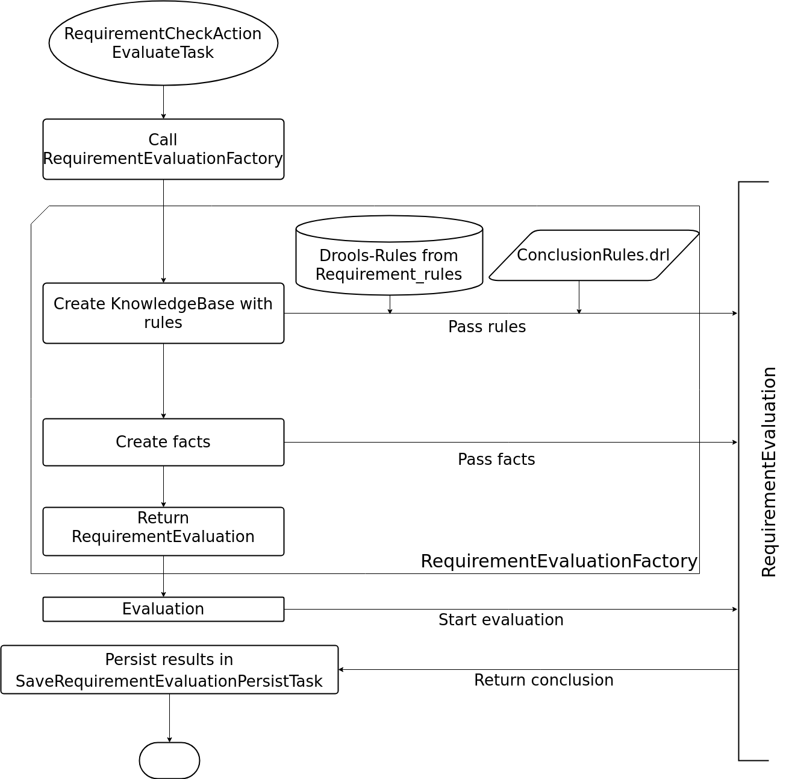

Educationrequirement
====================

We use Drools in the educationrequirement module to implementing requirement rules. Requirement rules are defined in the
``Requirement_rule`` entity. These are generally things like age verification, presence checks or verifying a student
has attended all mandatory modules of a course. A few base rules used to set the final status can be found in the
``ConclusionRules.drl`` file.

    a rough overview how we build our knowledge base and start the evaluation

Facts
-----

A summary for the available facts in the educationrequirement context. See the integration handbook for detailed
documentation.

EntityFact
^^^^^^^^^^

This used to work with entities in Drools. It's possible to access the values of the entity and to resolve to other
entities. An EntityFact of the ``Requirement`` being evaluated, the ``Schooling`` or ``Registration`` where the
evaluation was started and the ``User`` they belong to will always be inserted into the knowledge base at the start.

Utilities
---------

A summary for the available utility classes in the educationrequirement Drools context. See the integration handbook for
detailed documentation.

EntitiesContext
^^^^^^^^^^^^^^^

This class can be used to find entities not yet in the knowledge base, create EntityFacts for them and inserting them.
It is always available in all rules as ``entities``.

RequirementStatusUtil
^^^^^^^^^^^^^^^^^^^^^

This class is used to set the status of the ``Requirement`` that is being evaluated. Additional reasons for the
for the activation of this rule can be passed to it through the
:abbr:`addReason (ch.tocco.nice2.optional.educationrequirement.impl.requirementevaluation.globals.RequirementStatusUtil#addReason)`
method and the
:abbr:`Reason (ch.tocco.nice2.optional.educationrequirement.impl.requirementevaluation.globals.Reason)` class.
