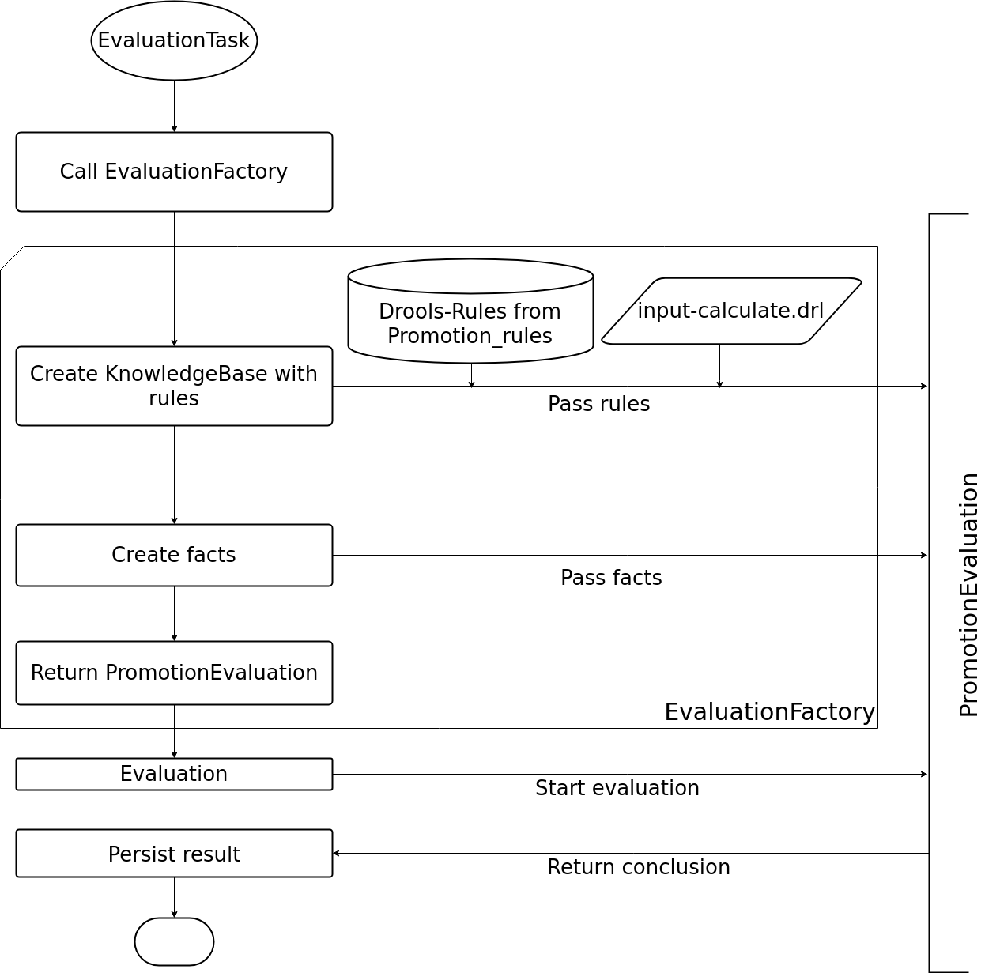

Qualification
=============

We use Drools in the qualification module to calculate averages, rounding values, setting dispenses and implement
promotion rules. Promotion rules are defined in the ``Promotion_rule`` entity, which can be grouped together to create
packages of rules. All our base rules are defined in the ``input-calculate.drl`` file.

    a rough overview how we build our knowledge base and start the evaluation

Facts
-----

A summary of the available and most often used facts in the qualification context. See the integration handbook for
detailed documentation.

Node
^^^^

This represents a node in the qualification structure. It can be either a
:nice:`EvalNode <ch/tocco/nice2/optional/qualification/impl/drools/facts/qs/EvalNode>`, wrapping a
``Evaluation_node``, or a :nice:`RatingNode <ch/tocco/nice2/optional/qualification/impl/drools/facts/qs/RatingNode>`,
wrapping a ``Input_node``.

Grade
^^^^^

This represents a numeric grade, the average of potentially multiple different exams or nodes. Any input with the type
``grades``, ``grades_max``, ``grade_mandatory``, ``grades_drop``, or ``points_threshold`` will produce these facts.

TotalPoints
^^^^^^^^^^^

This represents the sum of potentially multiple different exams where points can be entered. Both the ``points`` and
``points_threshold`` inputs will get summed.

ChoiceRating
^^^^^^^^^^^^

This represents the selection from a list of values from ``choice_rating`` inputs.

Presence
^^^^^^^^

This represents the presence of a student in a given node. This might a manually entered value or automatically
calculated. This is only available if a input of type ``presence`` exists.

IsDispensed
^^^^^^^^^^^

This represents a student being dispensed from a node. Check for the existence of this fact if you want to validate if a
student is dispensed.

Status
^^^^^^

This fact is used to find available status to set on a promotion.

ArrayList
^^^^^^^^^

This is the normal Java ArrayList, but it can be used in Drools together with the ``from collect`` instruction to easily
collect a list of facts.

Sum
^^^

This fact is a modified list that can also calculate sums or averages of its contents. It can be used the same way as
ArrayList and then checked for its calculations.

Utils
-----

A summary for the available utility classes in the qualification Drools context. See the integration handbook for
detailed documentation.

ConclusionFactory
^^^^^^^^^^^^^^^^^

This class is used together with ``Status`` facts to set a promotion status for the current evaluation. The final status
is decided by prioritizing all inserted status by their weights, filtering out any that where inserted with a negative
flag and picking the first remaining one.