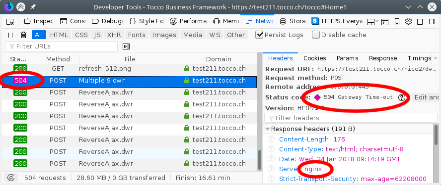

Web Server
==========

502 - Bad Gateway
-----------------

Error
^^^^^

HTTP requests fail with status code 504.

    504 returned by *Nginx*

Solution
^^^^^^^^

First, try to figure out what that request takes that long and try to make it faster.

If you can't make it faster, there is the possibility to adjust the timeout:

    * If the 504 has been issued by Nginx (see screenshot above) …:

        Adjust the `proxy_read_timeout`_ in the `Nginx configuration`_.

    * … else:

        Adjust the `HAProxy timeout`_ in the OpenShift configuration:

        ``oc edit route …`` and add/adjust this:

        .. code:: yaml

            metadata:
              annotations:
                haproxy.router.openshift.io/timeout: 15m

.. _proxy_read_timeout: http://nginx.org/en/docs/http/ngx_http_proxy_module.html#proxy_read_timeout
.. _Nginx configuration: https://github.com/tocco/openshift-nginx/blob/977a70cea85904b8cac560caac8b5f255c651af0/nice2.conf#L28
.. _HAProxy timeout: https://docs.openshift.com/container-platform/latest/install_config/configuring_routing.html
