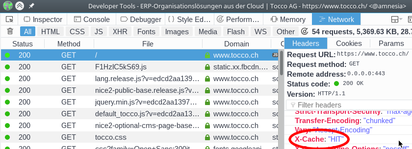

Nginx
=====

What data is cached?
--------------------

Nginx uses the ``Cache-Control``, ``Expires`` and ``Pragma`` headers (in that order) to determine if and for how long a
resource may be cached.

The `HTTP/1.1 standard`_ pretty clearly explains when an entry may be cached. Our setup adheres to this standard.

.. _HTTP/1.1 standard: https://www.w3.org/Protocols/rfc2616/rfc2616-sec14.html#sec14.9.1

How do I see if a resource was cached by Nginx?
-----------------------------------------------

Search for the ``X-Cache`` header on the response. (See screenshot below.)

You'll usually see one of these values [#f1]_:

============= ==================================================================
 Value        Description
============= ==================================================================
 HIT           Content has been served from cache.
 MISS          Content has not been served from cache.
 REVALIDATED   Content has been served from cache after revalidating with Nice.
               (Nice returned code 304.)
============= ==================================================================

    **Network** tab in **Inspector**

.. rubric:: Footnotes

.. [#f1] This value corresponds to the Nginx variable `$upstream_cache_status`_

.. _$upstream_cache_status: https://nginx.org/en/docs/http/ngx_http_upstream_module.html#var_upstream_cache_status
