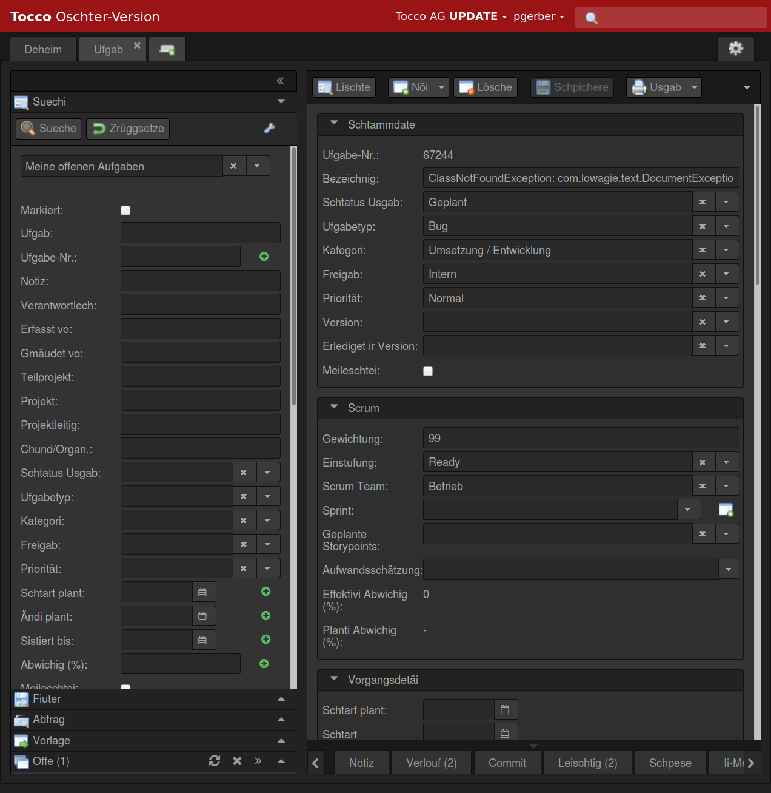
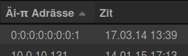
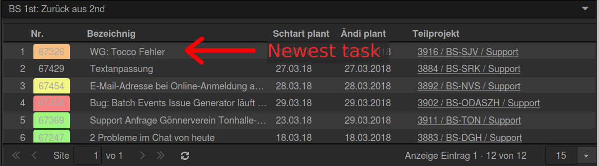

Release Notes
=============

2.16 Easter Edition (2018-04-01)
--------------------------------

A New Language
^^^^^^^^^^^^^^

We at Tocco always try to stay ahead of our competition. Hence, in anticipation of the next
`lingua franca`_, Swiss German, we decided to move away from the outdated Standard German.

Core parts have been translated already and we are confident full translation is going to be
completed before next year's release of the Easter Edition. We are very proud to be the first Zurich-based,
two-thousand-and-two-founded, (hopefully-)a-raise-to-Peter-granting, Tocco-AG-named ERP software
developer to offer this unique, progressive and award-\ :strike:`winning`\ seeking feature.

   Partially translated user interface.

   In this screenshot, the Greek influence can be seen clearly.

Reordered Info Boxes
^^^^^^^^^^^^^^^^^^^^

This far, info boxes showed the newest entries at the top and elderly entries at the bottom. We
believe our society does not show elderly the respect they have earned. We, at Tocco AG, strive to
make a difference in this universe. Thus, elderly tasks have been moved to the top where they
rightfully belong.

   Traditional info boxes with newest tasks at the top.

.. figure:: infobox_enhanced.png
   :scale: 80%

   New, enhanced info boxes with the oldest task at the top.

.. _lingua franca: https://en.wikipedia.org/wiki/Lingua_franca
